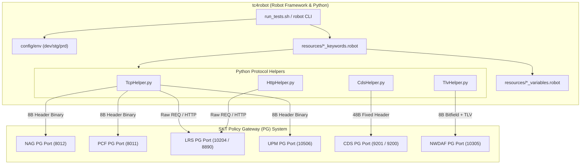

# ARCHITECTURE — 시스템 아키텍처 및 모듈 구조

SK텔레콤 **PG (Policy Gateway)** 연동 검증 슈트 **tc4robot** 의 전체 구조.
세부 규격은 각 문서로 넘긴다 — 여기서는 **무엇이 어디에 있는지**만 다룬다.

---

## 1. 시스템 개요

`tc4robot` 은 PG 와 6개 외곽 노드(NAG, PCF, LRS, UPM, CDS, NWDAF) 간의 인터페이스 규격과
전문 송수신 동작을 검증한다. 도구는 **능동 클라이언트(Client)** 로 동작해 노드별 수신 포트에
접속하고, 전문을 송수신한 뒤 응답과 상태 변화를 판정한다.



방향·포트·헤더·Body 의 전체 매트릭스는 [INTERFACES.md](INTERFACES.md) 에 있다.

---

## 2. 레이어드 아키텍처

역할과 책임을 분리해 4계층으로 구성한다.

```
+-----------------------------------------------------------------------+
|  Test Suite Layer (tests/*/*.robot)                                   |
|  - 시나리오 검증, TC 명명, 태그 관리, Suite/Test Setup & Teardown     |
+-----------------------------------------------------------------------+
|  Business Keyword Layer (resources/*_keywords.robot)                   |
|  - 도메인 키워드 (예: Send Subscriber QoS Notification), 응답 검증     |
+-----------------------------------------------------------------------+
|  Variable & Configuration Layer (config/env/*, resources/*_vars)      |
|  - 환경별(dev/stg/prd) 변수 오버라이드, PG_HOST 캐스케이딩 상속       |
+-----------------------------------------------------------------------+
|  Protocol & Transport Helper Layer (resources/*Helper.py)             |
|  - 소켓 커넥션 유지, struct 패킹/언패킹, TLV 인코딩, Keep-Alive       |
+-----------------------------------------------------------------------+
```

### 1) Test Suite Layer (`tests/`)

* 노드별 테스트케이스 정의 — [tests/nag/nag_tests.robot](../tests/nag/nag_tests.robot),
  [tests/pcf/pcf_tests.robot](../tests/pcf/pcf_tests.robot) 등
* `Suite Setup` / `Suite Teardown` 으로 슈트 단위 소켓 연결을 관리한다
* `Test Setup` 의 `Check <IFACE> Socket` 이 연결 유지 상태를 검증한다

작성 규칙은 [TC_CONVENTION.md](TC_CONVENTION.md) 에 있다.

### 2) Business Keyword Layer (`resources/*_keywords.robot`)

* 노드별 비즈니스 로직과 전문 송수신 단위 키워드
* 복합 전문 구성, 수신 응답의 Header / Body 파싱 및 검증 키워드

### 3) Variable & Configuration Layer (`config/env/`, `resources/*_variables.robot`)

* **단일 출처** — [resources/variables.robot](../resources/variables.robot) 이 공통 변수(`${PG_HOST}` 등)를 정의한다
* **상속** — 노드별 `*_variables.robot` 은 공통 변수를 참조만 한다
* **환경 오버라이드** — 실행 시 `--variablefile` 로 [config/env/stg.py](../config/env/stg.py) /
  [prd.py](../config/env/prd.py) 를 적용한다

우선순위 규칙과 환경 축 변수 목록은 [ENVIRONMENTS.md](ENVIRONMENTS.md) 에 있다.

### 4) Protocol & Transport Helper Layer (`resources/*Helper.py`)

Python 기반 저수준 프로토콜 인코딩/디코딩 및 통신 엔진. 4종이며 각각
[TcpHelper.py](../resources/TcpHelper.py) · [TlvHelper.py](../resources/TlvHelper.py) ·
[CdsHelper.py](../resources/CdsHelper.py) · [HttpHelper.py](../resources/HttpHelper.py) 다.

담당 범위와 주요 함수 목록은 [RESOURCES.md](RESOURCES.md#python-헬퍼-4종) 에 있다.

---

## 3. 핵심 메커니즘 — 어디를 볼 것인가

이 리포에서 반드시 알아야 할 제약 3가지. 상세는 각 링크로 간다.

| 메커니즘 | 요지 | 상세 |
|---|---|---|
| **소켓 라이프사이클** | 슈트당 1회 접속해 `Suite Variable` 로 공유한다. **TC 별 connect/disconnect 를 추가하지 말 것.** 닫힘 감지 시 `Fatal Error` 로 슈트 전체 중단 | [RESOURCES.md](RESOURCES.md#소켓-공유-규칙-절대) · [INTERFACES.md](INTERFACES.md#연결-실패-시-동작) |
| **`txn_id` 채번** | **0이 될 수 없다**(규격 제약). `Next TXN ID` 가 강제하며 65535 초과 시 1로 wrap | [RESOURCES.md](RESOURCES.md#common_keywordsrobot) |
| **전문 3계열 분리** | 8-옥텟 공통 / 48-옥텟 CDS / 8-옥텟 NWDAF+TLV. 계열마다 전용 헬퍼 | [INTERFACES.md](INTERFACES.md#전문-형식-3계열) |
| **환경 오버라이드** | `--variable` > `--variablefile` > 슈트 `*** Variables ***` > 임포트 Resource | [ENVIRONMENTS.md](ENVIRONMENTS.md#변수-우선순위) |

---

## 4. 관련 문서

* [README.md](README.md) — 문서 인덱스
* [INTERFACES.md](INTERFACES.md) — 노드 간 연동 매트릭스 및 포트/헤더 스펙
* [ENVIRONMENTS.md](ENVIRONMENTS.md) — dev/stg/prd 환경 설정 및 오버라이딩 체계
* [TC_CONVENTION.md](TC_CONVENTION.md) — TC 명명, 태그, 템플릿 작성 규칙
* [RESOURCES.md](RESOURCES.md) — 공통 키워드 및 Python 헬퍼 카탈로그
* [nodes/](nodes/) — 노드별 스펙 6종
* [CLAUDE.md](../CLAUDE.md) — 개발 가이드 및 프로젝트 메인 인덱스
