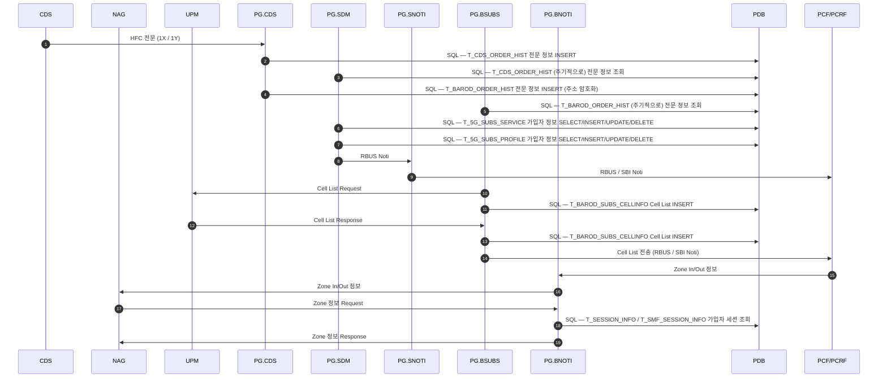

# INTERFACES — 노드 간 연동 매트릭스

PG 연동 6개 노드의 방향·포트·전문 형식을 한 장에 모은 표. **어느 노드를 건드리든 여기부터 본다.**
상세는 각 노드 스펙(`docs/nodes/<IFACE>.md`) 참조.

## 한눈에

| 노드 | 도구 역할 | 접속 방향 | 포트 | 헤더 | Body | 소켓 |
|---|---|---|---|---|---|---|
| [NAG](nodes/NAG.md) | NAG | Client → PG | 8012 | 8B `0x00` | JSON | 듀얼 (+8890 Listen) |
| [PCF](nodes/PCF.md) | PCF | Client → PG | 8011 | 8B `0x00` | JSON | 듀얼 (+NAG 8012) |
| [LRS](nodes/LRS.md) | LRS | Client → PG.LRS | 10204 | 없음 / HTTP | raw `REQ`/`ANS`, HTTP AIMS | 듀얼 (+8890 Listen) |
| [UPM](nodes/UPM.md) | UPM | Client → PG | 10506 | 8B `0x00` | JSON | 단일 |
| [CDS](nodes/CDS.md) | CDS | Client 듀얼 → PG.CDS | Rch 9201 → Sch 9200 | **48B** | 고정전문 | 듀얼 |
| [NWDAF](nodes/NWDAF.md) | NWDAF | Client → PG | 10305 | 8B 비트필드 | **TLV 바이너리** | 단일 |

**도구는 6개 노드 모두에서 능동 접속(Client) 한다.** 서버로 대기하는 건 NAG·LRS 가 함께 여는
LRS-PCF 보조 채널(8890) 하나뿐이다.

호스트는 전부 `${PG_HOST}`(`resources/variables.robot`, 기본 `192.168.15.141`)를 상속하며
`run_tests.sh all <IP>` 로 일괄 오버라이드된다.

## 전문 형식 3계열

| 계열 | 헤더 | 모듈 | 쓰는 노드 |
|---|---|---|---|
| 8-옥텟 공통 | Byte0 `0x00`(ProtoVer 0) / `0x20`(LRS 계열) | `TcpHelper.py` (`WITH NAME Tcp`) | NAG, PCF, UPM, LRS-PCF 채널 |
| 48-옥텟 CDS | Message ID / TID(date+seq) / System·App ID / Continue / Serial / Data Size | `CdsHelper.py` (`Cds`) | CDS |
| 8-옥텟 NWDAF | Byte0 비트필드(Ext/ProtoVer/HdrType/MsgType) + SvcId(2B) + MsgId(3B) + BodyLen(2B) | `TlvHelper.py` (`Tlv`) | NWDAF |

`txn_id` 는 **절대 0이 될 수 없다**(규격 명시). `Next TXN ID` 키워드가 강제한다.
NWDAF 는 `txn_id` 대신 Message Id(0x000~0xFFF 순환)를 쓴다.

## 듀얼 소켓 구조 — 어느 노드가 어느 채널을 먼저 여는가

**NAG** — 클라이언트 8012 + 서버 8890
```
① NAG 소켓(8012) 연결 → Hello 로 세션 등록
② LRS-PCF 서버 소켓(8890) Listen → LRS(PG) 가 접속
③ PG 의 Hello-Request(0x01) 수신 → Hello-Response(0x02) 회신
```
Subs-Cellid TC 가 `0x0b` 를 보내면 PG 는 **LRS-PCF 채널로 `0x05` Location-Info-Request 를 되돌려
보낸다.** 그래서 ②③ 이 미리 끝나 있어야 한다.

**PCF** — NAG 8012(세션 선등록) + PCF 8011. 두 소켓 모두 슈트 끝까지 살아 있어야 한다.

**LRS** — 클라이언트 10204 + 서버 8890. NAG 와 같은 8890 채널을 쓴다.
Session-Info(HTTP) 처리 중 PG 가 8890 으로 `0x05` 를 보내오므로 동일한 선처리가 필요하다.

**CDS** — **Rchannel(9201) 을 먼저 연결**하고 Schannel(9200) 을 뒤에 연다. 각 채널이
ConnectionRequest 를 보내고 ACK 를 받는 핸드셰이크를 한다.

| 순서 | 채널 | 송신 | 기대 응답 |
|---|---|---|---|
| 1 | Rchannel 9201 | `0003` RchannelConnectionRequest | `0004` ACK |
| 2 | Schannel 9200 | `0001` SchannelConnectionRequest | `0002` ACK |

## HFC 서비스 Call Flow — 세 노드가 어떻게 이어지는가

**슈트는 CDS·UPM·NAG 를 각각 독립적으로 테스트하지만, 운영에서는 하나의 사슬이다.**
HFC 가입(`1X`) / 해지(`1Y`) 전문 하나가 들어오면 UPM 의 Cell List 왕복과 NAG 의 Zone 정보
왕복까지 연쇄로 일어난다. 슈트가 이 세 노드를 왜 같이 들고 있는지가 여기서 드러난다.

출처: `PG (PCF Gateway) 교육 자료` Chapter 03 — *02. PG 서비스 별 동작 Flow — HFC 서비스*.



`RBUS / SBI Noti` 는 가입자에 따라 갈린다 — LTE 는 RBUS, SA 는 SBI.
세션 테이블도 마찬가지로 `T_SESSION_INFO`(LTE) / `T_SMF_SESSION_INFO`(SA) 다.
자세한 LTE/SA 대응은 [CDS 노드 스펙](nodes/CDS.md#lte--sa-차이--테이블-이름과-noti-방식뿐) 참조.

**☞ 일부 전문에 대해서는 PCF/PCRF 로 NOTI 하지 않는다.**

### 슈트의 어느 TC 가 어느 화살표인가

도구가 실제로 잡는 구간만 추린 것이다. 나머지는 전부 PG 내부라 보이지 않는다.

| 흐름의 화살표 | 도구 측 | opcode / 메시지 | 근거 |
|---|---|---|---|
| `CDS → PG.CDS` HFC 전문 | CDS 슈트 | `0015` CommandRequest, JOB Code `1X`/`1Y` | 확정 — [CDS 업무 코드](nodes/CDS.md#업무-코드별-필드-집합) |
| `PG.BSUBS → UPM` Cell List Request | UPM 슈트 (수동 수신) | `0x07` `${MSG_UPM_SUBS_INFO_REQ}` | 확정 — [UPM 메시지 타입](nodes/UPM.md#메시지-타입--양방향) 의 PG→UPM 방향과 일치 |
| `UPM → PG.BSUBS` Cell List Response | UPM 슈트 | `0x08` `${MSG_UPM_SUBS_INFO_RESP}` | 확정 |
| `PG.BNOTI → NAG` Zone In/Out 정보 | NAG 슈트 (수동 수신) | `0x07` `${MSG_ZION_REQ}` | **추정** — ZION 이 PG→NAG 방향인 것은 맞으나 이 화살표와 같은 것인지 미확인 |
| `NAG → PG.BNOTI` Zone 정보 Request/Response | NAG 슈트 | `0x09`/`0x0a` `${MSG_SUBS_ZONE_STATUS_*}` | **추정** — 위와 같음 |

`1X` 는 [CDS 노드 스펙](nodes/CDS.md#업무-코드별-필드-집합) 에 필드 집합이 확보돼 있으나
**`1Y`(HFC해지)는 미확인**이다. 이 흐름이 `1X`/`1Y` 를 쌍으로 다루므로 1Y 목록을 구하면
반드시 대조할 것.

**~~미확인~~ `T_BAROD_ORDER_HIST` 를 읽고 쓰는 주체 — 확정됐다(2026-08-04).**
**PG.CDS 가 쓰고 PG.BSUBS 가 주기적으로 읽는다.** 이전에 SDM 이 읽는 것으로 그렸던 것을
바로잡았다.

**위 다이어그램은 요약이다.** 1X 전문의 실제 처리에는 위에 없는 요소가 더 있다 —
주소 필드의 Masking/암호화 이중 저장, UPM 연동 시 Base64 인코딩, EMS 의 복호화 조회,
BSUBS 의 DB 폴링 기반 비동기 처리.

> 이 넷을 한자리에 그려 둔 `callflow/CDS_X1.md` 는 2026-08-21 에 삭제됐다.
> 지금 문서에 남아 있는 것은 위 네 줄이 전부다 — PG 내부 상세가 다시 필요하면
> PG 소스에서 다시 뜨거나 그 문서를 복원해야 한다.

## opcode 충돌 — 노드별 상수명을 그대로 써라

같은 opcode 가 노드마다 다른 의미다. **숫자를 직접 쓰지 말고 상수명을 쓴다.**

| opcode | NAG | PCF | LRS(8890) | UPM |
|---|---|---|---|---|
| `0x05` | | `${MSG_PCF_ZONE_REQ}` | `${MSG_LOC_INFO_REQ}` | `${MSG_UPM_SUBS_CHANGE_REQ}` |
| `0x06` | | `${MSG_PCF_ZONE_RESP}` | `${MSG_LOC_INFO_RESP}` | `${MSG_UPM_SUBS_CHANGE_RESP}` |
| `0x07` | `${MSG_ZION_REQ}` | | | `${MSG_UPM_SUBS_INFO_REQ}` |
| `0x09` | `${MSG_SUBS_ZONE_STATUS_REQ}` | | | `${MSG_UPM_CELLINFO_NOTI_REQ}` |
| `0x0b` | `${MSG_SUBS_CELLID_REQ}` (ADOT) | | | `${MSG_UPM_SUBS_SYNC_REQ}` |

`0x01`~`0x04`(Hello/Ping)만 `resources/variables.robot` 에서 공용이다.

## 환경별 접속 정보

포트·호스트는 각 `<iface>_variables.robot` 의 기본값을 쓰고, 환경별로 다르면
`config/env/<env>.py` 에서 노드별로 오버라이드한다 — [ENVIRONMENTS.md](ENVIRONMENTS.md).

```bash
bash run_tests.sh cds stg
```

과거 SSH 로 PG 의 `PG_V2.cfg` 를 읽던 `DynamicVars` 는 제거됐다.
실측 cfg 값이 하드코딩 기본값과 전부 같아 동작 차이가 없었기 때문이다.

## 연결 실패 시 동작

전 노드 공통. `Test Setup` 의 `Check ... Socket` 계열 키워드가 소켓이 닫혀 있으면
**`Fatal Error` 로 슈트 전체를 즉시 중단**한다. 연결이 없으면 이후 TC 가 의미 없기 때문이다.
TC 별 connect/disconnect 를 추가하지 말 것 — 자세한 규칙은 [RESOURCES.md](RESOURCES.md).

NWDAF 만 `Nwdaf Peer Closed`(논블로킹 `MSG_PEEK`)로 **PG 측 FIN/RST 까지 감지**한다.
다른 노드의 `Is Connected` 는 로컬 fd 만 보므로 상대가 끊은 것을 알지 못한다.
