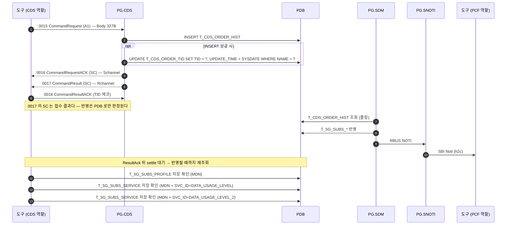

# CDS `A1` — 신규가입

| 항목 | 값 |
|---|---|
| 업무 코드 | `A1` |
| 테스트 케이스 | `TC-CDS-002` |
| 알림 경로 | SDM 경유 — 규칙 3 |
| 알림 판정 | **건너뜀** — 예외 목록에 있음 (아래 ⚠️) |
| UPM 연동 | 없음 |
| 예약 큐 적재 | 없음 |
| Body 필드 수 | 18개 / 총 327B (고정) |

> 슈트 전체가 쓰는 대상 가입자를 만든다 — 이 TC 가 실패하면 뒤가 전부 흔들린다.

## 콜플로우

## 전문 Body 필드

Body 는 업무 코드와 무관하게 **항상 327B** 다. 아래 필드만 채우고 나머지는 공백이다.

| # | 필드 | 폭(B) |
|---|---|---|
| 1 | `mdn` | 12 |
| 2 | `min` | 10 |
| 3 | `prod_id` | 10 |
| 4 | `data_prod_id` | 10 |
| 5 | `network` | 8 |
| 6 | `tablet_yn` | 1 |
| 7 | `os_ver` | 2 |
| 8 | `device_model` | 4 |
| 9 | `ca` | 1 |
| 10 | `aprf` | 1 |
| 11 | `imsi` | 15 |
| 12 | `mvno` | 1 |
| 13 | `limit` | 1 |
| 14 | `ms_type` | 1 |
| 15 | `category_lte` | 2 |
| 16 | `category_5g` | 2 |
| 17 | `device_type` | 1 |
| 18 | `product_type` | 2 |

출처는 `resources/CdsHelper.py` 의 `_fill_command_fields()` 분기다 — **규격서가 아니라 이 코드가 와이어의 기준이다.**
★ 분기가 선언하지 않은 필드는 값을 넘겨도 **조용히 버려진다.**

## 판정 기준

`CommandResult(0017)` 는 Body 내용과 무관하게 `SC` 를 준다. 실제 반영은 PDB 로만 판정된다.

- `T_5G_SUBS_PROFILE` (MDN) = **1건**
- `T_5G_SUBS_SERVICE` (MDN, `DATA_USAGE_LEVEL`) = **1건**
- `T_5G_SUBS_SERVICE` (MDN, `DATA_USAGE_LEVEL_2`) = **1건**

### ⚠️ 알림 판정은 현재 꺼져 있다

이 코드는 `@{CDS_NOTI_EXEMPT_CODES}`(A1 / 1Y / Z1)에 들어 있어 `Verify SBI Noti Sent` 가 **건너뛴다.**

그런데 위 경로 규칙(2026-08-19)대로면 이 코드도 알림이 나간다 — **두 지시가 어긋나 있다.** 규칙이 앞의 것을 대체하는 것이면 예외 목록에서 이 코드를 빼면 되고, 경로는 정해지지만 SNOTI 가 PCF 로 보내지 않는 것이면 지금이 맞다.

확인되기 전까지 **판정을 켜지 않았다** — 켜서 틀리면 TC 가 이유 없이 실패하는 쪽이라 되돌리기 어렵다.

## 관련 문서

- [CDS 노드 스펙](../nodes/CDS.md) — 인코딩 표, 함정, LTE/SA 차이
- [1X 전문 End-to-End](CDS_X1.md) — PG 내부 프로세스 상세
- `tests/cds/cds_tests.robot` — `TC-CDS-002`
