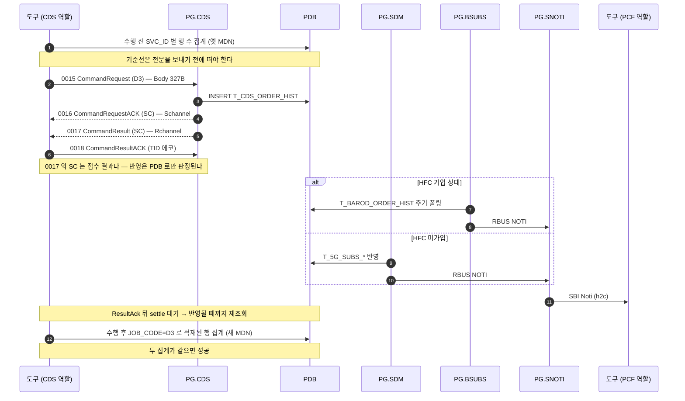

# CDS `D3` — 번호변경

| 항목 | 값 |
|---|---|
| 업무 코드 | `D3` |
| 테스트 케이스 | `TC-CDS-018` |
| 알림 경로 | HFC **가입** 상태 → BSUBS / **미가입** → SDM — 규칙 2 |
| 알림 판정 | `Verify SBI Noti Sent` 가 도착을 확인 |
| UPM 연동 | 없음 |
| 예약 큐 적재 | 없음 |
| Body 필드 수 | 19개 / 총 327B (고정) |

> 성공하면 `${CDS_ACTIVE_MDN}` 을 새 번호로 갱신한다 → 뒤의 Z1 이 그 번호로 해지한다.

## 콜플로우

## 전문 Body 필드

Body 는 업무 코드와 무관하게 **항상 327B** 다. 아래 필드만 채우고 나머지는 공백이다.

| # | 필드 | 폭(B) |
|---|---|---|
| 1 | `mdn` | 12 |
| 2 | `new_mdn` | 12 |
| 3 | `min` | 10 |
| 4 | `new_min` | 10 |
| 5 | `prod_id` | 10 |
| 6 | `data_prod_id` | 10 |
| 7 | `network` | 8 |
| 8 | `tablet_yn` | 1 |
| 9 | `os_ver` | 2 |
| 10 | `device_model` | 4 |
| 11 | `ca` | 1 |
| 12 | `aprf` | 1 |
| 13 | `imsi` | 15 |
| 14 | `mvno` | 1 |
| 15 | `limit` | 1 |
| 16 | `category_lte` | 2 |
| 17 | `category_5g` | 2 |
| 18 | `device_type` | 1 |
| 19 | `product_type` | 2 |

출처는 `resources/CdsHelper.py` 의 `_fill_command_fields()` 분기다 — **규격서가 아니라 이 코드가 와이어의 기준이다.**
★ 분기가 선언하지 않은 필드는 값을 넘겨도 **조용히 버려진다.**

## 판정 기준

`CommandResult(0017)` 는 Body 내용과 무관하게 `SC` 를 준다. 실제 반영은 PDB 로만 판정된다.

- 수행 **전**(옛 번호) `SVC_ID` 별 행 수 == 수행 **후**(새 번호, `JOB_CODE=D3`) 집계

알림은 `Verify SBI Noti Sent D3` 가 본다(도착 여부). 경로는 수신만으로 구분되지 않아 규칙으로 계산해 실패 메시지에 싣는다.

## 관련 문서

- [CDS 노드 스펙](../nodes/CDS.md) — 인코딩 표, 함정, LTE/SA 차이
- [1X 전문 End-to-End](CDS_X1.md) — PG 내부 프로세스 상세
- `tests/cds/cds_tests.robot` — `TC-CDS-018`
