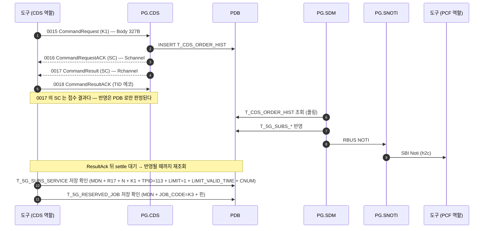

# CDS `K1` — Data(Time) 쿠폰 가입

| 항목 | 값 |
|---|---|
| 업무 코드 | `K1` |
| 테스트 케이스 | `TC-CDS-011` |
| 알림 경로 | SDM 경유 — 규칙 3 |
| 알림 판정 | `Verify SBI Noti Sent` 가 도착을 확인 |
| UPM 연동 | 없음 |
| 예약 큐 적재 | 있음 |
| Body 필드 수 | 6개 / 총 327B (고정) |

> 가입과 동시에 만료 예약이 걸린다. **인입 코드(K1)와 예약 코드(K3)가 다르다.** `START_TIME` 은 반드시 미래여야 한다 — 과거면 가입 직후 만료돼 판정이 실패한다.

## 콜플로우

## 전문 Body 필드

Body 는 업무 코드와 무관하게 **항상 327B** 다. 아래 필드만 채우고 나머지는 공백이다.

| # | 필드 | 폭(B) |
|---|---|---|
| 1 | `mdn` | 12 |
| 2 | `limit` | 1 |
| 3 | `start_time` | 12 |
| 4 | `coupon_type` | 2 |
| 5 | `coupon_pin` | 11 |
| 6 | `coupon_category` | 1 |

출처는 `resources/CdsHelper.py` 의 `_fill_command_fields()` 분기다 — **규격서가 아니라 이 코드가 와이어의 기준이다.**
★ 분기가 선언하지 않은 필드는 값을 넘겨도 **조용히 버려진다.**

## 판정 기준

`CommandResult(0017)` 는 Body 내용과 무관하게 `SC` 를 준다. 실제 반영은 PDB 로만 판정된다.

- `T_5G_SUBS_SERVICE` (MDN, `R17`, `SVC_TYPE=N`, `JOB_CODE=K1`, `TIME_PERIOD_ID=113`, `"LIMIT"=1`, `LIMIT_VALID_TIME`, `CNUM=핀`) = **1건 이상**
- `T_5G_RESERVED_JOB` (MDN, `JOB_CODE=K3`, 핀) = **1건 이상**

알림은 `Verify SBI Noti Sent K1` 가 본다(도착 여부). 경로는 수신만으로 구분되지 않아 규칙으로 계산해 실패 메시지에 싣는다.

## 관련 문서

- [CDS 노드 스펙](../nodes/CDS.md) — 인코딩 표, 함정, LTE/SA 차이
- [1X 전문 End-to-End](CDS_X1.md) — PG 내부 프로세스 상세
- `tests/cds/cds_tests.robot` — `TC-CDS-011`
