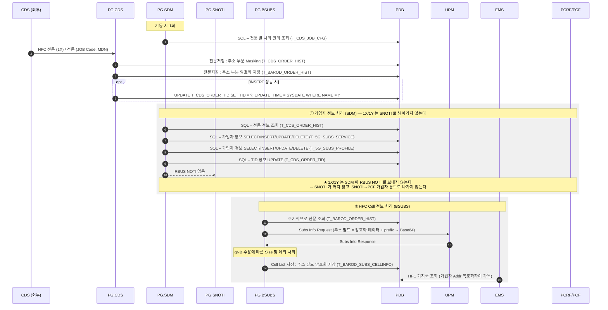
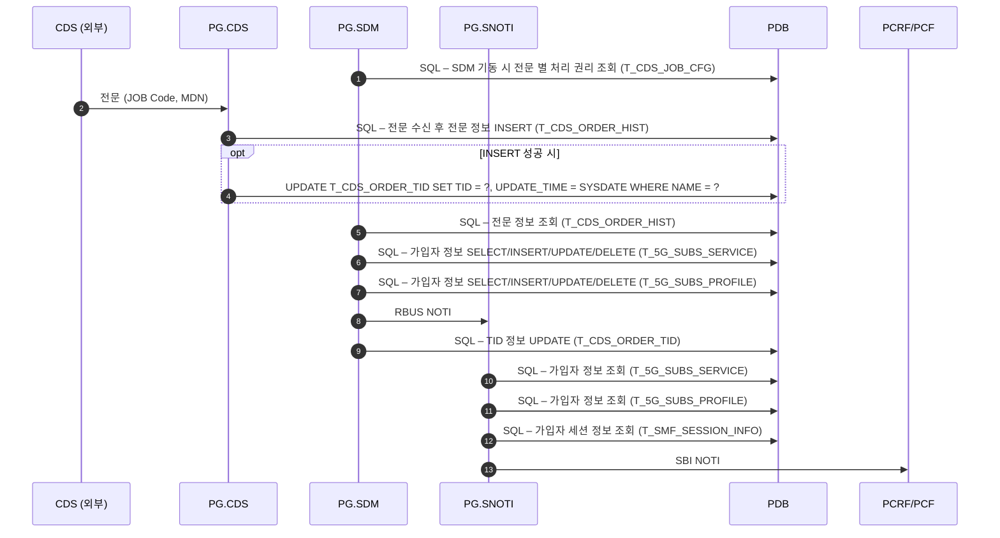
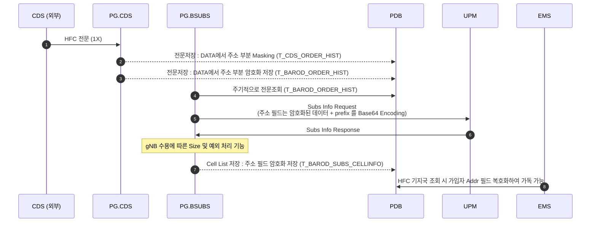

# 1X 전문 콜플로우 (통합)

PG(PCF Gateway)의 CDS 전문 처리 흐름을 두 갈래로 정리한다.

- **A. CDS 가입자(SA) 전문 처리** — SDM/SNOTI 경유, PCRF/PCF로 SBI NOTI
- **B. HFC 전문(1X) 처리** — BSUBS 경유, UPM 연동 및 Cell List 저장

---

## 1. 구성 요소

| 구분 | 요소 | 역할 |
|---|---|---|
| 외부 | CDS | 전문 송신 (JOB Code, MDN) |
| PG | CDS | 전문 수신 / 이력 저장 / TID 관리 |
| PG | SDM | 가입자 정보 처리 (SELECT/INSERT/UPDATE/DELETE) |
| PG | SNOTI | 가입자·세션 정보 조회 후 PCRF/PCF NOTI — **1X/1Y 는 호출되지 않는다** |
| PG | BSUBS | HFC(1X) 전문 처리, UPM 연동, Cell List 저장 |
| DB | PDB | T_CDS_JOB_CFG, T_CDS_ORDER_HIST, T_CDS_ORDER_TID, T_5G_SUBS_SERVICE, T_5G_SUBS_PROFILE, T_SMF_SESSION_INFO, T_BAROD_ORDER_HIST, T_BAROD_SUBS_CELLINFO |
| 외부 | PCRF/PCF | SBI NOTI 수신 |
| 외부 | UPM | Subs Info 조회 |
| 외부 | EMS | HFC 기지국 조회 |

---

## 2. 통합 콜플로우 (1X 전문 End-to-End)

CDS로부터 1X 전문을 수신한 뒤, **PG.SDM 계열(가입자 정보 처리)** 과 **PG.BSUBS 계열(HFC Cell 정보 처리)** 이 병행 동작하는 전체 흐름이다.

> ★ **1X/1Y 는 PG.SDM 이 RBUS NOTI 를 보내지 않는다.** 아래 3장의 일반 SA 전문 흐름과 갈리는 지점이 여기다 —
> SNOTI 가 깨지 않으므로 `SNOTI → PCF` 가입자 정보 변경 통보도 나가지 않는다.
> **1X 에서 PCF 로 나가는 것은 ②의 `BSUBS → PCF` Cell List 하나뿐이다.**

> ①과 ②는 서로 다른 프로세스에서 동작한다. ①은 전문 수신 즉시 처리되고, ②는 BSUBS가 T_BAROD_ORDER_HIST를 **주기적으로 폴링**하여 처리한다.
>
> ①이 SDM 에서 끝나는 것이 1X/1Y 의 특징이다. 가입자 테이블(`T_5G_SUBS_SERVICE`)에는 그대로 반영되므로
> **PDB 판정은 정상 동작하고, 달라지는 것은 PCF 로 나가는 알림 건수뿐**이다.

---

## 3. A. CDS 가입자(SA) 전문 처리 Flow

> 이 장은 **일반 SA 전문**의 흐름이다. `1X`/`1Y` 는 7단계(RBUS NOTI)부터 해당하지 않으므로
> 10~13단계도 일어나지 않는다 — 2장의 통합 콜플로우를 볼 것.

### 단계 설명

| # | 구간 | 처리 내용 | 대상 테이블 |
|---|---|---|---|
| 1 | PG.SDM ← PDB | SDM 기동 시 전문 별 처리 권리 조회 | T_CDS_JOB_CFG |
| 2 | CDS → PG.CDS | 전문 수신 (JOB Code, MDN) | - |
| 3 | PG.CDS → PDB | 전문 수신 후 전문 정보 INSERT | T_CDS_ORDER_HIST |
| 4 | PG.CDS → PDB | **3 이 성공했을 때만** TID 정보 UPDATE `SET TID = ?, UPDATE_TIME = SYSDATE WHERE NAME = ?` | T_CDS_ORDER_TID |
| 5 | PG.SDM ← PDB | 전문 정보 조회 | T_CDS_ORDER_HIST |
| 6 | PG.SDM ↔ PDB | 가입자 정보 SELECT/INSERT/UPDATE/DELETE | T_5G_SUBS_SERVICE |
| 7 | PG.SDM ↔ PDB | 가입자 정보 SELECT/INSERT/UPDATE/DELETE | T_5G_SUBS_PROFILE |
| 8 | PG.SDM → PG.SNOTI | RBUS NOTI | - |
| 9 | PG.SDM → PDB | TID 정보 UPDATE | T_CDS_ORDER_TID |
| 10 | PG.SNOTI ← PDB | 가입자 정보 조회 | T_5G_SUBS_SERVICE |
| 11 | PG.SNOTI ← PDB | 가입자 정보 조회 | T_5G_SUBS_PROFILE |
| 12 | PG.SNOTI ← PDB | 가입자 세션 정보 조회 | T_SMF_SESSION_INFO |
| 13 | PG.SNOTI → PCRF/PCF | SBI NOTI | - |

> **TID 갱신이 두 번**이다(4 · 9). PG.CDS 가 전문을 받아 넣은 직후 한 번,
> PG.SDM 이 처리를 끝낸 뒤 한 번. 앞의 것은 **INSERT 가 성공했을 때만** 나간다.

> ⚠️ **일부 전문에 대해서는 PCF/PCRF로 NOTI 하지 않음**

---

## 4. B. HFC 전문(1X) 처리 Flow

### 단계 설명

| # | 구간 | 처리 내용 | 대상 테이블 |
|---|---|---|---|
| 1 | CDS → PG.CDS | HFC 전문(1X) 수신 | - |
| 2 | PG.CDS → PDB | 전문저장, **DATA에서 주소 부분 Masking** | T_CDS_ORDER_HIST |
| 3 | PG.CDS → PDB | 전문저장, **DATA에서 주소 부분 암호화 저장** | T_BAROD_ORDER_HIST |
| — | PG.CDS → PDB | **2·3 이 성공했을 때만** TID 정보 UPDATE `SET TID = ?, UPDATE_TIME = SYSDATE WHERE NAME = ?` | T_CDS_ORDER_TID |
| 4 | PG.BSUBS ← PDB | 주기적으로 전문 조회 | T_BAROD_ORDER_HIST |
| 5 | PG.BSUBS → UPM | Subs Info Request — 주소 필드는 암호화 데이터(+prefix)를 **Base64 Encoding** | - |
| 6 | UPM → PG.BSUBS | Subs Info Response | - |
| 7 | PG.BSUBS | gNB 수용에 따른 Size 및 예외 처리 | - |
| 8 | PG.BSUBS → PDB | Cell List 저장, **주소 필드 암호화 저장** | T_BAROD_SUBS_CELLINFO |
| 9 | EMS ← PDB | HFC 기지국 조회 시 가입자 Addr 필드 **복호화하여 가독 가능** | T_BAROD_SUBS_CELLINFO |

---

## 5. 두 Flow 비교

| 항목 | A. CDS 가입자(SA) | B. HFC 전문(1X) |
|---|---|---|
| 처리 프로세스 | CDS → SDM → SNOTI | CDS → SDM (SNOTI 없음) + CDS → BSUBS |
| SDM → SNOTI RBUS NOTI | 보낸다 | **보내지 않는다** |
| 전문 이력 | T_CDS_ORDER_HIST | T_CDS_ORDER_HIST (Masking) + T_BAROD_ORDER_HIST (암호화) |
| 처리 방식 | 전문 수신 즉시 처리 | BSUBS가 **주기적으로 폴링** |
| 외부 연동 | PCRF/PCF (SBI NOTI) | UPM (Subs Info Req/Rsp), PCRF/PCF (Cell List), EMS (조회) |
| 주소 정보 보안 | 해당 없음 | Masking / 암호화 / Base64 Encoding / 복호화 |
| 결과 저장 | T_5G_SUBS_SERVICE, T_5G_SUBS_PROFILE | T_BAROD_SUBS_CELLINFO |

---

## 6. 주요 포인트

- **주소 정보 이중 저장**: 1X 전문은 원본 이력(T_CDS_ORDER_HIST)에 Masking, 별도 이력(T_BAROD_ORDER_HIST)에 암호화 저장하여 가독성과 보안을 분리한다.
- **UPM 연동 인코딩 규칙**: 주소 필드는 `암호화 데이터 + prefix` 형태를 Base64 Encoding하여 전달한다.
- **비동기 처리**: BSUBS는 요청-응답 직결이 아니라 DB 폴링 기반으로 동작하므로, 전문 수신과 UPM 연동 사이에 지연이 존재한다.
- **gNB 수용 예외 처리**: Cell List 크기 제한 및 예외 케이스는 BSUBS에서 처리한다.
- **SA 전문의 선택적 NOTI**: 모든 전문이 PCF/PCRF로 NOTI되지는 않는다 (전문 종류별 T_CDS_JOB_CFG 설정에 따름).
- **1X/1Y 는 RBUS NOTI 를 보내지 않는다**: 위 "선택적 NOTI" 의 확인된 실례다. SDM 이 가입자 테이블까지만 고치고
  SNOTI 를 깨우지 않으므로, `SNOTI → PCF` 가입자 정보 변경 통보가 없다.
  **1X 에서 PCF 로 나가는 알림은 `BSUBS → PCF` Cell List 하나뿐이다** — 도구가 PCF 역할로 Listen 할 때
  2건을 기다리면 오지 않는 1건 때문에 헛되이 실패한다.
