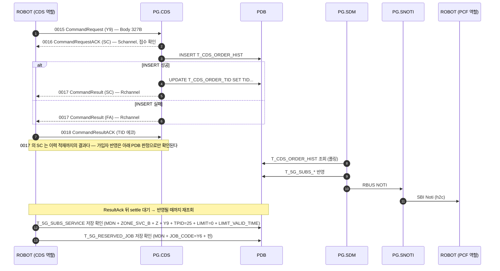

# CDS `Y9` — Data(Zone) 쿠폰 사용시점 알림

| 항목 | 값 |
|---|---|
| 업무 코드 | `Y9` |
| 테스트 케이스 | `TC-CDS-015` |
| 알림 경로 | SDM 경유 — 규칙 3 |
| 알림 판정 | `Verify SBI Noti Sent` 가 도착을 확인 |
| UPM 연동 | 없음 |
| 예약 큐 적재 | 있음 |
| Body 필드 수 | 6개 / 총 327B (고정) |

> `SVC_ID` 가 1X 의 `ZONE_SVC_D` 와 다르다(`ZONE_SVC_B`). `COUPON_TYPE=T` 여야 예약 큐에 Y6 이 들어간다 — 숫자면 Y8 이다.

## 콜플로우

## 전문 Body 필드

Body 는 업무 코드와 무관하게 **항상 327B** 다. 아래 필드만 채우고 나머지는 공백이다.

| # | 필드 | 폭(B) |
|---|---|---|
| 1 | `mdn` | 12 |
| 2 | `zone_code` | 4 |
| 3 | `limit` | 1 |
| 4 | `start_time` | 12 |
| 5 | `coupon_type` | 2 |
| 6 | `coupon_pin` | 11 |

출처는 `resources/CdsHelper.py` 의 `_fill_command_fields()` 분기다 — **규격서가 아니라 이 코드가 와이어의 기준이다.**
★ 분기가 선언하지 않은 필드는 값을 넘겨도 **조용히 버려진다.**

## 판정 기준

`0016 CommandRequestACK` 는 **받았다는 확인**이라 처리 전에 나간다 — 판정에 쓸 수 없다.

`0017 CommandResult` 가 나르는 것은 **전문 이력 적재의 성패**다. INSERT 가 실패하면 `FA`, 성공하면 Body 내용이 업무적으로 맞든 틀리든 `SC` 다.
가입자 테이블 반영은 PG.SDM 이 나중에 폴링해서 하므로 **PDB 로만 판정된다.**

- `T_5G_SUBS_SERVICE` (MDN, `ZONE_SVC_B`, `SVC_TYPE=Z`, `JOB_CODE=Y9`, `TIME_PERIOD_ID=25`, `"LIMIT"=0`, `LIMIT_VALID_TIME`) = **1건 이상**
- `T_5G_RESERVED_JOB` (MDN, `JOB_CODE=Y6`, 핀) = **1건 이상**

알림은 `Verify SBI Noti Sent Y9` 가 본다(도착 여부). 경로는 수신만으로 구분되지 않아 규칙으로 계산해 실패 메시지에 싣는다.

## 관련 문서

- [CDS 노드 스펙](../nodes/CDS.md) — 인코딩 표, 함정, LTE/SA 차이
- [1X 전문 End-to-End](CDS_X1.md) — PG 내부 프로세스 상세
- `tests/cds/cds_tests.robot` — `TC-CDS-015`
