# CDS 업무 코드별 콜플로우

전문 하나가 PG 안에서 어떤 경로로 흐르고 무엇으로 판정되는지를 업무 코드별로 정리했다.
**필드 집합은 `resources/CdsHelper.py` 의 `_fill_command_fields()` 에서 뽑은 것**이라
규격서가 아니라 코드가 기준이다.

> 이 문서는 `gen_callflow.py` 가 생성한다. **직접 고치지 말 것** —
> 값을 바꾸려면 생성기의 표(`T` / `PDB_*` / `SDM_APPLY` …)를 고치고 다시 돌린다.
> `python docs/callflow/gen_callflow.py` (리포 루트에서)

## PG 프로세스 목록

이 흐름에 관여하는 PG 프로세스들이다. **슈트를 돌리기 전에 기동을 확인한다** —
전문은 정상으로 오가는데 뒤쪽 프로세스가 죽어 있으면 `0017` 은 `SC` 를 주고
PDB 판정만 조용히 실패한다. 이름은 `/PG/CFG/ST.cfg` 기준이다.

| 프로세스 | 다이어그램의 참여자 | 하는 일 |
|---|---|---|
| `CDS201` | `PG.CDS` | 전문 수신, `T_CDS_ORDER_HIST` / `T_BAROD_ORDER_HIST` 적재, `0016`·`0017` 응답 |
| `P_SDM601` | `PG.SDM` | **주 처리** — 이력 폴링 → `T_5G_SUBS_*` 반영 → RBUS NOTI |
| `R_SDM601` | `PG.SDM` | **쿠폰 만료 처리** — `RDS601` 이 만든 만료 건을 집어 반영 |
| `SNOTI501` | `PG.SNOTI` | 세션 조회 후 PCF 로 SBI Noti |
| `BSUBS201` | `PG.BSUBS` | BAROD(HFC) 처리, UPM 왕복, CellList 적재/삭제 |
| `RDS601` | `PG.RDS` | 예약 큐(`T_5G_RESERVED_JOB`) 폴링 — 쿠폰 만료(`K3`) 생성 |

다이어그램의 `PG.SDM` 은 **한 참여자로 그려져 있지만 실제로는 둘이다.** 업무 코드
반영은 `P_SDM601`, `K1` 절 아래쪽의 쿠폰 만료 구간만 `R_SDM601` 이 맡는다.

> **쿠폰 만료(`K3`)는 `RDS601` → `R_SDM601` 두 프로세스를 탄다** — 나머지 업무 코드와
> 경로가 다르다. `TC-CDS-011` 이 3분을 기다리다 실패하면 이 둘을 본다.
> 예약이 `STATUS=E` 로만 바뀌고 `T_5G_RESERVED_ORDER_HIST` 에 만료 전문이 안 생기면
> `R_SDM601` 이 집을 것이 없어 쿠폰 행이 영영 남는다 (2026-08-27 관측).

## 알림 경로 규칙 (2026-08-19)

위에서부터 차례로 적용한다.

| # | 조건 | 경로 |
|---|---|---|
| 1 | `1X` · `1Y` | 무조건 **BSUBS** |
| 2 | HFC 가입 상태 + `D3` `C1` `G1` `Z1` | **BSUBS** |
| 3 | 그 외 전부 | **SDM** |

두 경로는 `PG.SNOTI` 에서 합류해 같은 SBI Noti 로 나간다 — **수신만으로는 구분되지 않는다.**
그래서 슈트는 규칙으로 예상 경로를 계산해 실패 메시지에 싣는다.

> ⚠️ 지금 슈트 순서로는 **규칙 2 의 BSUBS 분기를 타는 TC 가 하나도 없다.**
> `1Y`(004)가 HFC 를 해지한 뒤에 `C1`(007) · `G1`(008) · `D3`(018) · `Z1`(019)이
> 돌기 때문에 넷 다 SDM 경유로 판정된다.

## 다이어그램 읽는 법

주황 밴드(`★ 판정`)로 감싼 구간이 **TC 의 성패를 가르는 자리**다. 그 위의 전문 왕복과
PG 내부 처리는 배경이 없다 — `0017 CommandResult` 가 `SC` 여도 밴드 안이 틀리면 실패다.
전후 비교형(`C1` `G1` `D3`)은 밴드가 둘이다 — 전문 앞의 **기준선**과 뒤의 **집계**.

## 판정의 공통 규칙 — 전문 왕복으로는 판정하지 않는다

아래는 11개 코드에 모두 같이 적용된다. 각 절의 "판정 기준"은 이 위에 얹히는 코드별 조건이다.

`0016 CommandRequestACK` 는 **받았다는 확인**이라 처리 전에 나간다 — 판정에 쓸 수 없다.

`0017 CommandResult` 가 나르는 것은 **전문 이력 적재의 성패**다. INSERT 가 실패하면 `FA`, 성공하면 Body 내용이 업무적으로 맞든 틀리든 `SC` 다.
가입자 테이블 반영은 PG.SDM 이 나중에 폴링해서 하므로 **PDB 로만 판정된다.**

## 전문 Body 의 공통 규칙 — 항상 327B

Body 는 업무 코드와 무관하게 **항상 327B** 다. 코드별로 채우는 필드만 다르고 나머지는 공백이다.

출처는 `resources/CdsHelper.py` 의 `_fill_command_fields()` 분기다 — **규격서가 아니라 이 코드가 와이어의 기준이다.**
★ 분기가 선언하지 않은 필드는 값을 넘겨도 **조용히 버려진다.**

## 업무 코드

11개 전부 슈트가 실제로 보내는 코드다. `K3`(쿠폰 만료)은 여기 없다 —
CDS 인입이 아니라 **PG.RDS 가 만료 시각에 예약 큐를 보고 스스로 만든다**
([K1](#cds-k1) 절의 마지막 두 단계).

| 업무 코드 | 내용 | TC | 경로 | 알림 판정 |
|---|---|---|---|---|
| [`A1`](#cds-a1) | 신규가입 | `TC-CDS-002` | SDM | 건너뜀 ⚠️ |
| [`1X`](#cds-1x) | HFC 서비스 가입 | `TC-CDS-003` | BSUBS (무조건) | 확인 |
| [`1Y`](#cds-1y) | HFC 서비스 해지 | `TC-CDS-004` | BSUBS (무조건) | 확인 |
| [`I2`](#cds-i2) | 부가서비스신청 | `TC-CDS-005` | SDM | 확인 |
| [`I3`](#cds-i3) | 부가서비스해지 | `TC-CDS-006` | SDM | 확인 |
| [`C1`](#cds-c1) | 기기변경 | `TC-CDS-007` | BSUBS / SDM (HFC 상태) | 확인 |
| [`G1`](#cds-g1) | 정보변경 | `TC-CDS-008` | BSUBS / SDM (HFC 상태) | 확인 |
| [`K1`](#cds-k1) | Data(Time) 쿠폰 가입 | `TC-CDS-009 / 011` | SDM | 확인 |
| [`K2`](#cds-k2) | Data(Time) 쿠폰 해지 | `TC-CDS-010` | SDM | 확인 |
| [`D3`](#cds-d3) | 번호변경 | `TC-CDS-012` | BSUBS / SDM (HFC 상태) | 확인 |
| [`Z1`](#cds-z1) | 가입해지 | `TC-CDS-013` | BSUBS / SDM (HFC 상태) | 건너뜀 ⚠️ |

⚠️ = `@{CDS_NOTI_EXEMPT_CODES}` 에 있어 판정을 건너뛴다. 위 경로 규칙과 어긋나는 지점이라 확인이 필요하다(해당 절의 ⚠️ 참조).

---

## `A1` — 신규가입

| 항목 | 값 |
|---|---|
| 업무 코드 | `A1` |
| 테스트 케이스 | `TC-CDS-002` |
| 알림 경로 | SDM 경유 — 규칙 3 |
| 알림 판정 | **건너뜀** — 예외 목록에 있음 (아래 ⚠️) |
| UPM 연동 | 없음 |
| 예약 큐 적재 | 없음 |
| Body 필드 수 | 18개 / 총 327B (고정) |

> 슈트 전체가 쓰는 대상 가입자를 만든다 — 이 TC 가 실패하면 뒤가 전부 흔들린다.

### 콜플로우 — `A1`

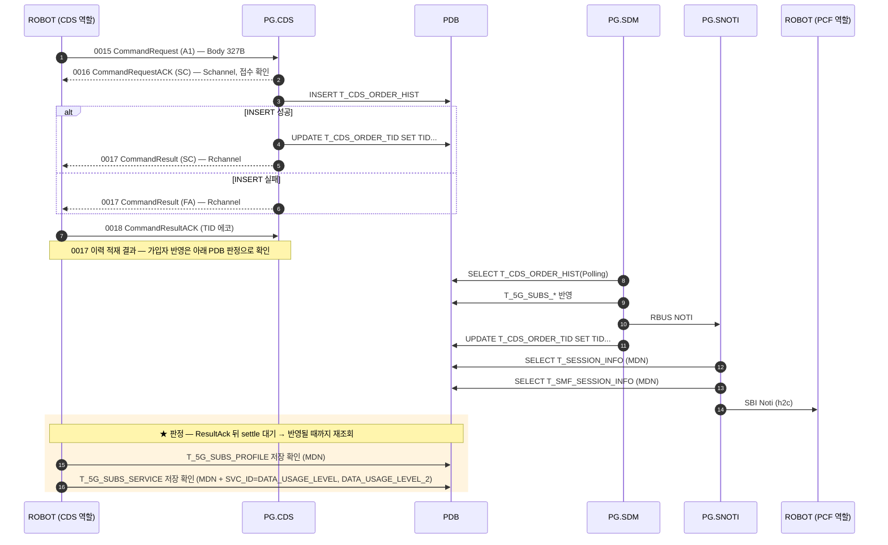

### 전문 Body 필드 — `A1`

아래 18개만 채우고 나머지는 공백이다 ([공통 규칙](#body-공통)).

| # | 필드 | 폭(B) |
|---|---|---|
| 1 | `mdn` | 12 |
| 2 | `min` | 10 |
| 3 | `prod_id` | 10 |
| 4 | `data_prod_id` | 10 |
| 5 | `network` | 8 |
| 6 | `tablet_yn` | 1 |
| 7 | `os_ver` | 2 |
| 8 | `device_model` | 4 |
| 9 | `ca` | 1 |
| 10 | `aprf` | 1 |
| 11 | `imsi` | 15 |
| 12 | `mvno` | 1 |
| 13 | `limit` | 1 |
| 14 | `ms_type` | 1 |
| 15 | `category_lte` | 2 |
| 16 | `category_5g` | 2 |
| 17 | `device_type` | 1 |
| 18 | `product_type` | 2 |

### 판정 기준 — `A1`

전문 왕복(`0016`/`0017`)으로는 판정하지 않는다 — [공통 규칙](#판정-공통) 참조.

- `T_5G_SUBS_PROFILE` (MDN) = **1건**
- `T_5G_SUBS_SERVICE` (MDN, `DATA_USAGE_LEVEL`) = **1건**
- `T_5G_SUBS_SERVICE` (MDN, `DATA_USAGE_LEVEL_2`) = **1건**

#### ⚠️ `A1` 의 알림 판정은 현재 꺼져 있다

이 코드는 `@{CDS_NOTI_EXEMPT_CODES}`(A1 / Z1)에 들어 있어 `Verify SBI Noti Sent` 가 **건너뛴다.**

그런데 위 경로 규칙(2026-08-19)대로면 이 코드도 알림이 나간다 — **두 지시가 어긋나 있다.** 규칙이 앞의 것을 대체하는 것이면 예외 목록에서 이 코드를 빼면 되고, 경로는 정해지지만 SNOTI 가 PCF 로 보내지 않는 것이면 지금이 맞다.

확인되기 전까지 **판정을 켜지 않았다** — 켜서 틀리면 TC 가 이유 없이 실패하는 쪽이라 되돌리기 어렵다.

[↑ 업무 코드 목록](#code-list)

---

## `1X` — HFC 서비스 가입

| 항목 | 값 |
|---|---|
| 업무 코드 | `1X` |
| 테스트 케이스 | `TC-CDS-003` |
| 알림 경로 | BSUBS 경유 (**무조건**) — 규칙 1 |
| 알림 판정 | `Verify SBI Noti Sent` 가 도착을 확인 |
| UPM 연동 | `0x07` 수신 → `0x08` 응답 |
| 예약 큐 적재 | 없음 |
| Body 필드 수 | 5개 / 총 327B (고정) |

> UPM `0x07` 수신 → `0x08` 응답까지 해야 완결된다.

### 콜플로우 — `1X`

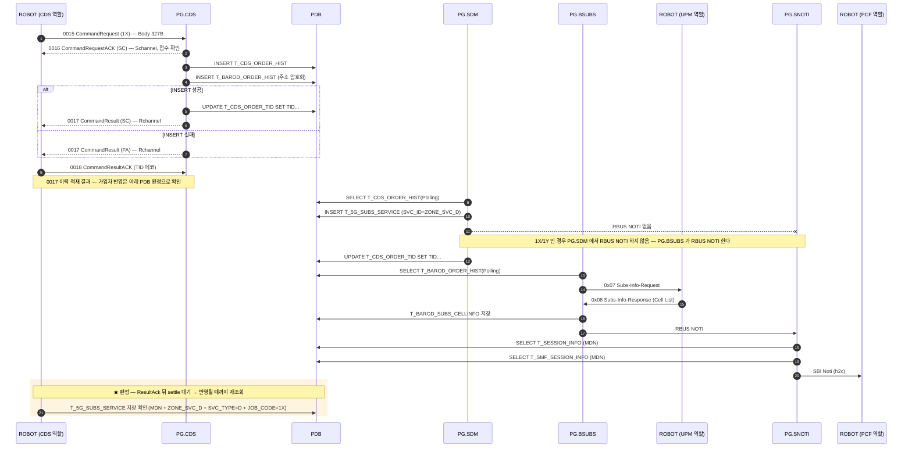

### 전문 Body 필드 — `1X`

아래 5개만 채우고 나머지는 공백이다 ([공통 규칙](#body-공통)).

| # | 필드 | 폭(B) |
|---|---|---|
| 1 | `mdn` | 12 |
| 2 | `prod_id` | 10 |
| 3 | `limit` | 1 |
| 4 | `addr` | 170 |
| 5 | `product_type` | 2 |

### 판정 기준 — `1X`

전문 왕복(`0016`/`0017`)으로는 판정하지 않는다 — [공통 규칙](#판정-공통) 참조.

- `T_5G_SUBS_SERVICE` (MDN, `ZONE_SVC_D`, `SVC_TYPE=D`, `JOB_CODE=1X`) = **1건 이상**

알림은 `Verify SBI Noti Sent 1X` 가 본다(도착 여부). 경로는 수신만으로 구분되지 않아 규칙으로 계산해 실패 메시지에 싣는다.

[↑ 업무 코드 목록](#code-list)

---

## `1Y` — HFC 서비스 해지

| 항목 | 값 |
|---|---|
| 업무 코드 | `1Y` |
| 테스트 케이스 | `TC-CDS-004` |
| 알림 경로 | BSUBS 경유 (**무조건**) — 규칙 1 |
| 알림 판정 | `Verify SBI Noti Sent` 가 도착을 확인 |
| UPM 연동 | `0x07` 수신 → `0x08` 응답 |
| 예약 큐 적재 | 없음 |
| Body 필드 수 | 3개 / 총 327B (고정) |

> 1X 과 같이 UPM 을 탄다 — 해지도 Cell 정보를 정리해야 한다.

### 콜플로우 — `1Y`

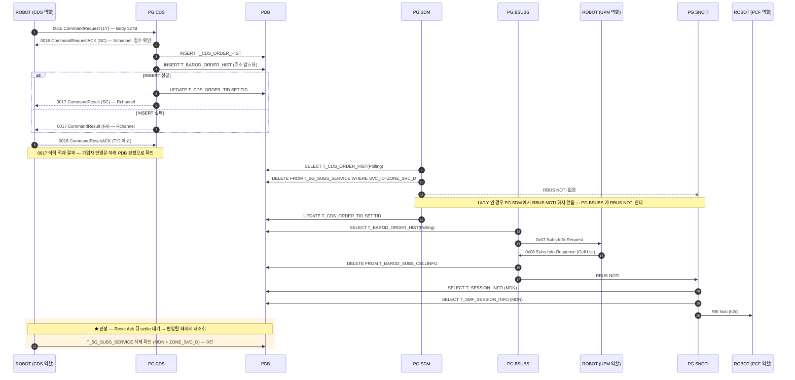

### 전문 Body 필드 — `1Y`

아래 3개만 채우고 나머지는 공백이다 ([공통 규칙](#body-공통)).

| # | 필드 | 폭(B) |
|---|---|---|
| 1 | `mdn` | 12 |
| 2 | `prod_id` | 10 |
| 3 | `product_type` | 2 |

### 판정 기준 — `1Y`

전문 왕복(`0016`/`0017`)으로는 판정하지 않는다 — [공통 규칙](#판정-공통) 참조.

- `T_5G_SUBS_SERVICE` (MDN, `ZONE_SVC_D`) = **0건** — `SVC_TYPE`/`JOB_CODE` 를 가리지 않는다(어떤 형태로든 남으면 해지가 덜 된 것)

알림은 `Verify SBI Noti Sent 1Y` 가 본다(도착 여부). 경로는 수신만으로 구분되지 않아 규칙으로 계산해 실패 메시지에 싣는다.

[↑ 업무 코드 목록](#code-list)

---

## `I2` — 부가서비스신청

| 항목 | 값 |
|---|---|
| 업무 코드 | `I2` |
| 테스트 케이스 | `TC-CDS-005` |
| 알림 경로 | SDM 경유 — 규칙 3 |
| 알림 판정 | `Verify SBI Noti Sent` 가 도착을 확인 |
| UPM 연동 | 없음 |
| 예약 큐 적재 | 없음 |
| Body 필드 수 | 8개 / 총 327B (고정) |

> `LIMIT` 은 예약어라 SQL 에서 큰따옴표로 감싼다.

### 콜플로우 — `I2`

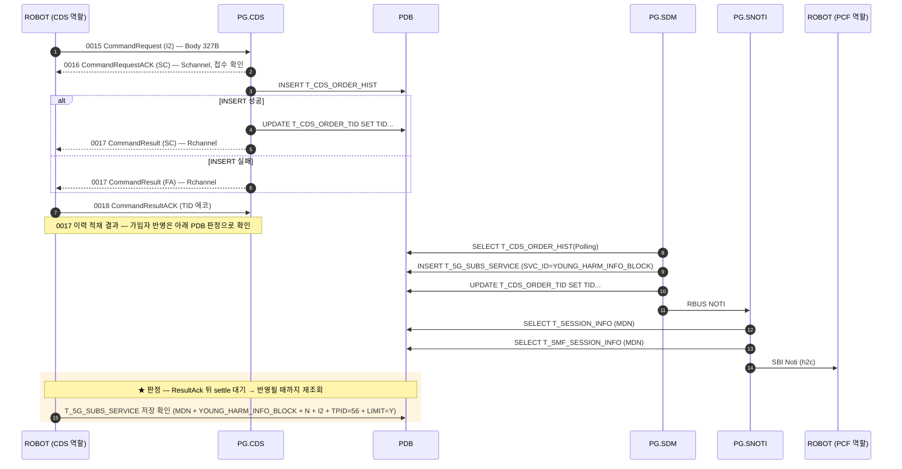

### 전문 Body 필드 — `I2`

아래 8개만 채우고 나머지는 공백이다 ([공통 규칙](#body-공통)).

| # | 필드 | 폭(B) |
|---|---|---|
| 1 | `mdn` | 12 |
| 2 | `min` | 10 |
| 3 | `prod_id` | 10 |
| 4 | `block_data_roaming_id` | 1 |
| 5 | `block_data_roaming_provider_id` | 1 |
| 6 | `block_harmful_yn` | 1 |
| 7 | `limit` | 1 |
| 8 | `product_type` | 2 |

### 판정 기준 — `I2`

전문 왕복(`0016`/`0017`)으로는 판정하지 않는다 — [공통 규칙](#판정-공통) 참조.

- `T_5G_SUBS_SERVICE` (MDN, `YOUNG_HARM_INFO_BLOCK`, `SVC_TYPE=N`, `JOB_CODE=I2`, `TIME_PERIOD_ID=56`, `"LIMIT"=Y`) = **1건 이상**

알림은 `Verify SBI Noti Sent I2` 가 본다(도착 여부). 경로는 수신만으로 구분되지 않아 규칙으로 계산해 실패 메시지에 싣는다.

[↑ 업무 코드 목록](#code-list)

---

## `I3` — 부가서비스해지

| 항목 | 값 |
|---|---|
| 업무 코드 | `I3` |
| 테스트 케이스 | `TC-CDS-006` |
| 알림 경로 | SDM 경유 — 규칙 3 |
| 알림 판정 | `Verify SBI Noti Sent` 가 도착을 확인 |
| UPM 연동 | 없음 |
| 예약 큐 적재 | 없음 |
| Body 필드 수 | 8개 / 총 327B (고정) |

### 콜플로우 — `I3`

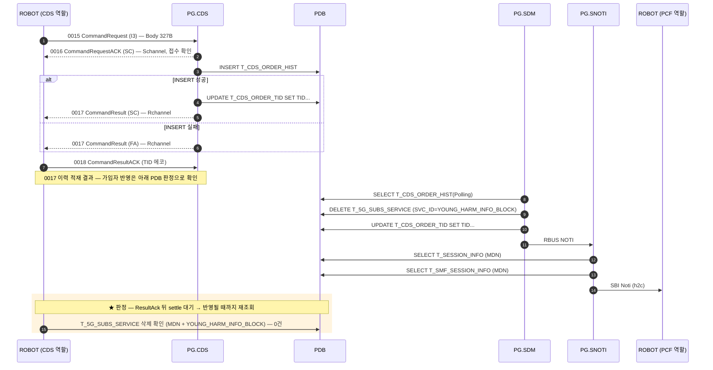

### 전문 Body 필드 — `I3`

아래 8개만 채우고 나머지는 공백이다 ([공통 규칙](#body-공통)).

| # | 필드 | 폭(B) |
|---|---|---|
| 1 | `mdn` | 12 |
| 2 | `min` | 10 |
| 3 | `prod_id` | 10 |
| 4 | `block_data_roaming_id` | 1 |
| 5 | `block_data_roaming_provider_id` | 1 |
| 6 | `block_harmful_yn` | 1 |
| 7 | `limit` | 1 |
| 8 | `product_type` | 2 |

### 판정 기준 — `I3`

전문 왕복(`0016`/`0017`)으로는 판정하지 않는다 — [공통 규칙](#판정-공통) 참조.

- `T_5G_SUBS_SERVICE` (MDN, `YOUNG_HARM_INFO_BLOCK`) = **0건**

알림은 `Verify SBI Noti Sent I3` 가 본다(도착 여부). 경로는 수신만으로 구분되지 않아 규칙으로 계산해 실패 메시지에 싣는다.

[↑ 업무 코드 목록](#code-list)

---

## `C1` — 기기변경

| 항목 | 값 |
|---|---|
| 업무 코드 | `C1` |
| 테스트 케이스 | `TC-CDS-007` |
| 알림 경로 | HFC **가입** 상태 → BSUBS / **미가입** → SDM — 규칙 2 |
| 알림 판정 | `Verify SBI Noti Sent` 가 도착을 확인 |
| UPM 연동 | 없음 |
| 예약 큐 적재 | 없음 |
| Body 필드 수 | 19개 / 총 327B (고정) |

> 전후 비교형이라 `Command Download Flow` **앞에서** 기준선을 먼저 뜬다. 레거시 구현이 `min ← mdn` 으로 채운다.

### 콜플로우 — `C1`

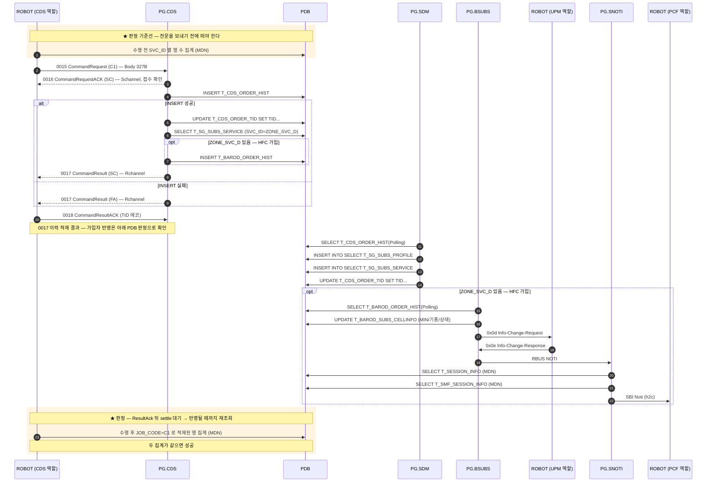

### 전문 Body 필드 — `C1`

아래 19개만 채우고 나머지는 공백이다 ([공통 규칙](#body-공통)).

| # | 필드 | 폭(B) |
|---|---|---|
| 1 | `mdn` | 12 |
| 2 | `min` | 10 |
| 3 | `new_min` | 10 |
| 4 | `prod_id` | 10 |
| 5 | `data_prod_id` | 10 |
| 6 | `network` | 8 |
| 7 | `tablet_yn` | 1 |
| 8 | `os_ver` | 2 |
| 9 | `device_model` | 4 |
| 10 | `ca` | 1 |
| 11 | `aprf` | 1 |
| 12 | `imsi` | 15 |
| 13 | `mvno` | 1 |
| 14 | `limit` | 1 |
| 15 | `ms_type` | 1 |
| 16 | `category_lte` | 2 |
| 17 | `category_5g` | 2 |
| 18 | `device_type` | 1 |
| 19 | `product_type` | 2 |

### 판정 기준 — `C1`

전문 왕복(`0016`/`0017`)으로는 판정하지 않는다 — [공통 규칙](#판정-공통) 참조.

- 수행 **전** `SVC_ID` 별 행 수 == 수행 **후** `JOB_CODE=C1` 로 적재된 행의 집계

알림은 `Verify SBI Noti Sent C1` 가 본다(도착 여부). 경로는 수신만으로 구분되지 않아 규칙으로 계산해 실패 메시지에 싣는다.

[↑ 업무 코드 목록](#code-list)

---

## `G1` — 정보변경

| 항목 | 값 |
|---|---|
| 업무 코드 | `G1` |
| 테스트 케이스 | `TC-CDS-008` |
| 알림 경로 | HFC **가입** 상태 → BSUBS / **미가입** → SDM — 규칙 2 |
| 알림 판정 | `Verify SBI Noti Sent` 가 도착을 확인 |
| UPM 연동 | 없음 |
| 예약 큐 적재 | 없음 |
| Body 필드 수 | 18개 / 총 327B (고정) |

> 필드 집합이 A1 과 완전히 같다(2026-08-03 확인).

### 콜플로우 — `G1`

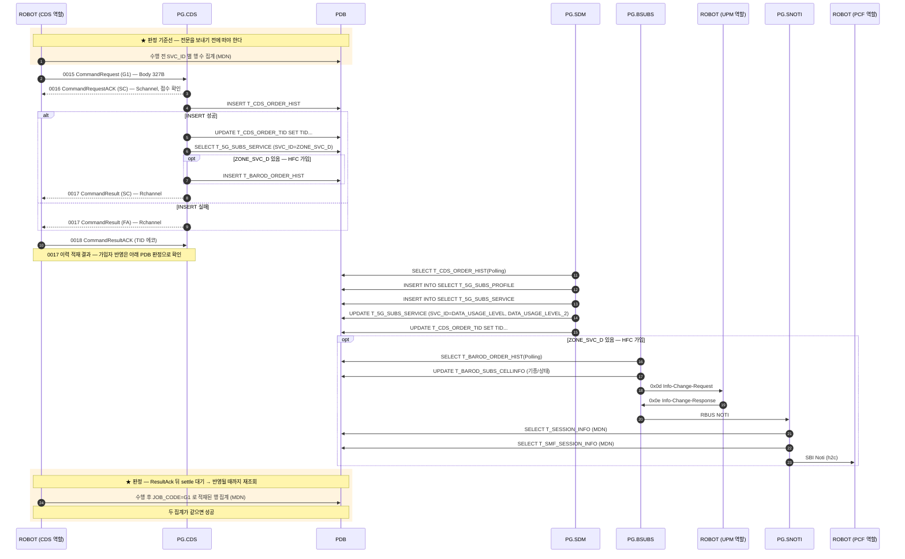

### 전문 Body 필드 — `G1`

아래 18개만 채우고 나머지는 공백이다 ([공통 규칙](#body-공통)).

| # | 필드 | 폭(B) |
|---|---|---|
| 1 | `mdn` | 12 |
| 2 | `min` | 10 |
| 3 | `prod_id` | 10 |
| 4 | `data_prod_id` | 10 |
| 5 | `network` | 8 |
| 6 | `tablet_yn` | 1 |
| 7 | `os_ver` | 2 |
| 8 | `device_model` | 4 |
| 9 | `ca` | 1 |
| 10 | `aprf` | 1 |
| 11 | `imsi` | 15 |
| 12 | `mvno` | 1 |
| 13 | `limit` | 1 |
| 14 | `ms_type` | 1 |
| 15 | `category_lte` | 2 |
| 16 | `category_5g` | 2 |
| 17 | `device_type` | 1 |
| 18 | `product_type` | 2 |

### 판정 기준 — `G1`

전문 왕복(`0016`/`0017`)으로는 판정하지 않는다 — [공통 규칙](#판정-공통) 참조.

- 수행 **전** `SVC_ID` 별 행 수 == 수행 **후** `JOB_CODE=G1` 로 적재된 행의 집계

알림은 `Verify SBI Noti Sent G1` 가 본다(도착 여부). 경로는 수신만으로 구분되지 않아 규칙으로 계산해 실패 메시지에 싣는다.

[↑ 업무 코드 목록](#code-list)

---

## `K1` — Data(Time) 쿠폰 가입

| 항목 | 값 |
|---|---|
| 업무 코드 | `K1` |
| 테스트 케이스 | `TC-CDS-009 / 011` |
| 알림 경로 | SDM 경유 — 규칙 3 |
| 알림 판정 | `Verify SBI Noti Sent` 가 도착을 확인 |
| UPM 연동 | 없음 |
| 예약 큐 적재 | 있음 |
| Body 필드 수 | 6개 / 총 327B (고정) |

> 가입과 동시에 만료 예약이 걸린다. **인입 코드(K1)와 예약 코드(K3)가 다르다.** K3 는 CDS 가 보내는 전문이 아니다 — 쿠폰 만료 시각이 되면 **PG.RDS 가 예약 큐를 보고 스스로 만든다.** 그래서 K3 는 시트가 없다. 만료까지 보는 것이 `TC-CDS-011` 로, 전문을 보내지 않고 RDS 가 지울 때까지 기다린다. `START_TIME` 은 반드시 미래여야 한다 — 과거면 가입 직후 만료돼 판정이 실패한다.

### 콜플로우 — `K1`

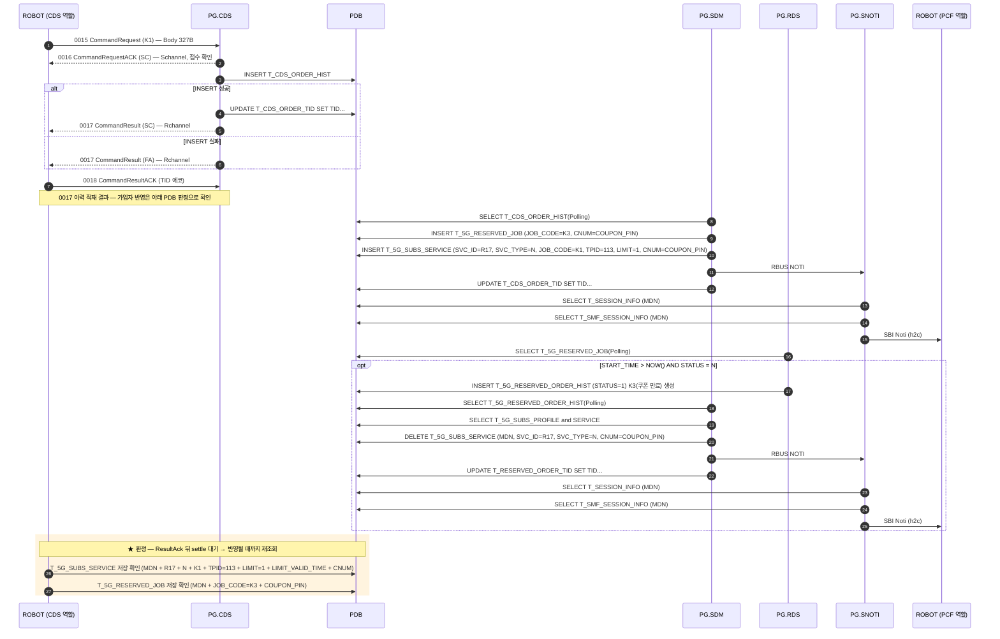

### 전문 Body 필드 — `K1`

아래 6개만 채우고 나머지는 공백이다 ([공통 규칙](#body-공통)).

| # | 필드 | 폭(B) |
|---|---|---|
| 1 | `mdn` | 12 |
| 2 | `limit` | 1 |
| 3 | `start_time` | 12 |
| 4 | `coupon_type` | 2 |
| 5 | `coupon_pin` | 11 |
| 6 | `coupon_category` | 1 |

### 판정 기준 — `K1`

전문 왕복(`0016`/`0017`)으로는 판정하지 않는다 — [공통 규칙](#판정-공통) 참조.

- `T_5G_SUBS_SERVICE` (MDN, `R17`, `SVC_TYPE=N`, `JOB_CODE=K1`, `TIME_PERIOD_ID=113`, `"LIMIT"=1`, `LIMIT_VALID_TIME`, `CNUM=COUPON_PIN`) = **1건 이상**
- `T_5G_RESERVED_JOB` (MDN, `JOB_CODE=K3`, COUPON_PIN) = **1건 이상**

알림은 `Verify SBI Noti Sent K1` 가 본다(도착 여부). 경로는 수신만으로 구분되지 않아 규칙으로 계산해 실패 메시지에 싣는다.

[↑ 업무 코드 목록](#code-list)

---

## `K2` — Data(Time) 쿠폰 해지

| 항목 | 값 |
|---|---|
| 업무 코드 | `K2` |
| 테스트 케이스 | `TC-CDS-010` |
| 알림 경로 | SDM 경유 — 규칙 3 |
| 알림 판정 | `Verify SBI Noti Sent` 가 도착을 확인 |
| UPM 연동 | 없음 |
| 예약 큐 적재 | 없음 |
| Body 필드 수 | 3개 / 총 327B (고정) |

> K2/K3/K4/K6 은 판정 기준이 **글자 그대로 같다** — 서로 구분되지 않으므로 핀을 업무별로 나눠 쓴다.

### 콜플로우 — `K2`

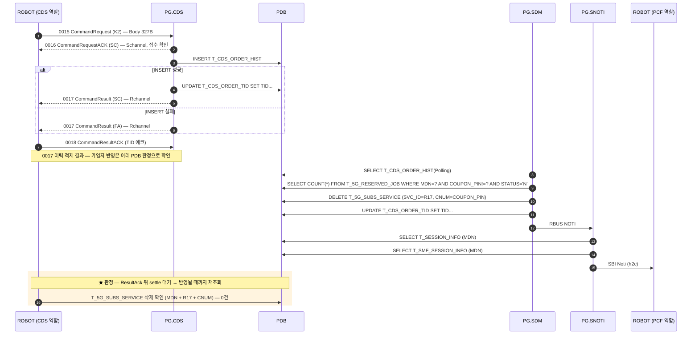

### 전문 Body 필드 — `K2`

아래 3개만 채우고 나머지는 공백이다 ([공통 규칙](#body-공통)).

| # | 필드 | 폭(B) |
|---|---|---|
| 1 | `mdn` | 12 |
| 2 | `limit` | 1 |
| 3 | `coupon_pin` | 11 |

### 판정 기준 — `K2`

전문 왕복(`0016`/`0017`)으로는 판정하지 않는다 — [공통 규칙](#판정-공통) 참조.

- `T_5G_SUBS_SERVICE` (MDN, `R17`, `CNUM=K1 의 COUPON_PIN`) = **0건**

알림은 `Verify SBI Noti Sent K2` 가 본다(도착 여부). 경로는 수신만으로 구분되지 않아 규칙으로 계산해 실패 메시지에 싣는다.

[↑ 업무 코드 목록](#code-list)

---

## `D3` — 번호변경

| 항목 | 값 |
|---|---|
| 업무 코드 | `D3` |
| 테스트 케이스 | `TC-CDS-012` |
| 알림 경로 | HFC **가입** 상태 → BSUBS / **미가입** → SDM — 규칙 2 |
| 알림 판정 | `Verify SBI Noti Sent` 가 도착을 확인 |
| UPM 연동 | 없음 |
| 예약 큐 적재 | 없음 |
| Body 필드 수 | 19개 / 총 327B (고정) |

> 성공하면 `${CDS_ACTIVE_MDN}` 을 새 번호로 갱신한다 → 뒤의 Z1 이 그 번호로 해지한다.

### 콜플로우 — `D3`

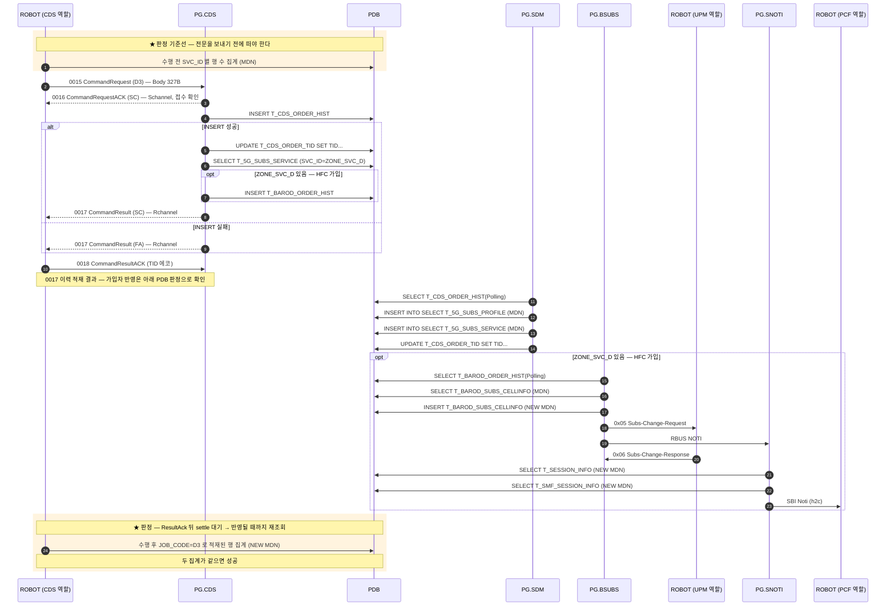

### 전문 Body 필드 — `D3`

아래 19개만 채우고 나머지는 공백이다 ([공통 규칙](#body-공통)).

| # | 필드 | 폭(B) |
|---|---|---|
| 1 | `mdn` | 12 |
| 2 | `new_mdn` | 12 |
| 3 | `min` | 10 |
| 4 | `new_min` | 10 |
| 5 | `prod_id` | 10 |
| 6 | `data_prod_id` | 10 |
| 7 | `network` | 8 |
| 8 | `tablet_yn` | 1 |
| 9 | `os_ver` | 2 |
| 10 | `device_model` | 4 |
| 11 | `ca` | 1 |
| 12 | `aprf` | 1 |
| 13 | `imsi` | 15 |
| 14 | `mvno` | 1 |
| 15 | `limit` | 1 |
| 16 | `category_lte` | 2 |
| 17 | `category_5g` | 2 |
| 18 | `device_type` | 1 |
| 19 | `product_type` | 2 |

### 판정 기준 — `D3`

전문 왕복(`0016`/`0017`)으로는 판정하지 않는다 — [공통 규칙](#판정-공통) 참조.

- 수행 **전**(옛 번호) `SVC_ID` 별 행 수 == 수행 **후**(새 번호, `JOB_CODE=D3`) 집계

알림은 `Verify SBI Noti Sent D3` 가 본다(도착 여부). 경로는 수신만으로 구분되지 않아 규칙으로 계산해 실패 메시지에 싣는다.

[↑ 업무 코드 목록](#code-list)

---

## `Z1` — 가입해지

| 항목 | 값 |
|---|---|
| 업무 코드 | `Z1` |
| 테스트 케이스 | `TC-CDS-013` |
| 알림 경로 | HFC **가입** 상태 → BSUBS / **미가입** → SDM — 규칙 2 |
| 알림 판정 | **건너뜀** — 예외 목록에 있음 (아래 ⚠️) |
| UPM 연동 | 없음 |
| 예약 큐 적재 | 없음 |
| Body 필드 수 | 16개 / 총 327B (고정) |

> 체인의 끝. **가입한 적이 없어도 통과한다** — 0건은 "지워졌다"와 "원래 없었다"를 구분하지 못한다. HFC(`ZONE_SVC_D`)가 붙어 있으면 **Cell 정리가 딸려 온다** — BSUBS 가 CellList 를 지운 뒤에야 가입자 테이블이 정리된다.

### 콜플로우 — `Z1`

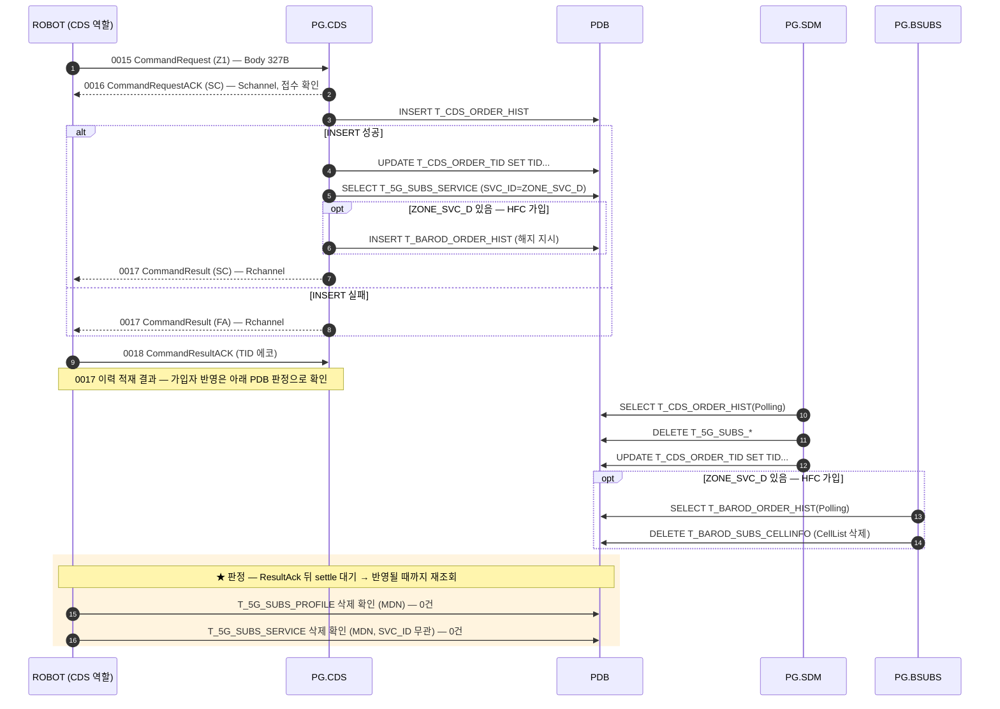

### 전문 Body 필드 — `Z1`

아래 16개만 채우고 나머지는 공백이다 ([공통 규칙](#body-공통)).

| # | 필드 | 폭(B) |
|---|---|---|
| 1 | `mdn` | 12 |
| 2 | `prod_id` | 10 |
| 3 | `network` | 8 |
| 4 | `tablet_yn` | 1 |
| 5 | `os_ver` | 2 |
| 6 | `device_model` | 4 |
| 7 | `ca` | 1 |
| 8 | `aprf` | 1 |
| 9 | `imsi` | 15 |
| 10 | `mvno` | 1 |
| 11 | `limit` | 1 |
| 12 | `ms_type` | 1 |
| 13 | `category_lte` | 2 |
| 14 | `category_5g` | 2 |
| 15 | `device_type` | 1 |
| 16 | `product_type` | 2 |

### 판정 기준 — `Z1`

전문 왕복(`0016`/`0017`)으로는 판정하지 않는다 — [공통 규칙](#판정-공통) 참조.

- `T_5G_SUBS_PROFILE` (MDN) = **0건**
- `T_5G_SUBS_SERVICE` (MDN, `SVC_ID` 무관) = **0건**

#### ⚠️ `Z1` 의 알림 판정은 현재 꺼져 있다

이 코드는 `@{CDS_NOTI_EXEMPT_CODES}`(A1 / Z1)에 들어 있어 `Verify SBI Noti Sent` 가 **건너뛴다.**

그런데 위 경로 규칙(2026-08-19)대로면 이 코드도 알림이 나간다 — **두 지시가 어긋나 있다.** 규칙이 앞의 것을 대체하는 것이면 예외 목록에서 이 코드를 빼면 되고, 경로는 정해지지만 SNOTI 가 PCF 로 보내지 않는 것이면 지금이 맞다.

확인되기 전까지 **판정을 켜지 않았다** — 켜서 틀리면 TC 가 이유 없이 실패하는 쪽이라 되돌리기 어렵다.

[↑ 업무 코드 목록](#code-list)

---

## 그 밖의 문서

- [../nodes/CDS.md](../nodes/CDS.md) — CDS 노드 스펙 (인코딩 표, 함정, LTE/SA 차이)
- `tests/cds/cds_tests.robot` — 위 표의 TC 들
- `resources/CdsHelper.py` — `_fill_command_fields()` (필드 집합의 출처)
