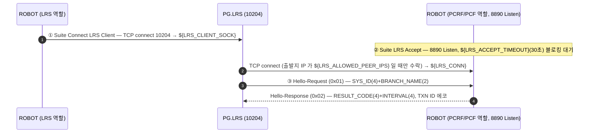
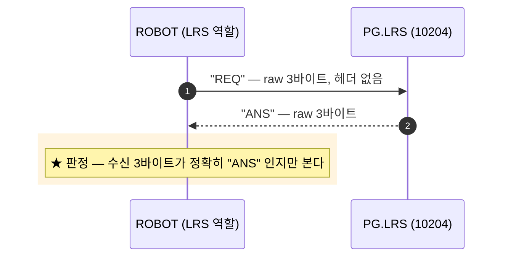
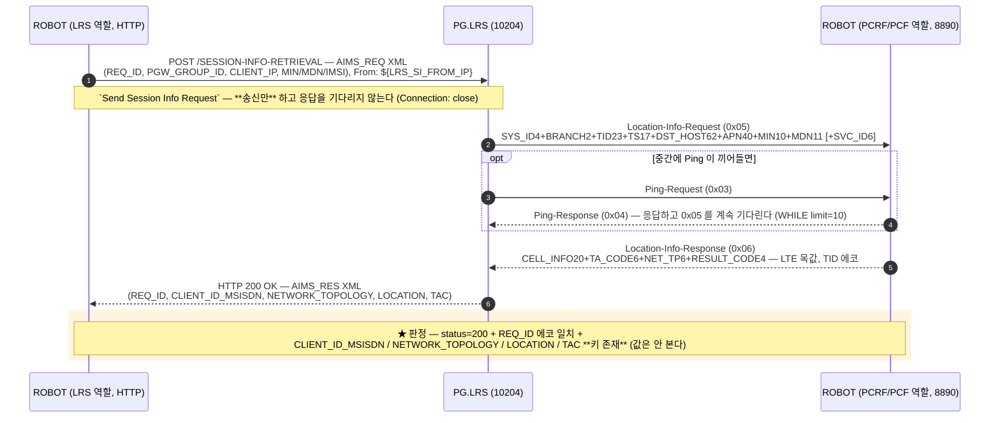

# LRS — 세션 정보 조회 (PG.LRS)

| 항목 | 값 |
|---|---|
| 주 채널 | **LRS (Client)** → PG.LRS:`${LRS_CLIENT_DEFAULT_PORT}`(10204) — raw TCP `REQ`/`ANS` + HTTP/1.1 XML |
| 곁채널 | **PCRF/PCF (Server)** — 도구가 `${LRS_SERVER_PORT}`(8890) Listen, PG.LRS 가 접속 |
| 곁채널 프로토콜 | 8-옥텟 헤더 + 고정길이 ASCII Body — **모두 PG 가 먼저 보낸다** (0x01/0x03/0x05) |
| 판정 | **PDB 없음** — HTTP status + `AIMS_RES` 필드 존재 + `REQ_ID` 에코가 전부 |
| TC | `TC-LRS-001`(Health Check) / `TC-LRS-002`(Session-Info). negative 6건은 주석 |

> ⚠ **같은 포트(10204)에서 프로토콜이 둘이다** — 헤더 없는 raw 3바이트(`REQ`/`ANS`)와
> HTTP/1.1 이 한 포트에 섞여 있다. 그리고 곁채널(8890)은 **NAG 슈트가 쓰는 것과 같은
> 채널**이다 — Session-Info 의 곁채널 왕복은 `TC-NAG-007` 과 완전히 같은 패턴이다
> ([nag_callflow.md](nag_callflow.md#콜플로우--③--subs-cellid-adot-tc-nag-007--이-노드의-핵심)).

## PG 프로세스 목록

슈트를 돌리기 전에 기동을 확인한다. 이름은 `/PG/CFG/ST.cfg` 기준이다.

| 프로세스 | 다이어그램의 참여자 | 하는 일 |
|---|---|---|
| `G_LRS201` | `PG.LRS` | 10204(raw `REQ`/`ANS` + HTTP) 수신, 8890 곁채널로 역접속 |

**두 채널이 이 프로세스 하나에 걸려 있다.** 그래서 안 떠 있으면 Suite Setup 이
8890 대기 30초를 채우고 슈트가 서는 것 말고 다른 증상이 없다 — 실패 메시지가
도구 쪽(`Suite LRS Accept` 타임아웃)을 가리켜 헤매기 쉽다.

`ST.cfg` 에 `A_LRS201`(40060)이 `G_LRS201`(40061)과 쌍으로 있다. `A_` 쪽이 이 흐름에
관여하는지는 **미확인**이라 위 표에 넣지 않았다.

## Suite Setup — 듀얼 소켓

30초 안에 PG 가 8890 에 붙지 않으면 Setup 이 실패해 **슈트 전체가 선다** — Health Check 만
돌리고 싶어도 마찬가지다. 운용자가 그 윈도우 안에 PG 접속을 준비해야 한다.

> ★ 붙지 않으면 [`G_LRS201` 기동](#pg-프로세스-목록)부터 본다.

> 곁채널 헤더 Byte0 은 표준 LRS 의 `0x20` 이 아니라 **`0x00`** 이다 — PG 가 0x05 를
> Byte0=0x00 으로 보내는 것을 로그로 확인해 도구도 `${LRS_TX_BYTE0}=0` 으로 맞췄다
> (NAG 슈트와 동일, NAG-Barod 계열).

## 콜플로우 ① — Health Check (`TC-LRS-001`)

주기 기본 30초(`${LRS_HC_DEFAULT_INTERVAL}`, `PG_V2.cfg` 에서 읽되 미수신 시 기본값).
`Send LRS Ping` 도 같은 REQ→ANS 1회다 — 지속 소켓의 keepalive 용도일 뿐 별도 opcode 가 없다.

## 콜플로우 ② — Session-Info (`TC-LRS-002`) ★ 이 노드의 핵심

두 채널이 **교차**한다. 스레드가 없으므로 HTTP 송신과 수신을 갈라 놓고, 그 사이에
곁채널 왕복(`Handle LRS Location Info`)을 끼워 넣는다.

0x06 이 나가야 PG 가 LOCATION/TAC 를 채워 200 을 준다 — 곁채널이 죽어 있으면 이 TC 는
HTTP 타임아웃으로 실패한다.

### ⚠ 판정 한계 — 위치 값은 도구가 준 목값에서 온다

`0x06` 에 싣는 위치는 도구의 **LTE 목값**이다(`${LRS_MOCK_CELL_INFO_LTE}`=`1048575:63`,
`${LRS_MOCK_TA_CODE_LTE}`=`3113`, `${LRS_MOCK_NET_TP_LTE}`=`L`). PG 는 그것을 가공해
`AIMS_RES` 에 되돌려줄 뿐이므로 이 TC 가 보는 것은 **PG 의 중계·조립 정확성**이다 —
실제 망 위치 조회를 검증하지 않는다. 게다가 슈트는 LOCATION/TAC 의 **존재만** 확인하고
값 비교를 하지 않으므로, 목값과 다른 값이 와도 통과한다.

### HTTP 에러 코드 — 전부 주석 TC

404(세션 없음) / 403(`From` IP 미등록 — `${LRS_SI_FROM_IP}` 는 PG 에 등록된 IP 여야 한다) /
400 / 500 / 601(RAA 에러) / 602(RAA Timeout). **실 PG 가 해당 상태를 유발해야** 도는
TC 라 6건 모두 주석 처리돼 있다(`TC-LRS-SI-002`~`007`).

## 판정 기준

PDB 조회가 없다. 볼 수 있는 것은 응답뿐이다.

| 계층 | 확인 대상 | 걸린 TC |
|---|---|---|
| 프로토콜 | raw 응답 = `"ANS"` | 001 |
| 프로토콜 | HTTP status = 200 | 002 |
| 업무 | `REQ_ID` 에코 일치 | 002 |
| 업무 | `CLIENT_ID_MSISDN` / `NETWORK_TOPOLOGY` / `LOCATION` / `TAC` 키 존재 | 002 |
| 곁채널 | 0x05 수신 자체 + TXN ID 에코 회신 — 안 하면 002 가 타임아웃 | 002 |

## 함정

- **PG 쪽 [`G_LRS201`](#pg-프로세스-목록) 이 떠 있어야 한다** — 안 떠 있을 때의 증상이
  도구 쪽 타임아웃으로 보인다.
- **`Check LRS Client Socket`(Test Setup)은 10204 만 본다** — 곁채널(`${LRS_CONN}`)이
  끊겨도 `TC-LRS-002` 가 0x05 를 기다리다 타임아웃 날 때까지 모른다 (NAG 와 같은 구조).
- `Suite LRS Accept` 키워드의 Documentation 은 "Hello 처리는 TC-LRS-001 에서 수행"
  이라 적혀 있지만 **낡았다** — 실제로는 Suite Setup 세 번째 단계(`Handle LRS Hello`)가
  처리하고, TC-LRS-001 은 Health Check 다.
- `lrs_variables.robot` 다수 변수에 `# TODO: 실환경` 이 붙어 있다 — 운영 PG 대상으로는
  실제 환경값 교체가 먼저다 ([nodes/LRS.md](../nodes/LRS.md#확인-필요)).
- `0x05` 는 PCF ZONE / UPM Subs-Change 와 opcode 가 겹친다 — `${MSG_LOC_INFO_REQ}` 를 쓸 것.

## 관련 문서

- [LRS 노드 스펙](../nodes/LRS.md) — 채널 구조, 메시지 타입, HTTP 응답 코드
- [nag_callflow.md](nag_callflow.md) — 같은 8890 곁채널을 쓰는 NAG Subs-Cellid 흐름
- `tests/lrs/lrs_tests.robot` — `TC-LRS-001`~`002` (활성) / SI-002~007 (주석)
- `resources/lrs_client_keywords.robot`(10204 쪽) · `resources/lrs_keywords.robot`(8890 쪽)
