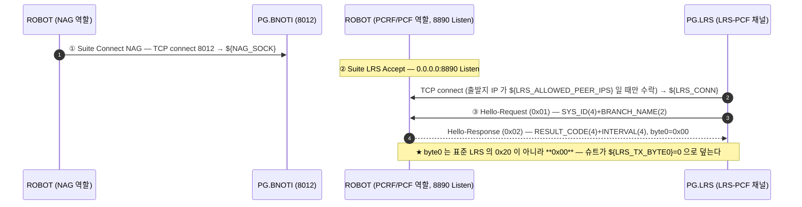
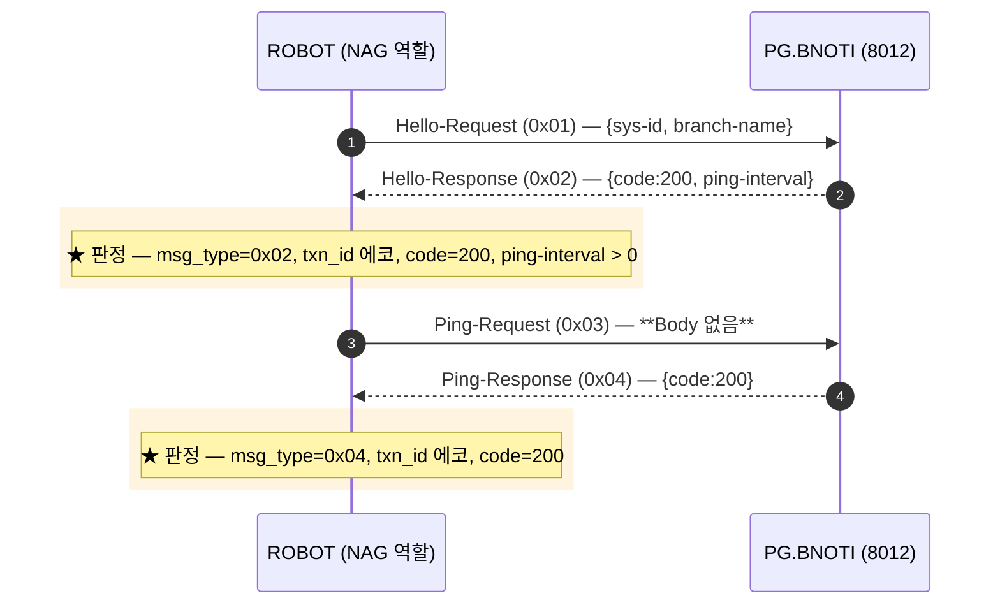
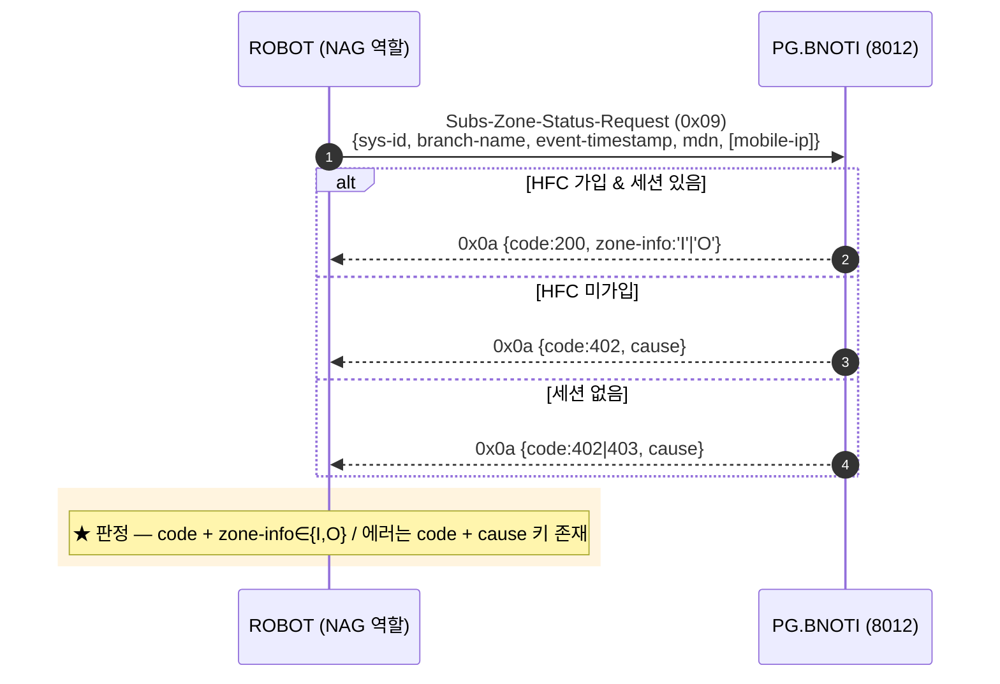
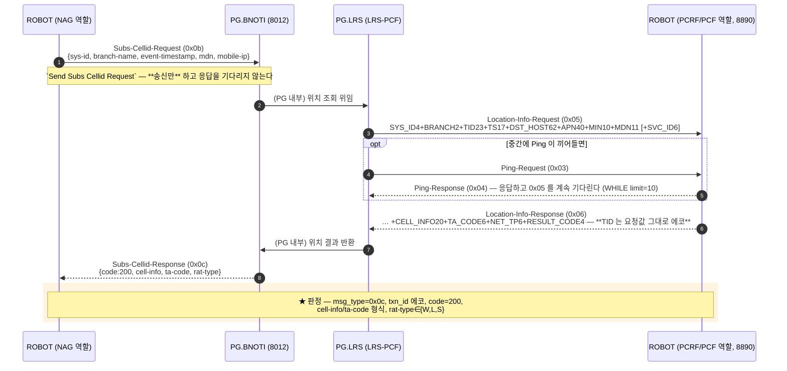
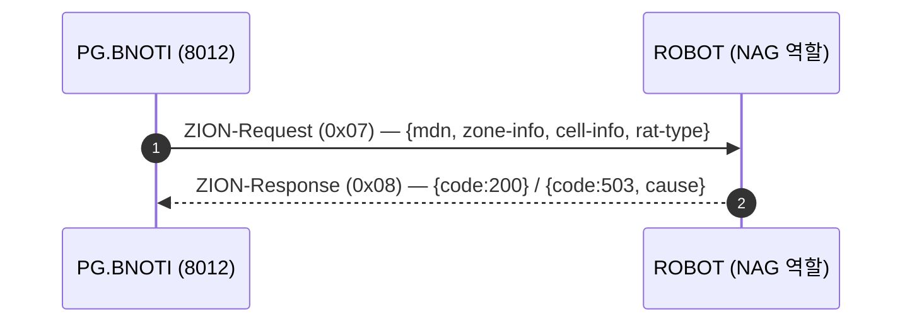

# NAG — HFC/ADOT 존·셀 조회 (PG-SC)

| 항목 | 값 |
|---|---|
| 도구 역할 | **NAG (Client)** → PG.BNOTI:`${NAG_PG_PORT}`(8012) — 주 채널 |
| 곁채널 | **PCRF/PCF (Server)** — 도구가 `${LRS_SERVER_PORT}`(8890) Listen, PG.LRS 가 접속 |
| 헤더 | 8B 공통 (`byte0` `msg_type` `body_length`(2, htons) `txn_id`(4, htonl)) |
| Body | 주 채널 = **JSON** / 곁채널 = **고정길이 ASCII** |
| 주력 메시지 | `0x09` Subs-Zone-Status · `0x0b` Subs-Cellid(ADOT) |
| 판정 | **PDB 없음** — 응답 `code` + `txn_id` 에코 + JSON 필드 형식이 전부 |
| TC | `TC-NAG-001`~`007` (7건). `0x07/0x08` ZION 은 주석 처리 |

> ⚠ **이 노드는 소켓이 두 개다.** `0x0b` Subs-Cellid 는 주 채널 왕복만으로 끝나지 않는다 —
> PG 가 곁채널로 `0x05` 를 되물어 오고, 도구가 `0x06` 으로 답해야 비로소 `0x0c` 가 온다.
> 그래서 Suite Setup 이 **두 소켓 + 곁채널 Hello 까지** 끝내 둔다.

## PG 프로세스 목록

**셋 다 떠 있어야 슈트가 선다(사용자 확인).** 두 소켓을 각각 다른 프로세스가 쥐고,
가입자를 만드는 `PG.CDS` 는 그보다 앞서 떠 있어야 한다.

| 프로세스 | 다이어그램의 참여자 | 담당 | 기동 플래그 |
|---|---|---|---|
| `G_BNOTI201` | `PG.BNOTI` | **주 채널 8012** — Hello/Ping, `0x09` Subs-Zone-Status, `0x0b` Subs-Cellid, `0x07` ZION 발신 | `/PG/BIN/PDB_RUN/G_BNOTI201.RUN` |
| `G_LRS201` | `PG.LRS` | **곁채널 8890** — 도구에 역접속해 `0x05` Location-Info 를 되묻는다 | `/PG/BIN/PDB_RUN/G_LRS201.RUN` |
| `CDS201` | `PG.CDS` | **사전 기동 필수** — 전문 수신·가입자 적재 | `/PG/BIN/PDB_RUN/CDS201.RUN` |

`/PG/BIN/PDB_RUN/<프로세스>.RUN` 은 **0바이트 플래그 파일**이다 — 내용이 아니라
있고 없음이 의미를 갖는다(같은 디렉토리에 `RDS601.RUN` `G_ZONE201.RUN` 등이 같은 형태로 있다).

### 어느 것이 죽었는지 증상으로 가르기

이 슈트는 **Suite Setup 이 두 프로세스를 다 거치므로**, 하나만 죽어도 TC 가 한 건도
돌지 않는다. 실패 지점이 다르니 그걸로 가른다.

| 증상 | 의심 |
|---|---|
| `Suite LRS Accept` 가 30초를 채우고 슈트가 섬 | **`G_LRS201`** — 8890 에 붙어 오지 않는다 |
| 소켓은 붙는데 `TC-NAG-001` Hello 가 `9999 Inactive Status` | **`G_BNOTI201`** — 떠 있어도 Standby 면 같은 응답이다 |
| `TC-NAG-007` 만 곁채널 `0x05` 를 기다리다 타임아웃 | **`G_LRS201`** — Setup 은 지났는데 중간에 끊긴 경우 |

2026-08-27 실행이 첫 줄에 해당했다 — 8890 대기 30초를 채우고 7건 전부 Suite Setup
실패로 떨어졌다. 같은 PG 의 `0x01` Hello 도 `9999 Inactive Status` 였다.

## Suite Setup — 듀얼 소켓

**NAG Hello(0x01)는 Suite Setup 이 하지 않는다** — `TC-NAG-001` 이 직접 보낸다. 다른 슈트와 다른 점이다.
곁채널 Hello 만 Setup 에서 처리한다(PG 가 먼저 보내오므로 안 받으면 이후가 막힌다).

## 콜플로우 ① — Hello / Ping (`TC-NAG-001` `002`)

`ping-interval` 은 값만 받아 두고 **주기 Ping 은 돌리지 않는다** — 슈트가 짧아 세션이 안 끊긴다는 전제다.

## 콜플로우 ② — Subs-Zone-Status (`TC-NAG-003`~`006`)

`mobile-ip` 는 Optional 이다 — `TC-NAG-004` 가 빼고 보내 그대로 성공하는지만 본다.
MDN 은 케이스별 전용 변수를 쓴다: `${TEST_MDN_NORMAL}` / `${TEST_MDN_NO_SS}`(미가입) / `${TEST_MDN_NO_SESSION}`(세션 없음).

> `TC-NAG-006` 은 402 **또는** 403 을 통과시킨다. 규격상 403(세션 없음)이 맞지만 실제 PG 가
> 402 를 주는 경우가 있어 둘 다 받는다 — 어느 쪽이 맞는지는 **확인 필요**.

## 콜플로우 ③ — Subs-Cellid ADOT (`TC-NAG-007`) ★ 이 노드의 핵심

두 소켓이 **교차**한다. 리포에 스레드가 없으므로 송신과 수신을 갈라 놓고,
그 사이에 곁채널 왕복을 끼워 넣는 방식으로 처리한다.

Body 폭이 **169B(SERVICE_ID 없음) / 175B(있음)** 두 가지다 — 수신 길이로 갈라 언팩한다
(SBI 경유 5G 세션은 SERVICE_ID 를 안 실어 보낸다).

### ⚠ 판정 한계 — 되돌아온 값은 도구가 준 값이다

`0x06` 에 실어 보내는 `cell-info`/`ta-code`/`rat-type` 은 **도구의 목값**이다
(`${LRS_MOCK_CELL_INFO_LTE}`=`1048575:63`, `${LRS_MOCK_TA_CODE_LTE}`=`3113`, `${LRS_MOCK_NET_TP_LTE}`=`L`).
PG 는 그것을 `0x0c` 로 되돌려줄 뿐이므로, `TC-NAG-007` 의 필드 검증은 **PG 의 중계 정확성**만 본다 —
실제 망에서 셀을 제대로 찾아왔는지는 검증하지 않는다. 값이 목값과 다르게 오면 그게 오히려 이상 신호다.

## 콜플로우 ④ — ZION (PG → NAG, **현재 비활성**)

`TC-NAG-014`~`016` 은 **주석 처리**돼 있다 — PG 쪽에서 실제 ZION 이벤트가 나야 도는 TC 라
자동 실행에 넣으면 수신 대기에서 슈트가 멎는다. 되살리려면 이벤트를 유발할 수단이 먼저 필요하다.

## 판정 기준

PDB 조회가 없다. 볼 수 있는 것은 응답 전문뿐이다.

| 계층 | 확인 대상 | 걸린 TC |
|---|---|---|
| 프로토콜 | `msg_type` (0x02/0x04/0x0a/0x0c) | 001 · 002 · 003 · 007 |
| 프로토콜 | `txn_id` 에코 | 001 · 002 · 003 · 007 |
| 업무 | `code` = 200 / 402 / 402·403 | 전 TC |
| 업무 | `zone-info`∈{I,O} · `cell-info` · `ta-code` · `rat-type`∈{W,L,S} | 003 · 007 |
| 에러 | `cause` 키 존재 (값은 안 본다) | 005 · 006 |

`TC-NAG-004`/`005`/`006` 은 **`txn_id` 에코를 확인하지 않는다** — 응답 body 만 본다.

## 함정

- **곁채널 닫힘을 감지하지 못한다.** `Check NAG Socket`(Test Setup)은 `${NAG_SOCK}` 만 본다.
  `${LRS_CONN}` 이 끊겨도 `TC-NAG-007` 이 실제로 `0x05` 를 기다리다 타임아웃 날 때까지 모른다.
- `Tcp.Is Connected` 는 **로컬 fd 만** 본다. PG 가 끊어도 통과한다.
- `Suite LRS Accept` 는 `${LRS_ACCEPT_TIMEOUT}`(30초) 안에 PG 가 안 붙으면 Setup 이 실패해
  **슈트 전체가 선다** — Subs-Cellid 를 안 돌릴 때도 마찬가지다.
- `0x07`·`0x09`·`0x0b` 는 다른 노드에서 다른 의미다. 숫자를 직접 쓰지 말고 `${MSG_*}` 를 쓸 것
  ([opcode 충돌표](../INTERFACES.md#opcode-충돌--노드별-상수명을-그대로-써라)).

## 관련 문서

- [NAG 노드 스펙](../nodes/NAG.md) — 접속·메시지 타입·응답 코드
- [LRS 노드 스펙](../nodes/LRS.md) — 곁채널(LRS-PCF)의 클라이언트 모드 쪽 스펙
- `tests/nag/nag_tests.robot` — `TC-NAG-001`~`007`
- `resources/nag_keywords.robot` · `resources/lrs_keywords.robot` — 주 채널 / 곁채널 구현
