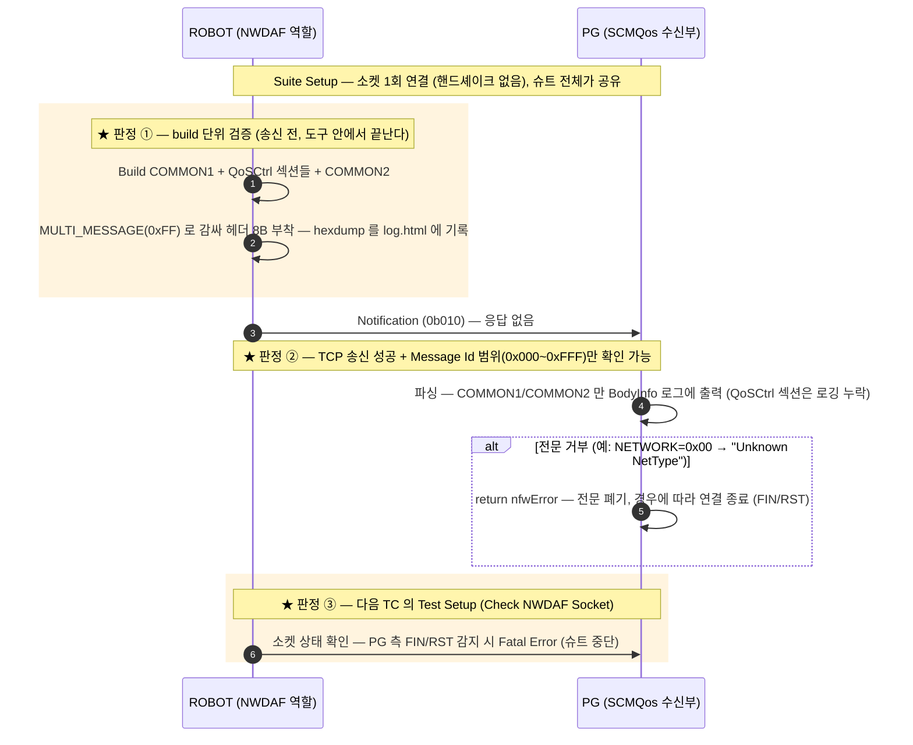
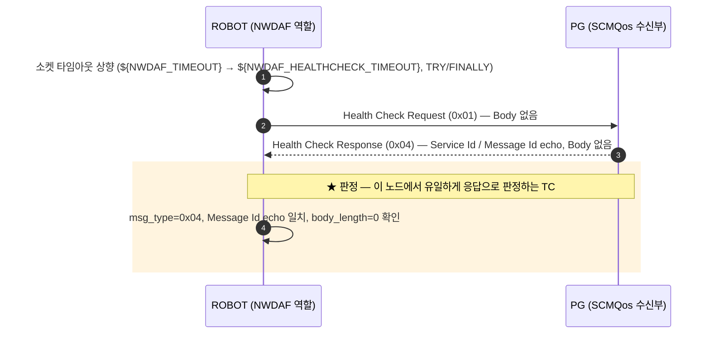
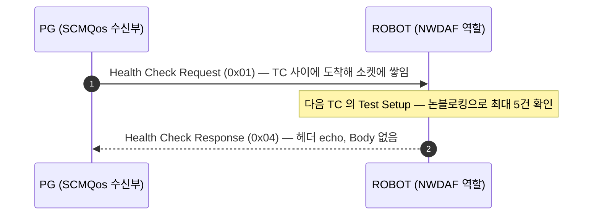

# NWDAF — 기지국 혼잡제어 (PG.NWMQOS)

| 항목 | 값 |
|---|---|
| 도구 역할 | NWDAF (Client) → PG:`${NWDAF_PORT}`(10305), 단일 소켓 |
| 주력 메시지 | **Notification(0b010)** — PG 응답 없음 (규격) |
| 보조 메시지 | Health Check Request(0x01) ↔ Response(0x04) — `TC-NWDAF-001` |
| Body | TLV 바이너리 — `MULTI_MESSAGE(0xFF){ COMMON1 + QoSCtrl 섹션들 + COMMON2 }` |
| Service Id | `0x0305` 하나뿐 (가입자 단위 QoS 제어) |
| Message Id | `txn_id` 역할 — `Next NWDAF Msg Id` 가 0x000~0xFFF 순환 |
| 판정 | **PDB 없음 · 응답 없음** — build 검증 + 송신 성공 + FIN/RST 감지가 전부 (아래 "판정 공백") |

> ⚠ 다른 노드와 달리 **판정에 쓸 되돌아오는 신호가 없다.** Notification 은 규격상 응답이
> 없고, PDB 반영을 보는 인터페이스도 아니다. 실제로 eNB 섹션 8개 필드 중 7개가 틀린
> 상태로 모든 TC 가 PASS 했던 전례가 있다 ([nodes/NWDAF.md](../nodes/NWDAF.md#판정-공백--이-노드의-핵심-제약)).

## 콜플로우 — Notification (주력)

판정 ③이 **한 TC 늦게** 걸린다는 점에 주의 — PG 가 전문을 거부하고 끊으면 그 TC 는
이미 "송신 성공" 으로 PASS 한 뒤고, 다음 TC 의 Test Setup 이 슈트를 중단시킨다.

## Body 섹션 조합 — PCEF_TYPE 비트마스크

`PCEF_TYPE`(0x0D)은 배타적 enum 이 아니라 **비트마스크**다. 비트 조합에 따라 한 전문에
실리는 QoSCtrl 섹션이 갈린다.

| PCEF_TYPE | Body 구성 | 대표 TC |
|---|---|---|
| `0x01` (P-GW/SMF) | COMMON1 + **pcefQoSCtrl** + COMMON2 | 002/004, 006~013 |
| `0x10` (eNB) | COMMON1 + **enodebQoSCtl** + COMMON2 | 003/005, 014~020 |
| `0x03` (LTE DPI) | COMMON1 + **pcefQoSCtrl + dpiQoSCtrl** + COMMON2 — 한 전문에 함께 | 032 |
| `0x02` (DPI 단독) | COMMON1 + **dpiQoSCtrl** + COMMON2 | 033 |

## 콜플로우 — Health Check (`TC-NWDAF-001`)

Health Check 전용 Service Id 는 미상이라 `0x0305` 를 그대로 쓴다
([nodes/NWDAF.md](../nodes/NWDAF.md#-확인-필요) 6번).

## 역방향 방어 — PG 발 Health Check

PG 가 주기적으로 Health Check 를 먼저 보내온다. 도구가 소켓을 읽지 않으면 계속 쌓이므로
매 TC 의 Test Setup(`Check NWDAF Socket`)이 `Drain NWDAF Pending Messages` 로 비운다.

## 판정 공백 — 이 노드의 핵심 제약

Notification 에는 응답이 없고 PDB 판정도 없으므로 Robot 이 자동으로 볼 수 있는 것은
세 가지뿐이다.

- **전문 조립 결과** — build 단위 TC (`Tlv Find All` 등으로 TLV 를 직접 검증, 034~036 처럼 송신 없는 TC 포함)
- **TCP 송신 성공** — 소켓 오류 없이 write 가 끝났다는 것 이상을 말해주지 않는다
- **`Check NWDAF Socket` 의 FIN/RST 감지** — PG 가 직전 전문을 거부하고 끊었을 때, 다음 TC 에서 잡힌다

**내용이 맞는지는 사람이 대조해야 한다** — `Send NWDAF Notification` 이 매 송신마다
전체 패킷 hexdump 를 `log.html` 에 남기므로 PG 의 `Header Info`/`BodyInfo` 덤프와 바이트
단위로 대조하라. 단, PG 의 `BodyInfo` 는 **COMMON1 + COMMON2 만 출력한다** —
pcefQoSCtrl/eNB/DPI 필드가 로그에 안 보이는 것은 파싱 실패가 아니라 로깅 누락이다.

## 관련 문서

- [NWDAF 노드 스펙](../nodes/NWDAF.md) — 헤더 비트 배치, 섹션별 인코딩 표, 함정, 확인 필요
- `tests/nwdaf/nwdaf_tests.robot` — `TC-NWDAF-001`~`036`
- `resources/nwdaf_keywords.robot` · `resources/TlvHelper.py` — build/송신/드레인 구현
