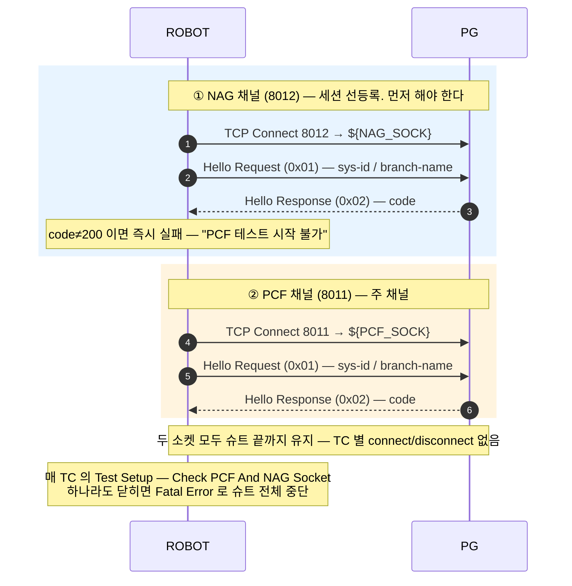
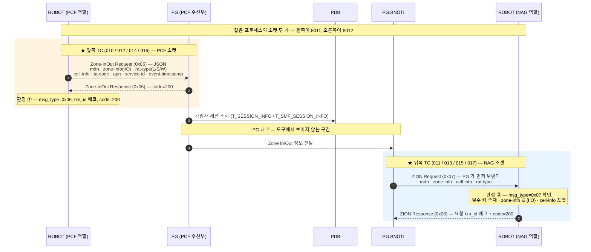
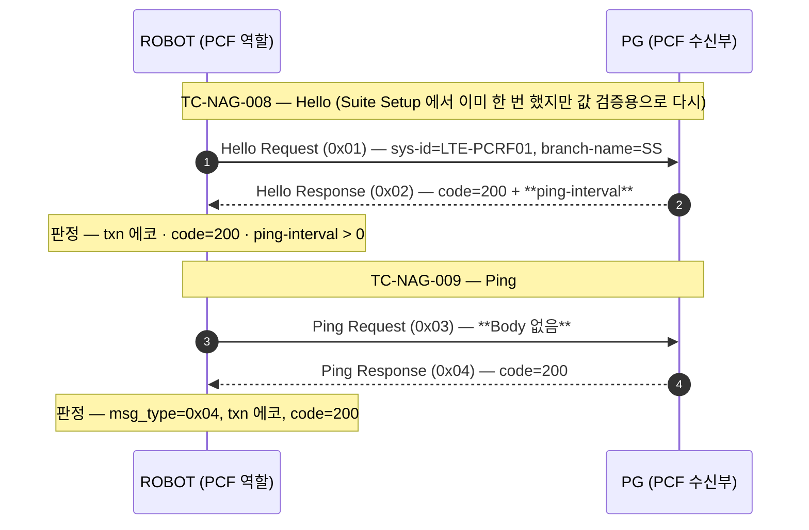

# PCF — ZONE 알림 (Zone-InOut ↔ ZION)

| 항목 | 값 |
|---|---|
| 도구 역할 | **PCF/PCRF (Client)** → PG:`${PCF_PG_PORT}`(8011) — 단, 소켓은 **2개** |
| 보조 소켓 | **NAG (Client)** → PG:`${NAG_PG_PORT}`(8012) — 가입자 세션 선등록 + ZION 수신 |
| 주력 메시지 | **Zone-InOut Request(0x05) ↔ Response(0x06)** — PCF 소켓 |
| 역방향 | **ZION Request(0x07) ↔ Response(0x08)** — **NAG 소켓** (PG 가 먼저 보낸다) |
| 보조 메시지 | Hello(0x01/0x02) · Ping(0x03/0x04) — `TC-NAG-008` / `TC-NAG-009` |
| Body | JSON, 8-옥텟 공통 헤더(Byte0 `0x00`) |
| 판정 | 응답 `code=200` + `txn_id` 에코 + **ZION 이 실제로 되돌아오는가** |

> ⚠ **이 노드는 PG 왕복이 두 소켓에 걸쳐 있다.** 요청은 PCF 소켓(8011)으로 나가고 그 결과인
> ZION 은 NAG 소켓(8012)으로 들어온다. 슈트가 소켓을 두 개 여는 이유가 이것이고,
> TC 번호가 `TC-PCF-*` 가 아니라 `TC-NAG-*` 인 이유도 이것이다.

> `0x05`/`0x06` 은 LRS(Location-Info) · UPM(Subs-Change) 에서 **완전히 다른 의미**다.
> 숫자를 직접 쓰지 말고 `${MSG_PCF_ZONE_REQ}` / `${MSG_PCF_ZONE_RESP}` 를 쓸 것
> ([INTERFACES.md opcode 충돌표](../INTERFACES.md)).

## Suite Setup — 듀얼 소켓, 순서가 고정이다

`Suite Connect With NAG` 가 **NAG 를 먼저** 붙인다. PG 가 ZONE 알림을 내리려면 해당 가입자의
세션이 등록돼 있어야 하므로, PCF 소켓만 열면 0x05 는 200 을 받아도 ZION 이 오지 않는다.



`txn_id` 는 **두 소켓이 하나의 전역 카운터(`Next TXN ID`)를 공유**한다. 소켓별로 나뉘어 있지
않으므로 로그에서 txn 값만 보고 어느 채널인지 판단하면 안 된다.

## 콜플로우 — Zone-InOut + ZION (주력)

슈트의 본체다. **한 번의 논리적 흐름이 TC 두 개로 쪼개져 있다** — 0x05 를 보내는 TC 와
그 결과 ZION 을 받는 TC 가 짝이다.



`Receive ZION Request` 는 **블로킹 수신**이다(`${PCF_TIMEOUT}`=10초). ZION 이 안 오면 그 TC 가
타임아웃으로 실패한다 — 이것이 이 노드에서 "PG 가 실제로 알림을 내렸다"를 판정하는 유일한 수단이다.

## TC 짝 — 어느 TC 가 어느 TC 의 결과를 받는가

| 보내는 TC (PCF 8011) | 받는 TC (NAG 8012) | 시나리오 | 주요 값 |
|---|---|---|---|
| `TC-NAG-010` | `TC-NAG-011` | Zone **IN** / LTE | `zone-info=I` `rat-type=L` `ta-code=3113`(Hexa 4) |
| `TC-NAG-012` | `TC-NAG-013` | Zone **OUT** / 5G | `zone-info=O` `rat-type=S` `ta-code=0` · sys-id `SPCF0001` |
| `TC-NAG-014` | `TC-NAG-015` | Zone **IN** / 3G 타사망 | `zone-info=I` `rat-type=W` `cell-info=45006-9999:99` `ta-code=008461`(Hexa 6) |
| `TC-NAG-016` | `TC-NAG-017` | Zone **IN** / txn 에코 검증 | 010 과 동일 값, `Next TXN ID` 를 명시 전달 |

`rat-type` — `L`(LTE) / `S`(5G SA) / `W`(3G WCDMA).
`cell-info` — `NodeB:Cell`, 타사망은 `plmn-NodeB:Cell` (`Cell Info Should Be Valid` 정규식).
`ta-code` — Zone IN 은 Hexa 4자리 또는 6자리, **Zone OUT 은 `0`**.

## 콜플로우 — Hello / Ping



## HFC 서비스 흐름에서의 위치

[INTERFACES.md 의 HFC Call Flow](../INTERFACES.md#hfc-서비스-call-flow--세-노드가-어떻게-이어지는가)
맨 아래 두 화살표 — `PCF → PG.BNOTI` 와 `PG.BNOTI → NAG` — 가 이 슈트가 잡는 구간이다.

```
CDS 1X/1Y → PG.CDS → PDB → PG.SDM/PG.BSUBS → UPM Cell List 왕복
                                    ↓
                          PCF 로 Cell List 통보 (RBUS/SBI)
                                    ↓
        ┌─────────── 여기부터 PCF 슈트가 잡는다 ───────────┐
        │  PCF → PG.BNOTI : Zone In/Out (0x05/0x06)        │
        │  PG.BNOTI → NAG : ZION (0x07/0x08)               │
        └──────────────────────────────────────────────────┘
```

**다른 슈트와 달리 PG 왕복의 양쪽 끝을 한 슈트가 다 본다.** 듀얼 소켓이 그걸 가능하게 한다 —
UPM 슈트가 `Cell List Request` 만 수동 수신하는 것과 대비된다.

단, INTERFACES.md 는 `PG.BNOTI → NAG` 화살표가 ZION(`0x07`) 과 **같은 것인지 "추정"** 으로
표시하고 있다. 슈트 문서(`TC-NAG-010`)는 "PG는 Zone IN 수신 후 NAG로 ZION-Request(0x07)를
발송함" 이라고 단정하고 있으니, 이 둘 중 하나는 정리가 필요하다.

## 함정

- **TC 번호가 슈트명과 다르다.** PCF 슈트 파일 안의 TC 는 전부 `TC-NAG-008`~`017` 이다.
  번호만 보고 `tests/nag/` 를 뒤지면 못 찾는다.
- **TC 순서 의존.** ZION TC 는 바로 앞 Zone TC 가 만들어낸 알림을 받는다.
  `--test "TC-NAG-011*"` 로 단독 실행하면 받을 ZION 이 없어 10초 타임아웃으로 실패한다.
- **ZION 은 소켓에 쌓인다.** 앞의 ZION TC 가 하나를 못 읽고 넘어가면 이후 ZION TC 들이
  전부 한 칸씩 밀린 전문을 읽는다 — 값 검증이 엉뚱한 TC 에서 깨진다. NWDAF 처럼
  Test Setup 에서 드레인하는 장치가 **PCF 슈트에는 없다.**
- **ZION 의 mdn 을 대조하지 않는다.** ZION TC 들은 `mdn` 키의 **존재만** 확인하고
  `${PCF_TEST_MDN}` 과 같은지는 비교하지 않는다. 다른 가입자의 ZION 이 섞여 들어와도 PASS 한다.
- **ZION 의 ta-code 는 검증하지 않는다.** `TA Code Should Be Valid` 키워드가 있는데도
  PCF 슈트에서는 쓰이지 않는다.
- **012 / 014 는 txn 에코를 확인하지 않는다.** `txn_id` 를 넘기지 않고 `PCF Zone InOut Should
  Succeed`(code 만) 로 끝난다. txn 에코는 008 / 009 / 010 / 016 에서만 본다.
- `TC-NAG-016` 의 Log 문구에 오타가 있다 — "TC-NAG-0176" (→ 017).

## 관련 문서

- [PCF 노드 스펙](../nodes/PCF.md) — 접속·메시지 타입·듀얼 소켓 정책
- [NAG 노드 스펙](../nodes/NAG.md) — ZION(0x07/0x08) 정의, NAG 채널 전체 메시지
- [INTERFACES.md](../INTERFACES.md) — opcode 충돌표, HFC 서비스 Call Flow
- `tests/pcf/pcf_tests.robot` — `TC-NAG-008`~`017` (10건)
- `resources/pcf_keywords.robot` · `resources/nag_keywords.robot` — 송수신/ZION 구현
