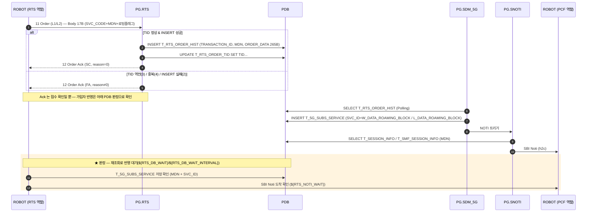

# RTS `L1`/`L2` — 로밍 데이터 차단

| 항목 | 값 |
|---|---|
| SVC_CODE | `L1`(→ SVC_ID=`W_DATA_ROAMING_BLOCK`) / `L2`(→ SVC_ID=`L_DATA_ROAMING_BLOCK`) |
| 테스트 케이스 | `TC-RTS-001`(L1) / `TC-RTS-002`(L2) |
| 알림 경로 | `PG.SDM_5G` → `PG.SNOTI` → PCF (SBI Noti) — 사용자 확인 |
| 알림 판정 | `Verify RTS SBI Noti Sent` 가 도착을 확인 |
| UPM 연동 | 없음 |
| Body 폭 | 17B(이번 범위) — 와이어 오프셋 0(SVC_CODE)/2(MDN)/14(로밍 플래그) |
| PG 측 프로세스 | `RTS201` · `P_SDM601` · `SNOTI501` — 슈트 전에 **기동 확인** (아래 표) |

> ⚠ RTS 는 CDS 문서의 "PG.RDS"(쿠폰 예약작업 폴러)와 **별개 인터페이스**다. 이름이 비슷해서
> 생긴 혼동으로 이 노드가 추가됐다 — 절대 같은 것으로 취급하지 말 것 ([nodes/RTS.md](../nodes/RTS.md)).

> L1/L2 는 SVC_ID 가 서로 다른 걸 보면 단순 ON/OFF 토글 쌍이 아니라 **별개의 차단 유형**일
> 가능성이 있다 — 정확한 의미는 확인 필요. 아래 다이어그램은 두 코드가 구조적으로 동일해서
> 하나로 합쳐 그렸다(달라지는 값만 표에 분리).

## PG 측 프로세스

슈트를 돌리기 전에 기동을 확인한다. 이름은 `/PG/CFG/ST.cfg` 기준이다.

| 프로세스 | 다이어그램의 참여자 | 하는 일 |
|---|---|---|
| `RTS201` | `PG.RTS` | Order(`11`) 수신, `T_RTS_ORDER_HIST` 적재, Ack(`12`) 응답 |
| `P_SDM601` | `PG.SDM_5G` | 이력 폴링 → `T_5G_SUBS_SERVICE` 반영 → RBUS NOTI |
| `SNOTI501` | `PG.SNOTI` | 세션 조회 후 PCF 로 SBI Noti |

뒤의 둘은 **CDS 흐름과 같은 프로세스다** ([cds_callflow.md](cds_callflow.md#pg-측-프로세스)).
그래서 `P_SDM601` 이나 `SNOTI501` 이 죽으면 RTS 와 CDS 가 **함께** 무너진다 — RTS 만
실패하면 `RTS201` 쪽을, 둘 다 실패하면 뒤쪽을 본다.

`12 Order Ack` 는 `RTS201` 이 준다. 그러니 **Ack 가 `SC` 여도 `P_SDM601` 이 죽어 있으면**
가입자 반영과 알림이 통째로 안 일어난다 — 아래 PDB 판정에서만 드러난다.
CDS 의 쿠폰 만료를 맡는 `R_SDM601` 은 이 흐름에 관여하지 않는다.

## 콜플로우

## 코드별 값

| SVC_CODE | 로밍 플래그(와이어 offset14) | DB 저장 오프셋(85) | 반영 SVC_ID |
|---|---|---|---|
| `L1` | `Y` | `Y` | `W_DATA_ROAMING_BLOCK` |
| `L2` | `N` | `N` | `L_DATA_ROAMING_BLOCK` |

**와이어(수신) 오프셋과 DB 저장 오프셋이 다르다** — 각각 14 / 85. `T_RTS_ORDER_HIST.ORDER_DATA`
는 PG 가 265B 로 재조립해 넣는 별도 버퍼라서 그렇다. 상세는 [nodes/RTS.md](../nodes/RTS.md#wire-인코딩--★-이중-오프셋-구조-이-노드의-핵심-함정) 참조.

## 판정 기준

`12 Order Ack` 는 **접수(InsertOrder) 성패**만 나른다 — `InsertOrder` 가 실제로 성공했을 때만
`SC`를 준다는 점은 CDS `CommandResult`보다 신뢰도가 높지만, Body 내용(SVC/로밍 플래그)이
잘못돼도 INSERT 자체는 성공하면 `SC`가 나온다는 점은 CDS 와 같다. 가입자 서비스 테이블 반영은
`PG.SDM_5G` 가 나중에 폴링해서 하므로 **PDB 로만 판정된다.**

- `T_RTS_ORDER_HIST.ORDER_DATA[85]`(SQL `SUBSTR(ORDER_DATA, 86, 1)`) = 요청한 로밍 플래그 — **프로토콜 계층**(TC-RTS-001 만)
- `T_5G_SUBS_SERVICE`(MDN, SVC_ID) = **1건 이상** — **업무 계층**(TC-RTS-001/002 공통, 사용자 확인)
- `Verify RTS SBI Noti Sent` — PCF SBI Noti 도착 여부(사용자 확인)

`PG.SDM_5G` 가 정확히 어떤 프로세스인지(`SDM_5G/OrderDataReader.cpp` 가 `T_RTS_ORDER_HIST`를
읽는 코드는 확인했으나 그 이후 처리 전체는 조사 범위 밖이었다)와 반영까지 걸리는 지연 시간은
**확인 필요** — 현재 `${RTS_DB_WAIT}`/`${RTS_NOTI_WAIT}` 는 CDS 값을 참고한 추정치다.

## 관련 문서

- [RTS 노드 스펙](../nodes/RTS.md) — 인코딩 표, 이중 오프셋, 함정, 확인 필요
- `tests/rts/rts_tests.robot` — `TC-RTS-001` / `TC-RTS-002`
