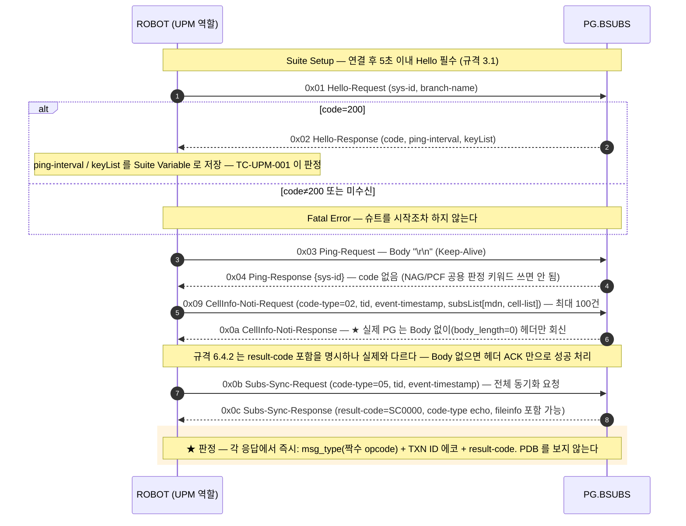
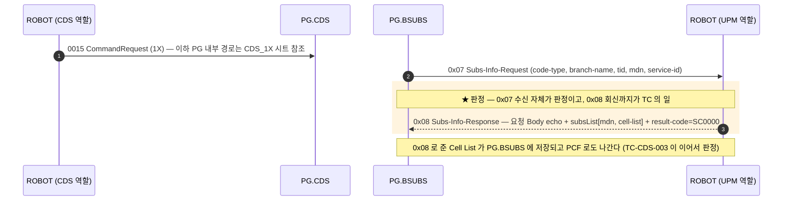

# UPM — HFC 서비스 연동 (UPM ↔ PG.BSUBS)

| 항목 | 값 |
|---|---|
| 도구 역할 | UPM (Client) → PG:`${UPM_PG_PORT}`(10506), 단일 소켓 |
| 헤더 / Body | 8-옥텟 공통 헤더 (Byte0 `0x00`) / **JSON** |
| 방향 | **양방향** — 능동 송신 4종(Hello/Ping/CellInfo-Noti/Subs-Sync) + 수동 수신 3종(Subs-Change/Subs-Info/Info-Change) |
| Hello 제약 | **연결 후 5초 이내 Hello 미송신 시 PG 가 연결을 끊는다** (규격 3.1) — Suite Setup 이 처리 |
| 판정 | 응답 즉시 판정 — `msg_type` + `txn_id` 에코 + `result-code=SC0000` (**PDB 판정 없음**) |
| 수동 수신 TC | PG 측 이벤트(CDS 업무 코드)가 트리거 — **UPM 슈트가 아니라 CDS 슈트에서 돈다** (아래 표) |

> ⚠ `0x05`·`0x07`·`0x09`·`0x0b` 는 다른 노드에서 전혀 다른 의미다 —
> [opcode 충돌표](../INTERFACES.md#opcode-충돌--노드별-상수명을-그대로-써라). 숫자 대신
> `${MSG_UPM_*}` 상수를 쓸 것. 또 JSON Body 의 `tid`(24자리 문자열)는 헤더의
> `txn_id`(4B 바이너리)와 **완전히 별개**다 ([nodes/UPM.md](../nodes/UPM.md#tid--txn_id-와-별개다)).

## 콜플로우 — 능동 송신 (UPM 슈트, TC-UPM-001~004)

## 콜플로우 — 수동 수신 (PG.BSUBS → UPM, 트리거는 CDS)

수동 수신 3종은 PG 측에서 실제 이벤트(가입·해지·변경)가 나야 온다. 그 트리거를 쥔 것이
**CDS 업무 코드**라서, UPM 슈트에 두면 영원히 수신 대기만 하다 타임아웃한다 — 실제로 도는
구간은 **CDS 슈트로 옮겨져 있다** ([cds_callflow.md](cds_callflow.md) 의 각 시트에도 이
왕복이 그려져 있다).

| 트리거 (CDS 코드) | PG.BSUBS → UPM | UPM → PG.BSUBS (응답) | 검증하는 TC |
|---|---|---|---|
| `1X` HFC 가입 | `0x07` Subs-Info-Request | `0x08` — **Cell List 를 담아** 회신 | `TC-CDS-003` (CDS 슈트) |
| `1Y` HFC 해지 | `0x07` Subs-Info-Request | `0x08` — 해지도 Cell 정리를 위해 탄다 | `TC-CDS-004` (CDS 슈트) |
| `C1`/`G1` 기변·정보변경 | `0x0d` Info-Change-Request | `0x0e` — mdn 에코 | `TC-UPM-311` (**주석**) |
| `D3` 번호변경 | `0x05` Subs-Change-Request | `0x06` — mdn/new-mdn 에코 | `TC-UPM-321` (**주석**) |

`C1`/`G1`/`D3` 는 **HFC 가입 상태일 때만** BSUBS↔UPM 왕복이 일어난다 — 미가입이면 이
구간 자체가 없다 ([cds_callflow.md](cds_callflow.md) 규칙 2).

수동 수신 3종은 모두 같은 모양이다 — 요청 Body 의 `code-type`/`branch-name`/`tid`/`mdn` 을
echo 하고 `result-code=SC0000` 을 붙여 **요청 헤더의 `txn_id` 로** 회신한다. 응답을 안 보내면
PG 쪽 흐름이 완결되지 않으므로, **회신까지가 도구의 일**이다.

> ⚠ 주석 처리된 `TC-UPM-399` 는 "1Y(code-type=03)는 UPM 요청/응답이 없다"고 적어 두었지만,
> 실제로는 `TC-CDS-004` 가 1Y 의 `0x07` 수신을 판정하고 있다 — **주석이 낡았다.** 되살리려
> 할 때 이 어긋남부터 확인할 것.

## 판정 기준

- **능동 송신 4종** — 응답이 항상 오므로 즉시 판정한다: `msg_type`(요청+1 의 짝수 opcode),
  `txn_id` 에코, `result-code=SC0000`(`${UPM_RC_SUCCESS}`), `code-type` echo.
  예외 둘: Ping 응답은 `{sys-id}` 뿐이라 code 검증이 없고, CellInfo-Noti 응답은 Body 없이
  올 수 있어 헤더 ACK 만으로 성공 처리한다.
- **수동 수신 3종** — 수신(opcode·code-type·mdn 형식) + 정상 응답 송신이 판정의 전부다.
- **PDB 판정 없음** — 가입자 테이블 반영은 UPM 인터페이스의 관심사가 아니다. HFC 전문의
  PDB 판정(`T_5G_SUBS_SERVICE`/`T_BAROD_SUBS_CELLINFO`)은 CDS 슈트가 한다.

## 관련 문서

- [UPM 노드 스펙](../nodes/UPM.md) — 메시지 타입 표, tid 생성 규칙, code-type, 함정
- [cds_callflow.md](cds_callflow.md) — 트리거 쪽 흐름 (CDS_1X / CDS_1Y / CDS_C1 / CDS_G1 / CDS_D3 시트)
- `tests/upm/upm_tests.robot` — `TC-UPM-001`~`004` (활성) / 311·321·399 (주석)
- `resources/upm_keywords.robot` — 송수신·echo 응답 구현
