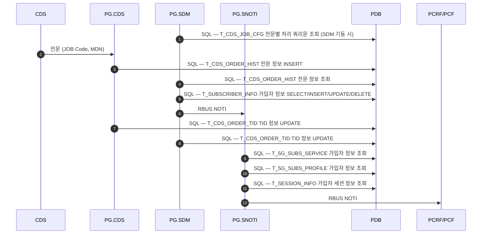
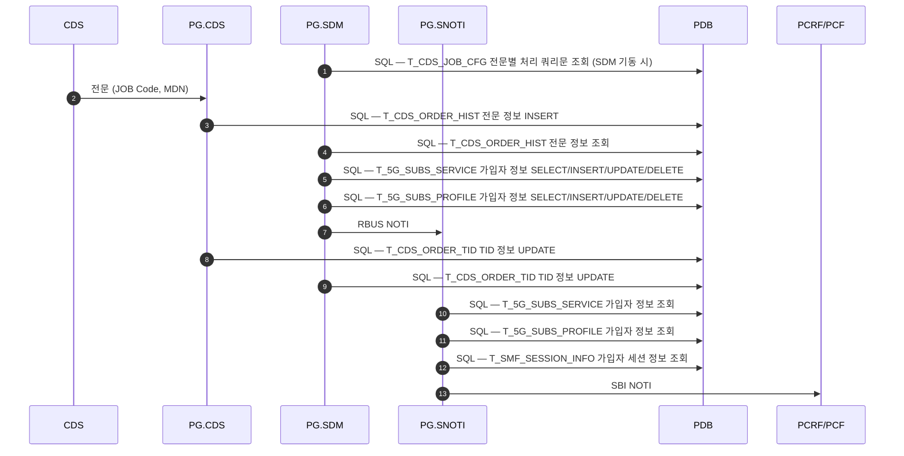
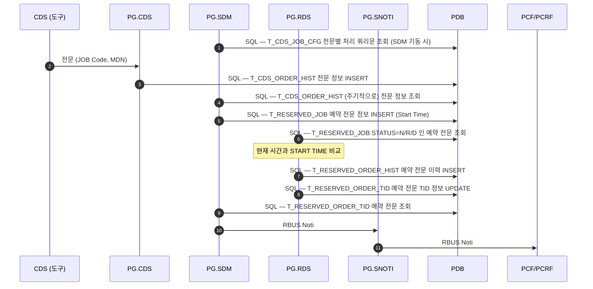

# CDS — 노드 스펙

규격: `CDS 표준 인터페이스 규격 Ver6.0`
파일: [`cds_tests.robot`](../../tests/cds/cds_tests.robot) · [`cds_keywords.robot`](../../resources/cds_keywords.robot) · [`cds_variables.robot`](../../resources/cds_variables.robot) · [`CdsHelper.py`](../../resources/CdsHelper.py)

## 접속 — 듀얼 소켓, Rchannel 이 먼저

| 항목 | 값 |
|---|---|
| 도구 역할 | CDS (능동 Connector) |
| 방향 | 도구 → PG.CDS |
| Schannel | `${CDS_SCH_PORT}` = 9200 |
| Rchannel | `${CDS_RCH_PORT}` = 9201 |
| 헤더 | **48-옥텟** 빅엔디안 |
| Body | 고정전문 |
| 타임아웃 | `${CDS_TIMEOUT}` = 10초 |

**접속 순서가 정해져 있다 — Rchannel 을 먼저 연다.**

| 순서 | 채널 | 송신 | 기대 |
|---|---|---|---|
| 1 | Rchannel 9201 | `0003` RchannelConnectionRequest | `0004` ACK |
| 2 | Schannel 9200 | `0001` SchannelConnectionRequest | `0002` ACK |

**접속과 해제는 TC 가 아니라 Suite Setup / Teardown 이다.**

| | 키워드 | 하는 일 |
|---|---|---|
| Suite Setup | `Suite CDS Connect` | Rch 연결 → `0003`/`0004` → Sch 연결 → `0001`/`0002` → **두 소켓 생존 확인** |
| Suite Teardown | `Suite CDS Disconnect` | Sch `0005`→`0006` 검증 → Rch `0007`→`0008` 검증 → 소켓 종료 |

Setup 이 실패하면 슈트가 서지 않으므로 접속을 TC 로 재확인할 필요가 없다. 해제도
슈트가 끝나면 반드시 해야 하는 일이라 TC 로 두면 실패·필터 시 건너뛰게 된다.

Teardown 은 역순이 아니라 **Schannel→Rchannel 순으로** Release 를 보낸 뒤 닫는다.
`Send Release And Validate` 가 ACK 의 msg_id 와 `Result=SC` 를 검증하되,
**PG 가 ACK 없이 끊는 것은 정상 해제로 간주**한다(규격상 허용).

실 PG.CDS 는 실제로 ACK 없이 끊는다. 이 경로의 로그는 **`INFO` 다** — 예전에는 `WARN`
이라 매 실행마다 `Release(5)` / `Release(7)` 2건이 리포트 상단 경고에 떴다.
코드가 스스로 "정상 해제로 간주"한다고 선언한 경로를 경고로 올리는 게 어긋나서 내렸다.
추적은 그대로라 `log.html` 에서 ACK 수신 여부를 구분할 수 있다.

ACK 검증을 `Run Keyword And Ignore Error` 로 감싸지 않는다 — 감싸면 검증이 무력화된다.
Robot 은 **teardown 안의 키워드가 실패해도 나머지를 계속 실행**하므로 소켓 종료는 어차피
수행된다. 실제로 Release ACK 를 `FA` 로 돌려주는 가짜 PG 로 확인했다: 두 채널 모두
실패를 보고하고, 그럼에도 소켓은 닫혔다.

포트와 `${CDS_DST_SYS_ID}`(PG.CDS SYSTEM_ID, 기본 `PG01`)는 `cds_variables.robot` 기본값이며
환경별로 다르면 `config/env/<env>.py` 에서 오버라이드한다.
업로드 전용 포트 `${CDS_UP_SCH_PORT}`(6100) / `${CDS_UP_RCH_PORT}`(6101) 도 정의돼 있다.

## 메시지 타입

| ID | 이름 | ID | 이름 |
|---|---|---|---|
| `0001`/`0002` | SchannelConnectionRequest / ACK | `0017`/`0018` | CommandResult / ACK |
| `0003`/`0004` | RchannelConnectionRequest / ACK | `0025`/`0026` | UploadRequest / ACK |
| `0005`/`0006` | SchannelReleaseRequest / ACK | `0027`/`0028` | UploadResult / ACK |
| `0007`/`0008` | RchannelReleaseRequest / ACK | `0029`/`0030` | SubsDataRequest / ACK |
| `0013`/`0014` | ProcessStateRequest / ACK | `0031`/`0032` | SubsDataResult / ACK |
| `0015`/`0016` | CommandRequest / ACK | | |

Process State 값: `${CDS_PS_NORMAL}`=1 / `${CDS_PS_ABNORMAL}`=2, `uint16` 빅엔디안
(`pack_process_state` / `unpack_process_state`).

## Call Flow — PG 내부 처리

**도구가 검증하는 구간은 첫 화살표 하나(`전문(JOB Code, MDN)`)뿐이다.** 그 뒤는 전부 PG
내부이며 도구에서 보이지 않는다. 전문이 실제로 반영됐는지는 PDB 테이블로만 확인된다 —
`CommandResult` 는 Body 내용과 무관하게 `SC` 로 오기 때문이다(아래 [함정](#body-인코딩-회귀를-자동으로-잡을-수-없다) 참조).

전문은 **즉시 / 예약** 두 갈래이고 각각 **LTE / SA** 가입자로 갈린다 — 아래 다이어그램 2개와
[차이 표](#lte--sa-차이--테이블-이름과-noti-방식뿐)로 네 경우를 모두 덮는다.
CDS 가 여러 노드에 걸치는 HFC(`1X`/`1Y`) 흐름은 [INTERFACES.md](../INTERFACES.md#hfc-서비스-call-flow--세-노드가-어떻게-이어지는가) 에 있다.

출처: `PG (PCF Gateway) 교육 자료` Chapter 03 — *02. PG 서비스 별 동작 Flow*.

### LTE 가입자



### SA 가입자



### 예약 전문 — RDS 가 START TIME 까지 들고 있는다

예약 전문은 **PG.RDS 가 추가로 낀다.** SDM 이 즉시 처리하지 않고 `T_RESERVED_JOB` 에
Start Time 과 함께 넣어두면, RDS 가 `STATUS=N/R/D` 인 건을 돌면서 **현재 시각과 START TIME 을
비교**해 때가 됐을 때 실행한다. `T_CDS_ORDER_TID` 대신 `T_RESERVED_ORDER_TID` 를 쓴다.



### LTE / SA 차이 — 테이블 이름과 NOTI 방식뿐

**흐름의 단계·순서는 LTE 와 SA 가 완전히 동일하다.** 위 다이어그램에서 아래 이름만 바뀐다.

| 흐름 | 항목 | LTE | SA |
|---|---|---|---|
| 즉시 | SDM 가입자 정보 갱신 | `T_SUBSCRIBER_INFO` (1개) | `T_5G_SUBS_SERVICE` + `T_5G_SUBS_PROFILE` (2개) |
| 즉시 | SNOTI 세션 정보 조회 | `T_SESSION_INFO` | `T_SMF_SESSION_INFO` |
| 예약 | 예약 큐 | `T_RESERVED_JOB` | `T_5G_RESERVED_JOB` |
| 예약 | 예약 이력 | `T_RESERVED_ORDER_HIST` | `T_5G_RESERVED_ORDER_HIST` |
| 예약 | 예약 TID | `T_RESERVED_ORDER_TID` | `T_5G_RESERVED_ORDER_TID` |
| 공통 | **PCF/PCRF 통보** | **RBUS Noti** | **SBI Noti** |

`T_CDS_JOB_CFG` · `T_CDS_ORDER_HIST` 는 LTE/SA 공용이다. SDM→SNOTI 구간은 SA 도 RBUS Noti 이며,
**바뀌는 건 SNOTI→PCF/PCRF 마지막 구간 하나**다.

즉시 전문에서 SNOTI 의 가입자 정보 조회는 **LTE 도 `T_5G_SUBS_SERVICE` / `T_5G_SUBS_PROFILE` 를 본다**
— SDM 이 쓰는 테이블(`T_SUBSCRIBER_INFO`)과 다르다.

**☞ 일부 전문에 대해서는 PCF/PCRF 로 NOTI 하지 않는다.** 네 흐름 모두에 붙은 단서다.
**목록이 확정됐다(2026-08-19): `A1` · `1Y` · `Z1` 셋뿐이고, 나머지 전 코드는 나간다.**

| 코드 | PCF 로 알림 | 비고 |
|---|---|---|
| `A1` 신규가입 / `Z1` 가입해지 | **안 나간다** | 도구는 판정을 건너뛴다 |
| 그 외 전부 | 나간다 | 각 TC 가 `Verify SBI Noti Sent` 로 도착을 판정 |

`1X`·`1Y` 는 예외가 아니다 — `SDM → SNOTI` RBUS NOTI 가 안 나가 **SDM 발 가입자
통보**는 없지만, **SNOTI 를 BSUBS 가 깨운다**(규칙 1). `TC-CDS-003`/`004` 가 각각
판정한다.

#### 알림을 만드는 프로세스 — 코드 + HFC 가입 상태로 갈린다 (2026-08-19)

알림이 **나가는지**와 **누가 만드는지**는 다른 문제다. 후자는 규칙 세 개를 위에서부터
차례로 적용해 정해진다. 같은 `Z1` 이 HFC 가입 상태에서는 BSUBS 를, 미가입 상태에서는
SDM 을 탄다.

| 업무 코드 | HFC 가입 | HFC 미가입 | 규칙 |
|---|---|---|---|
| `1X` · `1Y` | BSUBS | BSUBS | 1 — 무조건 |
| `D3` · `C1` · `G1` · `Z1` | **BSUBS** | SDM | 2 — 상태로 갈린다 |
| 그 외 전부 (`A1` `I2` `I3` `K1~K6` `Y9` `SS` `ST` …) | SDM | SDM | 3 |

두 경로는 **`PG.SNOTI` 에서 합류**한다. 도구가 PCF 역할로 받는 것은 어느 쪽이든 같은
SBI Noti 라 **수신만으로는 경로를 구분할 수 없다.** 그래서 슈트는 규칙으로 예상 경로를
계산해 실패 메시지에 실어 둔다 — `SBI Noti (Z1, SDM 경유 / HFC=False)` 처럼 찍히므로,
못 받았을 때 BSUBS 쪽(폴링·UPM 왕복)을 볼지 SDM 쪽을 볼지 바로 갈린다.

도구 쪽 구현:
`@{CDS_NOTI_BSUBS_ALWAYS}`(1X·1Y) / `@{CDS_NOTI_BSUBS_IF_HFC}`(D3·C1·G1·Z1) /
`${CDS_HFC_SUBSCRIBED}`(1X 가 켜고 1Y 가 끈다) → `Expected Noti Route` 키워드.

> ⚠️ **지금 슈트 순서로는 규칙 2 의 BSUBS 분기를 타는 TC 가 하나도 없다.**
> `1Y`(004)가 HFC 를 해지한 뒤에 `C1`(007) · `G1`(008) · `D3`(018) · `Z1`(019)이 돌기
> 때문에 넷 다 SDM 경유로 판정된다. 그 분기를 덮으려면 `1Y` 를 뒤로 미루거나 해당 TC
> 앞에서 `1X` 를 한 번 더 보내야 하는데, **둘 다 TC 간 의존성을 건드린다.**

도구 쪽 목록은 `@{CDS_NOTI_EXEMPT_CODES}`(cds_variables.robot) 하나가 쥔다 —
**목록이 바뀌면 그 변수만 고치면 되고** TC 는 자기 업무 코드를 넘기기만 한다.
TID 는 갱신되는데 PCF 반영이 없으면 이 목록부터 의심할 것.

### 도구 관점에서의 함의

| 흐름 | 도구가 볼 수 있는 것 |
|---|---|
| `전문 → PG.CDS` | `CommandResult`(`SC`/`FA`) — **Body 내용과 무관하게 `SC`** |
| `PG.CDS → PDB` 이후 전부 | **없음.** PDB 조회 없이는 판정 불가 |

그래서 **`db` 태그가 붙은 TC 는 PDB 를 직접 조회해 판정한다.** 전문 12개 중
`TC-CDS-001`(ProcessState)을 뺀 **11개 전부**가 여기 해당한다 — `001` 만 전문
흐름으로 완결된다.

### PDB 판정 기준 (업무 코드별)

`Command Download Flow` 뒤에 판정 키워드를 붙인다. 기준은 세 갈래다.

| TC | 코드 | 키워드 | 성공 조건 |
|---|---|---|---|
| 002 | A1 신규가입 | `Verify Subscriber Provisioned In PDB` | PROFILE 1건 + SERVICE 2건이 **모두 `1`** |
| 003 / 010 | 1X HFC가입 | `Verify Zone Service Subscribed In PDB` | **`1`건 이상** |
| 004 / 011 | 1Y HFC해지 | `Verify Zone Service Released In PDB` | **`0`건** |
| 005 | I2 부가서비스신청 | `Verify Addon Service Subscribed In PDB` | **`1`건 이상** |
| 006 | I3 부가서비스해지 | `Verify Addon Service Released In PDB` | **`0`건** |
| 007 / 008 / 009 | C1 / G1 / D3 | `Verify Service Counts Preserved In PDB` | 수행 **전후 `SVC_ID` 별 행 수가 동일** |
| 012 | Z1 가입해지 | `Verify Subscriber Removed From PDB` | PROFILE / SERVICE 가 **모두 `0`** |

```sql
-- 002 A1 : 생겼는지
SELECT COUNT(*) FROM T_5G_SUBS_PROFILE WHERE MDN = ?
SELECT COUNT(*) FROM T_5G_SUBS_SERVICE WHERE MDN = ? AND SVC_ID = 'DATA_USAGE_LEVEL'
SELECT COUNT(*) FROM T_5G_SUBS_SERVICE WHERE MDN = ? AND SVC_ID = 'DATA_USAGE_LEVEL_2'

-- 003/010 1X : 존 서비스가 붙었는지            → 1건 이상
SELECT COUNT(*) FROM T_5G_SUBS_SERVICE
 WHERE MDN = ? AND SVC_ID = 'ZONE_SVC_D' AND SVC_TYPE = 'D' AND JOB_CODE = '1X'

-- 004/011 1Y : 존 서비스가 떨어졌는지          → 0건
SELECT COUNT(*) FROM T_5G_SUBS_SERVICE WHERE MDN = ? AND SVC_ID = 'ZONE_SVC_D'

-- 005 I2 : 부가서비스가 붙었는지               → 1건 이상
SELECT COUNT(*) FROM T_5G_SUBS_SERVICE
 WHERE MDN = ? AND SVC_ID = 'YOUNG_HARM_INFO_BLOCK' AND SVC_TYPE = 'N'
       AND JOB_CODE = 'I2' AND TIME_PERIOD_ID = '56' AND "LIMIT" = 'Y'

-- 006 I3 : 부가서비스가 떨어졌는지             → 0건
SELECT COUNT(*) FROM T_5G_SUBS_SERVICE WHERE MDN = ? AND SVC_ID = 'YOUNG_HARM_INFO_BLOCK'

-- 007/008/009 C1·G1·D3 : 수행 전후 집계가 같은지
SELECT SVC_ID, COUNT(*) FROM T_5G_SUBS_SERVICE WHERE MDN = ?                  GROUP BY SVC_ID  -- 전
SELECT SVC_ID, COUNT(*) FROM T_5G_SUBS_SERVICE WHERE MDN = ? AND JOB_CODE = ? GROUP BY SVC_ID  -- 후

-- 013 Z1 : 사라졌는지 (SVC_ID 를 가리지 않는다)
SELECT COUNT(*) FROM T_5G_SUBS_PROFILE WHERE MDN = ?
SELECT COUNT(*) FROM T_5G_SUBS_SERVICE WHERE MDN = ?
```

몇 가지가 의도적이다.

- **"1건 이상"은 건수를 못 박지 않는다는 뜻이다.** 존·부가 서비스가 여러 건일 수 있어
  `= 1` 로 잠그지 않았다.
- **해지 쪽은 `SVC_TYPE`·`JOB_CODE` 를 걸지 않는다.** 어떤 형태로든 남아 있으면 해지가
  덜 된 것이기 때문이다. `Z1` 이 `SVC_ID` 까지 안 거는 것도 같은 이유다.
- **`I2` 의 `LIMIT` 은 큰따옴표로 감쌌다.** 골디락스·알티베이스 모두 `LIMIT` 절이 있어
  예약어와 겹친다. 큰따옴표 식별자는 대소문자를 구분하므로 컬럼이 대문자로 만들어져
  있어야 맞는다 — `컬럼 없음` 으로 실패하면 따옴표를 빼 보고, 그래도 구문 오류면 실제
  컬럼명을 확인할 것.
- **전후 비교형은 `Command Download Flow` 앞에서 기준선을 뜬다**
  (`Capture Service Counts Per SVC_ID`). 순서가 바뀌면 이미 바뀐 상태를 기준으로 삼는다.
  `D3` 는 번호가 바뀌므로 **기준선은 옛 번호, 검증은 새 번호**로 넘긴다.

#### 이 기준이 놓치는 것

**`0` 건은 "지워졌다"와 "원래 없었다"를 구분하지 못한다.** 해지 TC(004/006/011/012)는
짝이 되는 가입 TC 가 앞서 도는 것을 전제로 한다(슈트 순서). 단독 실행하면 애초에
가입이 없어도 통과한다.

**전후 비교도 "0건 → 0건" 이면 그냥 통과한다.** 서비스가 하나도 없는 가입자에게
`C1`/`G1`/`D3` 를 걸면 이 판정은 아무것도 보증하지 않는다.

| 항목 | 내용 |
|---|---|
| 대상 DB | 환경에 따라 **골디락스** 또는 **알티베이스** |
| 드라이버 | ODBC (`pyodbc`). `resources/CdsDbHelper.py` 가 직접 쓴다 — `DatabaseLibrary` 는 쓰지 않는다 |
| 접속 방식 | **완성된 ODBC 문자열 하나뿐** — `${CDS_DB_CONNSTR}`. 도구가 조립하지 않는다 |
| 비밀번호 | 접속 문자열 안에. 환경변수 `PG_CDS_DB_CONNSTR` 우선, 없으면 `${CDS_DB_CONNSTR}` |
| 접속 시점 | **Suite Setup**(`Suite CDS Connect`)에서 소켓에 이어 1회. DB 가 안 붙으면 전문 송수신 TC 까지 포함해 슈트 전체가 서지 않는다 |
| 트랜잭션 | `autocommit` **끔**(`${CDS_DB_AUTOCOMMIT}`=`${FALSE}`). 조회 직전마다 rollback — 아래 절 |
| 종료 | `Suite CDS Disconnect` |
| 반영 대기 | `${CDS_DB_SETTLE}`(1s) 쉰 뒤, `${CDS_DB_WAIT}`(30s) 동안 `${CDS_DB_WAIT_INTERVAL}`(2s) 간격 재조회 |

재조회가 필요한 이유는 위 흐름 그대로다 — PG.SDM 이 `T_CDS_ORDER_HIST` 를 **주기적으로
폴링**해 가입자 테이블에 반영하므로 `CommandResult`(0017) 수신 시점에는 아직 안 들어와 있다.

그래서 대기가 **두 단계**다. `ResultAck`(0018)를 보낸 직후부터:

```
 ResultAck ─── SETTLE ─── 1차 조회 ─┬─ INTERVAL ─ 재조회 ─┬─ … ─ 판정 종료
                                    └───── WAIT 안에서 반복 ─────┘
```

`SETTLE` 은 **첫 조회 전에 무조건 쉬는 시간**이다(`Settle Before PDB Query`). 반영이
시작되기도 전에 조회해 "없음"을 보고 루프를 도는 낭비를 줄인다 — 실패한 조회도 로그를
남기고 트랜잭션을 여닫아 진단이 지저분해지기 때문이다. `WAIT` 은 `SETTLE` 과 **별개로
센다**: 최대 대기는 `SETTLE + WAIT` 다.

특정 업무 코드만 반영이 느리면 TC 에서 그 TC 만 덮어쓴다.

```robotframework
Verify Zone Service Subscribed In PDB    ${CDS_MDN}    settle=10s
```

`settle=0` 이면 쉬지 않고 곧바로 조회한다.

#### 접속 문자열 — 조립하지 않는다

`${CDS_DB_CONNSTR}` 에 완성된 ODBC 문자열을 넣으면 **그대로** `pyodbc` 로 간다.
DSN 을 `odbc.ini`(Linux) / ODBC 데이터 원본 관리자(Windows)에 등록해 두고 이름만
참조하는 것이 골디락스 정석이다.

```python
CDS_DB_CONNSTR = 'DSN=GOLD_GLOBAL;UID=pdb;PWD=...'
```

`${CDS_DB_KIND}` `${CDS_DB_DSN}` `${CDS_DB_DRIVER}` `HOST`/`PORT`/`NAME`/`USER`/
`PASSWORD`/`EXTRA` 로 **조립하던 경로는 제거했다.** 조립 로직(`_KIND_SPEC`,
`build_conn_str`, `_fmt_driver`)도 함께 없앴다. 골디락스에서 DSN-less 조립이 거부됐고
(아래 절), 실환경 `odbc.ini` 에 문자열로 옮기기 번거로운 항목이 있어 결국 전부 DSN
등록 + 완성 문자열로 수렴했기 때문이다.

DB 마다 키워드 표기가 다르다는 사실 자체는 **여전히 유효하다** — 이제 문자열을 직접
쓰는 사람이 알아야 한다.

| 항목 | 골디락스 | 알티베이스 |
|---|---|---|
| 호스트 | `HOST` | `Server` |
| 포트 | `PORT` | `PORT` |
| DB 이름 | `DATABASE` | `DBName` |
| 계정 / 비밀번호 | `UID` / `PWD` | `UID` / `PWD` |

골디락스 값은 실환경 `odbc.ini` 실측(2026-08-06)이고 **알티베이스 값은 아직 미검증**이다.

#### 함정 — 골디락스 DSN-less 는 `IM012` 로 거부됐다

```
DRIVER={/PG/goldilocks_home/lib/libgoldilockscs-ul64.so};SERVER=...;PORT=22581;...
→ IM012 [SUNJESOFT][ODBC][GOLDILOCKS]DRIVER keyword syntax error (19043)
```

두 가지가 겹쳐 있었다. **DSN 없이 문자열을 직접 쓸 때 그대로 적용된다.**

1. **`.so` 경로에 중괄호를 붙이면 안 된다.** ODBC 표준은 `DRIVER={이름}` 이지만 GOLDILOCKS
   드라이버 매니저가 이를 거부한다. 경로는 맨몸으로 쓰고, 드라이버 '이름'일 때만 감싼다
   (이름에는 공백이 흔해 중괄호가 필요하다).
2. **호스트 키워드가 `SERVER` 가 아니라 `HOST`** 다 (`odbc.ini` 실측).

둘을 알고도 **골디락스는 DSN 등록이 정석**이다. 실환경 `odbc.ini` 에
`ALTERNATE_SERVERS`(186~188 폴백) · `LOCALITY_AWARE_TRANSACTION` · `LOCATOR_DSN` 이
들어 있어 접속 문자열로 그대로 옮기기 번거롭기 때문이다. 스탠자 전문은
`cds_variables.robot` 의 PDB 절 주석에 남겨 뒀다. 조립 경로를 지우고 완성 문자열
하나만 남긴 것도 이 결론의 연장이다.

#### 함정 — `?` 바인딩이 진단 없이 죽는다

접속이 붙은 뒤 조회에서 다음이 나왔다(골디락스, 2026-08-06).

```
('HY000', 'The driver did not supply an error!')
sql=SELECT COUNT(*) FROM T_5G_SUBS_PROFILE WHERE MDN = ?  params=('01090010001',)
```

**주 원인은 문자 인코딩이다.** 골디락스·알티베이스 ODBC 드라이버는 유니코드
(`SQL_WVARCHAR`) 바인딩을 지원하지 않는 경우가 있는데, pyodbc 는 기본적으로 문자열을
와이드로 보낸다. 두 번째 요인은 바인딩 자체다 — pyodbc 는 `?` 를 바인딩할 때
`SQLDescribeParam` 으로 파라미터 타입을 묻는데, 이를 구현하지 않은 드라이버에서는
역시 진단 없이 SQL_ERROR 만 돌아온다.

**현재 대응은 접속 문자열의 `CHARSET=` + `?` 바인딩 고정이다.**

| 요인 | 예전 | 지금 |
|---|---|---|
| 문자 인코딩 | `${CDS_DB_ENCODING}`(기본 `utf-8`) → `conn.setencoding` / `setdecoding` | **`${CDS_DB_CONNSTR}` 의 `CHARSET=`** (골디락스는 `UHC`). 변수·코드 모두 제거 |
| 파라미터 바인딩 | `${CDS_DB_BIND}` 로 `auto`/`param`/`literal` 선택, 리터럴 폴백 있음 | **`?` 고정**(`param` 상당). `setinputsizes` 로 `SQLDescribeParam` 회피. 모드 선택·리터럴 경로 제거 |

★ **둘은 같은 것이 아니다.** `CHARSET=` 은 **드라이버**가 서버와 주고받는 문자셋이고,
`setencoding` 은 **pyodbc** 가 Python `str` 을 어느 SQL 타입으로 바인딩하는지다.
`CHARSET=` 만으로 이 HY000 이 안 나는지는 **실환경에서 확인해야 한다** — 리터럴 폴백이
없으므로 재발하면 조회가 그대로 실패한다. 그때 pyodbc 쪽을 되살리려면 `db_connect` 의
`pyodbc.connect(...)` 직후에 세 줄을 넣으면 된다.

```python
conn.setencoding(encoding='utf-8')
conn.setdecoding(pyodbc.SQL_CHAR,  encoding='utf-8')
conn.setdecoding(pyodbc.SQL_WCHAR, encoding='utf-8')
```

(PG 참조 샘플은 두 DB 모두에 이 설정을 무조건 적용한다.)

#### 함정 — 같은 HY000 인데 원인이 다르다 (2026-08-18)

위 증상이 **글자 하나 다르지 않게** 재발했다. 그런데 원인은 바인딩도 인코딩도 아니었다.
**`?` 를 쓰지 않는 `SELECT 1` 조차 같은 에러로 죽었다** — 즉 문장이 하나도 실행되지 않는
상태였고, 바인딩을 아무리 손봐도 고쳐지지 않았을 것이다.

진짜 메시지는 접속 문자열에서 **`CHARSET=` 을 빼자** 나왔다.

```
('HY000', '[SUNJESOFT][ODBC][GOLDILOCKS]failed to open library
          (libgoldilockscvtUHC_64.so)\n (11087) (SQLExecDirectW)')
```

★ **`CHARSET=` 이 있으면 골디락스가 진단 레코드를 삼킨다.** 이게 이 함정의 핵심이다 —
"진단 없는 HY000" 을 만나면 **가장 먼저 `CHARSET=` 을 빼고 한 번 돌려 볼 것.** 그러면
드라이버가 진짜 원인을 말해 준다. 2026-08-06 건도 같은 이유로 원인이 안 보였을 수 있다.

원인은 환경이었다. 드라이버 본체는 `DRIVER=` 의 절대경로로 로드되지만,
**문자셋 변환 라이브러리는 런타임에 이름만으로 `dlopen`** 되므로 탐색 경로에 있어야 한다.

```
LD_LIBRARY_PATH = /opt/gcc-8.3.0/lib64:/lib:      ← $GOLDILOCKS_HOME/lib 이 없다
GOLDILOCKS_HOME = (설정 안 됨)
```

그래서 **접속(`pyodbc.connect`)과 `getinfo` 는 성공하는데 SELECT 만 전부 실패한다.**
접속이 됐다고 조회가 되는 것이 아니다 — 진단할 때 이 둘을 나눠 볼 것.

조치:

```bash
export GOLDILOCKS_HOME=/PG/goldilocks_home
export LD_LIBRARY_PATH=$GOLDILOCKS_HOME/lib:$LD_LIBRARY_PATH
```

`run_tests.sh` 가 이미 넣어 준다(이미 설정돼 있으면 건드리지 않는다).
**`robot` 을 직접 부르면 셸에서 먼저 export 해야 한다.**
Python 안에서 `os.environ` 으로 넣는 것은 소용없다 — glibc 가 프로세스 시작 시점에
`LD_LIBRARY_PATH` 를 읽어 두기 때문에 **robot 을 띄우기 전**이어야 한다.

##### 원인을 가르는 순서

| 검사 | 실패하면 |
|---|---|
| `pyodbc.connect` | 호스트·포트·계정·드라이버 파일 경로 |
| `getinfo(SQL_DBMS_NAME)` | 위와 같음 (여기까지 되면 접속은 정상이다) |
| `SELECT 1 FROM DUAL` | **환경** — 변환 라이브러리, `LD_LIBRARY_PATH` |
| `SELECT COUNT(*) FROM <표>` (파라미터 없이) | 테이블·권한·스키마 |
| `... WHERE MDN = ?` | 비로소 **바인딩** (`SQLDescribeParam`) |

위에서부터 하나씩 좁히면 바인딩을 의심할 자리가 마지막이라는 것이 드러난다.
`CHARSET=` 을 뺀 접속을 한 벌 더 두고 비교하는 것도 잊지 말 것.

#### 함정 — `autocommit=False` 는 재조회를 무력화할 수 있다

`autocommit` 은 **꺼져 있다**(`${CDS_DB_AUTOCOMMIT}` 기본 `${FALSE}`, PG 참조 샘플과 동일).
이 헬퍼는 조회만 하므로 커밋할 것이 없지만, **끈 상태에서는 `SELECT` 도 트랜잭션을 연다.**
`Verify Subscriber Provisioned In PDB` 는 30초간 재조회하는데, 그 트랜잭션을 그대로 두면
재조회가 **첫 조회의 스냅샷에 갇혀 SDM 이 나중에 반영한 행을 영영 못 본다** — 재시도가
통째로 무력화된다.

그래서 `db_count` 는 조회 직전마다 `db_end_transaction(conn)` 으로 트랜잭션을 끊는다.

```python
def db_end_transaction(conn):
    if conn is None or getattr(conn, 'autocommit', True):
        return            # autocommit 이면 열린 트랜잭션이 없다
    conn.rollback()       # 되돌릴 변경이 없다 — 새 스냅샷을 뜨는 것이 목적
```

**autocommit 을 끈 채 이 rollback 을 빼면 증상이 바로 재현된다.** 반대로 `${TRUE}` 로
켜면 rollback 은 no-op 이 되고 결과는 같아야 한다.

`T_CDS_ORDER_HIST` · `T_CDS_ORDER_TID` 대조는 아직 붙이지 않았다 — 전문 단위 적재를
보려면 그쪽이 맞다.

**예약 전문은 특히 그렇다.** 실행이 START TIME 까지 미뤄지므로 `CommandResult` 를 받은
시점에는 아직 아무것도 반영되지 않았다 — `T_RESERVED_JOB` 에 적재만 된 상태다.

어느 JOB Code 가 예약으로 분류되는지는 **PG.SDM 이 정한다** — 규격 자료에는 없다.
`SDM/Syncer/Syncer.cpp` 의 `SyncReservedJobTBL()` 분기가 유일한 근거다(2026-08-10 확인).

### 쿠폰 / 옵션 계열 판정 기준 (2026-08-10 지정)

**주 판정 대상은 예약 큐가 아니라 가입자 서비스 테이블(`T_5G_SUBS_SERVICE`)이다.**
가입 계열 3개만 예약 큐 적재를 추가로 본다 — 쿠폰이 유효기간 뒤에 만료돼야 하므로
가입과 동시에 만료 예약이 걸린다.

| 코드 | 업무 | 서비스 테이블 판정 | 예약 큐 |
|---|---|---|---|
| `K1` | Data(Time) 쿠폰 가입 | `R17` + `N` + `K1` + TPID `113` + LIMIT `1` + CNUM(핀) 저장 | `K3` |
| `K2` | Data(Time) 쿠폰 해지 | `R17` + CNUM(핀) 삭제 | — |
| `K3` | Data(Time) 쿠폰 만료 | `R17` + CNUM(핀) 삭제 | — |
| `K4` | Data(Time) 쿠폰 취소 | `R17` + CNUM(핀) 삭제 | — |
| `K5` | 3Mbps 쿠폰 가입 | `R17` + `N` + `K5` + TPID `0` + LIMIT `2` + CNUM(핀) 저장 | `K7` |
| `K6` | 3Mbps 쿠폰 해지 | `R17` + CNUM(핀) 삭제 | — |
| `Y9` | Zone 부가서비스(쿠폰) 사용시점 알림 | `ZONE_SVC_B` + `Z` + `Y9` + TPID `25` + LIMIT `0` 저장 | `Y6` |
| `SS` | 0플랜 옵션(3시간 프리) 가입 | `TIME_SVC_I` + `T` + `SS` + TPID `SS_`+START_TIME(12) + LIMIT `0` + CNUM `0` 저장 | — |
| `ST` | 0플랜 옵션(3시간 프리) 해지 | `TIME_SVC_I` 삭제 | — |

세 가지가 함정이다.

**인입 코드와 예약 큐 적재 코드가 다르다** — K1→`K3`, K5→`K7`, Y9→`Y6`
(Y9 는 `COUPON_TYPE` 이 숫자 권종이면 `Y8`). 인입 코드로 예약 큐를 조회하면 한 건도
나오지 않는다. K1 은 `COUPON_CATEGORY` 가 `T`/`P` 가 아니면 Syncer 가 걸러
**예약을 아예 넣지 않는다.**

**K2/K3/K4/K6 은 판정 기준이 글자 그대로 같다** — 해지·만료·취소가 서로 구분되지
않는다. 게다가 0건 판정은 "지워졌다"와 "원래 없었다"를 구분하지 못하므로, 각 TC 가
**자기 전용 핀(CNUM)으로 가입을 먼저 만들어야** 판정이 의미를 갖는다.

**START TIME 이 미래여야 한다.** 과거를 넣으면 가입과 동시에 걸린 만료 예약을 RDS 가
즉시 집어가 서비스 행이 사라진다 → 가입 판정이 이유 없이 실패한다 (`${CDS_START_TIME}`).

**시간 컬럼은 전부 전문의 `START_TIME` 에서 나온다.** PDB 의 필드 정의 테이블이 근거다.

```sql
SELECT * FROM T_5G_CDS_ORDER_CFG;
-- ID  TITLE        SUBTITLE           SIZE
-- 25  START_TIME   LIMIT_VALID_TIME    12
```

`TITLE` 이 전문 필드명, `SUBTITLE` 이 그 별칭이다. 즉 `LIMIT_VALID_TIME` 은 `START_TIME` 이
DB 로 넘어간 값이다.

**다만 들어가는 컬럼마다 폭이 다르다.** 전문의 `START_TIME` 은 12자리(`YYYYMMDDHH24MI`)인데,
`LIMIT_VALID_TIME` 컬럼은 `CHAR(14)`(`YYYYMMDDHH24MISS`)라 뒤에 초 `00` 이 붙는다.
반면 SS 의 `TIME_PERIOD_ID` 는 **초 없이 12자리 그대로** 접두만 붙인다.

| 코드 | 시간 컬럼 | 기대값 | 예 | 변수 |
|---|---|---|---|---|
| `K1` `K5` `Y9` | `LIMIT_VALID_TIME` | START_TIME + `00` → **14** | `20371231235900` | `${CDS_LIMIT_VALID_TIME}` |
| `SS` | `TIME_PERIOD_ID` | `SS_` + START_TIME → 접두 + **12** | `SS_203712312359` | `${CDS_DB_TPID_SS}` |

**여기가 가장 헷갈리는 자리다.** 판정 기준표가 `LIMIT_VALID_TIME($LIMIT_VALID_TIME)` 과
`TIME_PERIOD_ID(SS_$LIMIT_VALID_TIME)` 로 **같은 토큰**을 쓰지만 실제 값은 다르다 —
SS 만 초가 붙지 않는다(2026-08-11 실값 확인). cfg 의 `SIZE 12` 도 전문 필드 폭이지 컬럼
폭이 아니다. `LIMIT_VALID_TIME` 은 `CHAR` 고정폭이라 12자리로 조회하면 절대 안 맞는다.

형식이 또 어긋나면 저 두 변수만 고치면 된다 — 조회 SQL 과 키워드는 그대로다.

슈트가 지금 다루는 것은 `TC-CDS-009`(K1 가입) · `010`(K2 해지) 쌍과,
`011`(K1 가입 → PG.RDS 만료) 하나다.
3Mbps(`K5`/`K6`) · 취소(`K4`) · Zone(`Y9`) · 시간프리(`SS`/`ST`)는 TC 가 없다.

`K3`(만료)은 **애초에 CDS 로 인입되지 않는다** — K1 가입 때 `T_5G_RESERVED_JOB` 에
걸린 예약을 보고 **PG.RDS 가 쿠폰 만료 시각에 스스로 만든다.** 도구가 보낼 전문이
아니므로 TC 도 콜플로우 시트도 없다.

### 1X 는 CDS 에서 끝나지 않는다 — UPM 까지 간다

`1X`(HFC 서비스 가입)를 받으면 PG.BSUBS 가 이어서 **UPM 으로 Subs-Info-Request(0x07)** 를
밀고, UPM 이 Cell 정보를 담아 `0x08`(result-code `SC0000`)로 답해야 흐름이 완결된다.

이 구간은 원래 UPM 슈트의 `TC-UPM-301` 이었는데, **그 슈트에는 1X 를 보낼 방법이 없어**
영원히 수신 대기만 하다 타임아웃했다(그래서 주석 처리돼 있었다). 트리거를 쥔 쪽은 CDS 이므로
`TC-CDS-003` 으로 옮겼고, 지금은 `Verify UPM Subs Info Notified` 키워드가 담당한다.

그 대가로 **CDS 슈트가 UPM 포트(10506)에도 의존한다.** PDB 와 같은 정책이라 Suite Setup 에서
붙고, UPM 이 안 뜨면 슈트 전체가 서지 않는다. 끄려면 `--variable CDS_UPM_VERIFY:False`.

`0x08` 응답을 반드시 보내야 한다 — 안 보내면 PG 가 UPM 응답을 기다리다 재시도로 넘어가
**뒤따르는 TC 의 PDB 판정이 흔들린다.**

### `C1`/`G1` 도 HFC 가입 상태면 UPM 을 탄다 — 코드 종류가 다르다

**PG 소스로 확정(2026-08-24)** — `BSUBS/SIF.cpp` `processInfoChgReq`/`processInfoChgRes`,
`BSUBS/BaroDSubDB.sc` `UpdateInfoChg()`. `1X`/`1Y` 와 **다른 메시지 종류**를 쓴다.

| 코드 | UPM 메시지 | PDB (BSUBS → UPM 사이) |
|---|---|---|
| `1X`/`1Y` | `0x07` Subs-Info-Request / `0x08` Response | 없음 (UPM 응답 뒤 `T_BAROD_SUBS_CELLINFO` 저장·삭제) |
| `C1`/`G1` | `0x0d` Info-Change-Request / `0x0e` Response | `UPDATE T_BAROD_SUBS_CELLINFO` (UPM 요청 **전**) |

`C1`(기기변경)은 `MIN`·기종·상태를, `G1`(정보변경)은 기종·상태를 갱신한다 — `UpdateInfoChg()`
안에서 `jobcode` 로 SQL 이 갈린다(`C1` 만 `MIN` 컬럼을 추가로 쓴다).

이 경로는 **PG.CDS 가 `ZONE_SVC_D` 로 HFC 가입을 확인해 `T_BAROD_ORDER_HIST` 에 INSERT 했을
때만** 열린다(규칙 2). 지금 슈트 순서로는 그 분기를 타는 TC 가 없다 — "선택적 NOTI" 절 참조.
`TC-CDS-007`/`008` 은 항상 SDM 경유로만 검증된다.

**⚠ RBUS NOTI 여부는 확인하지 못했다.** 같은 소스에서 `processInfoChgRes` 를 끝까지 읽었으나
`sendnotiByRbus`/`sendnotiByHttp` 호출이 보이지 않는다 — `1X`/`1Y`(`processSubsInfoRes`)나
`D3`(`processSubsChgReq`, 요청 직후 무조건 호출)와 다르다. `Z1`(`processSubsDelReq`)도 마찬가지로
호출이 없다. 규칙 2 는 `C1`/`G1`/`D3`/`Z1` 넷을 묶어 "HFC 가입 시 BSUBS 가 NOTI" 라고 정했는데,
소스상으로는 **`D3` 만 그 조건을 뚜렷이 만족한다.** 이 다이어그램의 `alt HFC 가입 → BSUBS→SNOTI`
줄은 아직 그 업무 규칙을 그대로 따른 것이지, 이 소스 확인으로 검증된 것이 아니다.

### PCF SBI Noti 수신 — 도구가 PCF 역할로 HTTP/2 Listen — 도구가 PCF 역할로 HTTP/2 Listen

SA(5G) 가입자는 PG 가 PCF 로 **SBI Noti** 를 보낸다. `1X` 흐름에서 PCF 방향 화살표는
원래 둘인데, **그중 하나는 실제로 나가지 않는다.**

| 보내는 쪽 | 내용 | 나가는 시점 | 1X/1Y |
|---|---|---|---|
| `PG.SNOTI` → PCF | 가입자 정보 변경 통보 | SDM 이 가입자 테이블을 고친 뒤 | **나가지 않는다** |
| `PG.BSUBS` → PCF | Cell List 전송 | UPM `0x08` 응답을 받은 뒤 | 나간다 |

`1X`/`1Y` 는 SDM 이 SNOTI 로 RBUS NOTI 를 보내지 않아 첫 줄이 성립하지 않는다(위 "선택적 NOTI" 절).
**그래서 `TC-CDS-003` 이 기다리는 알림은 Cell List 한 건뿐이다** — 가입자 Noti 를 같이 기다리게
만들면 오지 않는 쪽 때문에 TC 가 헛되이 실패한다.

Cell List 는 `CommandResult(0017)` 보다 늦게 오고, **전문(SC)·PDB 어느 쪽으로도 보이지 않는다.**
그래서 `HttpNotiServer.py` 가 `${CDS_NOTI_PORT}` 를 Listen 해 실제 도착을 판정한다.

**프로토콜이 HTTP/2 평문(h2c)이다.** 3GPP SBI 라 표준 `http.server` 로는 첫 프리페이스에서
막힌다 — `h2` 패키지(sans-IO 스택)로 프레임을 직접 처리한다. `pip install h2`.

> **`No keyword with name 'Noti.Noti Server Start' found`** 가 뜬다면 `h2` 미설치다.
> 예전에는 `HttpNotiServer.py` 가 최상단에서 `import h2` 를 해서, 패키지가 없으면
> **라이브러리 자체가 안 올라오고** Robot 이 저 메시지로 보고했다 — 진짜 원인이 전혀
> 드러나지 않았다. 지금은 지연 임포트라 서버를 띄울 때 `pip install h2` 안내와 함께
> 실패하고, `${CDS_NOTI_VERIFY}=False` 면 `h2` 없이도 슈트가 그대로 돈다.
> 시험 장비가 개발 PC 와 다르면 **그 장비에** 설치해야 한다.
지원하는 건 **prior-knowledge** 방식뿐이라, PG 가 HTTP/1.1 Upgrade 로 붙으면 받지 못하고
`noti_errors()` 에 "h2c prior-knowledge 가 아닌 접속" 이 남는다 — 알림이 안 잡히면 여기부터 볼 것.

함정이 셋이다.

**LTE 가입자면 아무것도 안 온다.** SBI 가 아니라 RBUS 로 나가기 때문이다(위 LTE/SA 대조표).
이 판정은 SA 전제다.

**링크는 별도 스레드가 감시한다.** accept 루프와 무관하게 도는 감시 스레드가
`${CDS_NOTI_MONITOR_INTERVAL}`(기본 1s)마다 "지금 몇 개 붙어 있는지" 표본을 뜬다.
누적 접속 이력만으로는 **슈트 중간에 PG 가 끊긴 것을 알 수 없기 때문**이다 — 이력은
그대로 남아 "접속 있음" 으로 보인다. 알림이 안 오면 `Verify PCF Noti Received` 가
**그 TC 동안의 링크 상태**를 실패 메시지에 붙인다.

```
{'live': 0, 'connected': False, 'total_connects': 1,
 'connects_since': 0, 'disconnects_since': 1, 'samples_with_no_link': 3, ...}
```

`disconnects_since` 가 0이 아니면 전문이 아니라 **링크가 끊겼던 것**이다.

`${CDS_NOTI_REQUIRE_LINK}`(기본 `${FALSE}`)를 켜면 알림을 기다리기 전에 링크가
살아 있는지부터 본다. 기본이 꺼짐인 이유는 **PG 가 알림마다 새로 붙는 구현일 수
있어서**다 — 그러면 평소 연결 수가 0이라 켜 두면 멀쩡한 흐름을 막는다.

**수신 상태는 TC 마다 리셋된다.** `Test Setup`(`CDS Test Setup`)이 소켓 생존 확인과
함께 쌓인 알림·오류를 비우고 TC 시작 시각을 찍는다. **알림을 판정하는 TC 는 일부뿐
이지만 리셋은 전 TC 에서 한다** — 판정 TC 안에서만 비우면 그 전에 다른 TC 가 유발한
알림이 큐에 남아 자기 결과로 오인된다. 접속 이력은 지우지 않는다(지우면 링크 진단이
불가능해진다).

**PG 가 이 주소로 보내도록 설정돼 있어야 한다.** 도구가 붙는 게 아니라 PG 가 붙어 오는
방향이라, 포트만 열어 둔다고 오지 않는다.

**Suite Setup 은 Listen 만 열고 바로 TC 를 시작한다 — 접속을 기다리지 않는다.**
PG 는 상시 붙어 있는 것이 아니라 **보낼 알림이 생겼을 때 비로소 다이얼한다**(세션의
`RES_URI`/`UDR_NOTI_URI` 를 보고 붙는다). 전문을 보내기도 전에 붙을 이유가 없으므로
기다리면 아무 일 없이 타임아웃만 난다.
→ **알림이 실제로 왔는지는 1X 를 보낸 `TC-CDS-003` 이 판정한다**(`${CDS_NOTI_WAIT}` 대기).

`${CDS_NOTI_WAIT_CONNECT}=True`(`--sbi-wait`)로 켜면 예전처럼 Suite Setup 이 접속을
기다렸다 시작한다. PG 가 **상시 접속을 유지하는** 환경에서 "아예 붙지도 않았다" 를
슈트 시작 시점에 잡고 싶을 때만 쓴다.

접속 성립(프리페이스 + 서버 SETTINGS)은 요청 수신과 **따로 센다** — PG 가 붙어만
두고 알림은 나중에 보내는 경우도 구분해야 하기 때문이다.

끄는 손잡이가 둘이고 층이 다르다.

| 조합 | 동작 | run_tests.sh |
|---|---|---|
| `VERIFY=True` + `WAIT_CONNECT=False` | Listen 만 하고 바로 시작 — **`TC-CDS-003` 이 알림 도착으로 판정** | **(기본)** |
| `VERIFY=True` + `WAIT_CONNECT=True` | 접속까지 기다렸다 시작 (상시 접속 환경용) | `--sbi-wait` |
| `VERIFY=False` | Listen 도 판정도 안 함 (`WAIT_CONNECT` 는 무시) | `--no-sbi` |

기본이 "안 기다림" 인 이유는 위에 적은 대로다 — PG 는 보낼 알림이 생겼을 때 붙으므로
슈트 시작 시점에 기다려 봐야 타임아웃만 난다. 판정은 트리거를 쥔 `TC-CDS-003` 이 한다.

**실 PG 의 `:path` 가 확인되지 않아 경로 필터(`${CDS_NOTI_PATH_*}`)가 비어 있다.**
비어 있으면 경로를 가리지 않으므로 두 알림이 구분되지 않는다 — 그래서 Cell List 판정은
`since`(0x08 응답 시각) 로 **그 이후 도착분만** 본다. 경로가 확인되면 변수를 채우는 편이
정확하고, 그때는 `since` 없이도 구분된다.

### `T_5G_SUBS_SERVICE` 스키마

판정 SQL 을 쓸 때 컬럼명·타입을 여기서 확인한다. 슈트가 조회하는 컬럼은 전부 여기 있다
(2026-08-10 대조).

```sql
SELECT column_name, data_type, data_length, nullable
  FROM user_tab_columns WHERE table_name = 'T_5G_SUBS_SERVICE';
```

| 컬럼 | 타입 | 길이 | NULL | 슈트에서 |
|---|---|---|---|---|
| `MDN` | VARCHAR | 15 | **N** | 전 판정의 기준 |
| `SVC_ID` | VARCHAR | 32 | **N** | `R17` `ZONE_SVC_B` `ZONE_SVC_D` `TIME_SVC_I` `YOUNG_HARM_INFO_BLOCK` … |
| `CNUM` | VARCHAR | 12 | **N** | 쿠폰 핀(11자리). SS 는 `0` |
| `SVC_TYPE` | VARCHAR | 8 | Y | `N` `Z` `T` `D` |
| `JOB_CODE` | VARCHAR | 4 | Y | 인입 업무 코드 |
| `TIME_PERIOD_ID` | VARCHAR | 32 | Y | K1 `113` / K5 `0` / Y9 `25` / SS `SS_`+14자리 |
| `LIMIT` | VARCHAR | 6 | Y | **예약어** — SQL 에서 `"LIMIT"` 로 감싼다 |
| `LIMIT_VALID_TIME` | **CHAR** | **14** | Y | 전문 START_TIME + 초 `00` |
| `CREATE_TIME` `UPDATE_TIME` `ACTIVE_TIME` `EXPIRE_TIME` | CHAR | 14 | Y | 미사용 |
| `UPDATE_TID` | CHAR | 16 | Y | 미사용 (전문 TID 16자와 같은 폭) |
| `LIMIT_VALID_NOTI` | CHAR | 1 | Y | 미사용 |
| `DESCRIPTION` | VARCHAR | 32 | Y | 미사용 |

`NOT NULL` 인 셋(`MDN` + `SVC_ID` + `CNUM`)이 사실상 이 테이블의 키다. 그래서 같은
가입자가 같은 `SVC_ID` 로 **핀만 다른 쿠폰을 여러 건** 들 수 있고, 해지·만료·취소 판정이
`CNUM` 까지 걸어야 하는 이유가 된다 — 슈트가 쿠폰 TC 마다 핀을 나눠 쓰는 근거다.

### `T_5G_CDS_ORDER_CFG` 는 Body 레이아웃의 1차 근거다

같은 테이블의 `ID` 순서 · `TITLE` · `SIZE` 가 곧 `CdsHelper._CMD_LAYOUT` 이다
(ID 1~35 = `svc_code` ~ `product_type`, 합 327B). 레이아웃을 의심할 일이 생기면
PG 소스보다 이 테이블을 먼저 보는 편이 빠르다.

한 가지 어긋나는 것이 있다. **ID 36 `RESERVED`(50B)** 가 정의돼 있어 cfg 기준 전체는
377B 인데, 도구는 327B 만 보낸다(실 A1 전문 캡처가 327B였던 근거). CDS 시뮬레이터는
또 30B 를 붙여 357B 다. 셋이 다 다르지만 `RESERVED` 는 뒤에 붙는 미사용 패딩이고 PG 는
헤더의 `data_size` 만큼 읽으므로 지금까지 문제가 되지 않았다.

## wire 인코딩

### 48-옥텟 헤더

```
Message ID / Transaction ID(date + seq) / System ID / Application ID
/ Continue Flag / Serial No / Data Size
```

정수 필드는 `htonl`/`htons` 로 **빅엔디안 송신**한다. `pack_cds_header` / `parse_cds_header` 참조.

### Transaction ID — 와이어 12B, PG 인식은 16자

와이어는 규격대로 `tidDate` char(8) + `seqNo` uint32 BE(4) = **12B** 다.
그런데 PG 는 이걸 받아서 **16자 문자열로 만들어** DB 기본키로 쓴다.

```c
// CDS/CDownMessage.cpp:70
sprintf(strTid, "%8.8s%08d", _pR->GetTid()->tidDate, _pR->GetTid()->seqNo);
```
```sql
-- CDS/sql.txt:6,14
TRANSACTION_ID char(16) NOT NULL,  CONSTRAINT PK_CDS_ORDER_HIST PRIMARY KEY(TRANSACTION_ID)
```

`%08d` 가 8자리이므로 **seq 에 `HHMMSS * 100 + 일련번호`** 를 넣으면
PG 가 찍는 16자가 정확히 `YYYYMMDD HHMMSS NN` 이 된다.

| | 값 |
|---|---|
| 와이어 | `tidDate="20260731"`, `seqNo=9300001` |
| PG 렌더링 | `2026073109300001` = `20260731`+`093000`+`01` |

`Next CDS TID` 가 이 계산을 하며, **초가 바뀌면 일련번호를 0 으로 리셋**한다.
같은 초에 100개를 넘기면 순환하면서 WARN 을 남긴다(테스트 슈트에서는 도달하지 않는다).

`${CDS_TID_SEQ_MOD}`(=100)는 **자유롭게 못 바꾼다** — `%08d` 8자리에서 HHMMSS 가 6자리를
쓰므로 일련번호 몫이 2자리뿐이다. 1000 으로 올리면 날짜 자리를 침범한다.

날짜만 쓰던 이전 방식은 **하루에 두 번 돌리면 TID 가 겹쳤다**(seq 가 매 실행 1부터).
PG 기본키와 충돌하므로 시각을 넣어 회피한다.

8-옥텟 공통 헤더를 쓰지 않는 유일한 노드다(NWDAF 는 8옥텟이되 필드 구성이 다름).
소켓 자체는 `TcpHelper` 의 클라이언트 함수를 재사용한다.

### CommandRequest(0015) Body — 327 옥텟 고정 레코드

업무 코드(`svc_code`) 와 무관하게 **항상 35필드 327B 전체를 보낸다.** 해당 코드가 쓰지
않는 필드는 공백으로 채운다. 채울 필드는 `CdsHelper._fill_command_fields(code)` 가 정한다.

**레이아웃은 실 A1 전문 샘플 327B + 규격표 35필드로 이중 검증됐다** — 추정이 아니다.
샘플의 모든 유효 바이트가 A1 대상 필드에만 정렬되고, 규격표의 순서·크기가 전부 일치했다.

아래 `A1` 열은 실 A1 전문에서 **값이 채워져 있던 필드**를 표시한다(값 자체는 실 가입자
데이터라 옮기지 않는다). 다만 규격표와 어긋나 근거가 필요한 두 건은 값을 남겼다.

| off | 내부 필드명 | 규격명 (TCP / JSON) | Size | 값 | A1 |
|---|---|---|---|---|---|
| 0 | `svc_code` | JOB_CODE / opCode | 2 | 업무 코드 | `A1` |
| 2 | `mdn` | MDN / mdn | 12 | | ● |
| 14 | `new_mdn` | NEW_MDN | 12 | | |
| 26 | `min` | MIN / min | 10 | | ● |
| 36 | `new_min` | NEW_MIN | 10 | | |
| 46 | `prod_id` | PRODUCT_ID / produId | 10 | 상품 ID | ● |
| 56 | `data_prod_id` | ADD_SVC / addSvc | 10 | 안심데이터상품ID | (옵션) |
| 66 | `network` | NETWORK_ID / netId | 8 | WCDMA CDMA WiBro LTE 5G 플래그 | `10011` ★ |
| 74 | `block_data_roaming_id` | ROADMING_STOP / roamStopId | 1 | 0=해당없음 1=가입/해지 | |
| 75 | `block_data_roaming_provider_id` | ROADMING_STOP_PROVIDER / roamStopProviId | 1 | 0/1 | |
| 76 | `allow_mvoip_yn` | MVOIP_APPLY_FG | 1 | 0/1 | |
| 77 | `tablet_yn` | TABLET_PC_YN / tabPcYn | 1 | 0=아니오 1=예 | ● |
| 78 | `os_ver` | OS_VERSION / osVer | 2 | | ● |
| 80 | `device_model` | TERMINAL_MODEL_CODE / termModelCode | 4 | | ● |
| 84 | `block_harmful_yn` | YOUNG_HARM_INFO_BLOCK / YoungHarmInfoBlock | 1 | 청소년 유해정보 차단 | |
| 85 | `block_roaming_data_yn` | ROAMING_DATA | 1 | 0=허용 1=차단 2=VOMS제휴망 | |
| 86 | `block_roaming_mvoip_yn` | ROAMING_MVOIP | 1 | 0=허용 1=차단 | |
| 87 | `zone_code` | ZONE_CODE | 4 | 0000~9999 | |
| 91 | `ca` | CA | 1 | CA 단말 속성 3=L3 4=L4 | `7` ★ |
| 92 | `aprf` | APRF / aprfTermAttri | 1 | 0=N/A 1=Support | ● |
| 93 | `imsi` | IMSI | 15 | 450+05+국번호(5)+Serial(5) | ● |
| 108 | `mvno` | MVNO_COMPANY / mvnoCompa | 1 | | 공백 |
| 109 | `limit` | LIMIT_SUBS_FG / limitSubsFlag | 1 | 한도형 가입자 | ● |
| 110 | `qos_param` | ROAMING_QOS_PARAM | 1 | | |
| 111 | `start_time` | START_TIME | 12 | **쿠폰 종료 시간** / 시간프리 Start ★ | |
| 123 | `coupon_type` | COUPON_TYPE | 2 | 쿠폰 권종 / 시간프리 End | |
| 125 | `coupon_pin` | COUPON_PIN | 11 | | |
| 136 | `ms_type` | MS_TYPE / catMsType | 1 | Cat.M1 단말 타입 | 공백 |
| 137 | `category_lte` | CATEGORY_LTE / lteCatgy | 2 | Default 10 | 공백 |
| 139 | `category_5g` | CATEGORY_5G / 5gCatgy | 2 | Default 10 | 공백 |
| 141 | `device_type` | DEVICE_TYPE / devceType | 1 | W=3G L=LTE N=NSA S=SA (Null=LTE) | ● |
| 142 | `coupon_category` | COUPON_CATEGORY | 1 | T=Time P=Period | |
| 143 | `real_start_time` | REAL_START_TIME | 12 | 쿠폰 **시작** 시간 (91/92 만 쓴다) ★ | |
| 155 | `addr` | ADDR | 170 | 주소 (**cp949**) | |
| 325 | `product_type` | PRODUCT_GEN_TYPE / produGenType | 2 | 01=3G 02=LTE 03=5G | ● |

`●` = 실 전문에 값이 있던 필드 / `공백` = 규격상 A1 필수인데 실 전문은 비어 있던 필드 /
`★` = 규격표와 어긋나 값을 근거로 남긴 필드(아래 함정 절).

`addr` 만 한글이 들어가 cp949 로 인코딩한다(`_FIELD_ENCODING`). 나머지는 ASCII.

#### 업무 코드별 필드 집합

코드가 쓰지 않는 필드는 공백으로 나간다. 대상 필드는
`CdsHelper._fill_command_fields(code)` 의 분기가 정한다.

**A1 을 기준으로 읽는 게 빠르다.** 나머지는 대부분 A1 의 가감이다.

| 코드 | 규격 필드 수 | 구성 |
|---|---|---|
| `A1` 신규 | 17 | `opCode` `mdn` `min` `produId` `addSvc`(**옵션**) `netId` `tabPcYn` `osVer` `termModelCode` `aprfTermAttri` `mvnoCompa` `limitSubsFlag` `catMsType` `lteCatgy` `5gCatgy` `devceType` `produGenType` |
| `G1` | 17 | **A1 과 완전히 동일** |
| `C1` 기기변경 | 18 | **A1 + `newMin`** |
| `Z1` 해지 | 15 | **A1 − `min` − `addSvc`** |
| `D3` 번호변경 | 8 | `opCode` `mdn` `newMdn` `min` `newMin` `produId` `limitSubsFlag` `produGenType` |
| `I2` `I3` | 9 | `opCode` `mdn` `min` `produId` `roamStopId` `roamStopProviId` `YoungHarmInfoBlock` `limitSubsFlag` `produGenType` |
| `1X` HFC가입 | 6 | `opCode` `mdn` `produId` `limitSubsFlag` `addr` `produGenType` |
| `1Y` HFC해지 | **미확인** | 아래 [업무 코드](#업무-코드) 참조 |

`A1` `G1` `C1` `Z1` 는 **단말·망 필드 전체**(`netId` `tabPcYn` `osVer` `termModelCode`
`aprfTermAttri` `mvnoCompa` `catMsType` `lteCatgy` `5gCatgy` `devceType`)를 쓰는 계열이고,
`D3` `I2` `I3` `1X` 는 **가입자 식별 + 업무 고유 필드만** 쓰는 계열이다.

`1X` 는 **`addr` 를 쓰는 유일한 코드**다(170B, cp949).
`I2`/`I3` 만 `roamStopId`(`ROADMING_STOP`) · `roamStopProviId`(`ROADMING_STOP_PROVIDER`) ·
`YoungHarmInfoBlock`(`YOUNG_HARM_INFO_BLOCK`) 을 쓴다.

`addSvc` 외에는 전부 필수다. **실 전문은 여기에 `CA` 와 `IMSI` 를 더 채워 보낸다**
(아래 [함정](#규격표와-실-전문이-어긋난다--실-전문이-기준이다) 참조) — 코드 분기도 두 필드를 유지한다.

`C1`(기기변경) 은 `min ← mdn` 을 강제하고 `new_mdn` 을 선언하지 않는다 — MDN 이 바뀌지
않는 업무라서다. `new_min` 만 넘긴다. **규격 C1 에도 `newMdn` 이 없어 이 판단이 확인됐다.**

이 단말·망 필드들은 `${CDS_NETWORK}` `${CDS_CA}` `${CDS_IMSI}` 등 **코드 공용 변수**로
`Send Command Request` 의 기본 인자에 올라가 있다. 하나를 채우면 그 필드를 선언한
모든 코드에 반영된다.

#### 규격과 코드 분기 대조 결과

2026-08-03 에 위 규격 목록을 `_fill_command_fields` 분기와 나란히 대조한 결과다.

| 코드 | 규격에 있는데 코드에 **없음** | 코드에만 **더 있음** | 판정 |
|---|---|---|---|
| `A1` | — | `ca` `imsi` | 정상 (실 전문 근거로 유지) |
| `Z1` | — | `ca` `imsi` | 정상 — 규격으로 확인됨 |
| `C1` | — | `ca` `imsi` | 정상 — 규격으로 확인됨 |
| `G1` | ~~`min`~~ | `ca` `imsi` | ✅ **2026-08-03 코드 수정 완료** |
| `I2` `I3` | ~~`produId` · `produGenType`~~ | ~~`mvnoCompa`~~ | ✅ **2026-08-03 코드 수정 완료** |
| `D3` | — | `addSvc` `netId` `tabPcYn` `osVer` `termModelCode` `ca` `aprf` `imsi` `mvnoCompa` `lteCatgy` `5gCatgy` `devceType` (12개) | ⚠ **과다 선언 (미반영)** |

**`G1` 의 `min` 누락은 고쳤다.** 규격상 G1 은 A1 과 필드 집합이 완전히 같은데 코드 분기만
`min` 이 빠져 있었다 — Z1 에서 발견됐던 것과 같은 유형의 레거시 누락이다.
`Send Command Request` 는 모든 코드에 `min=${CDS_MIN}` 을 넘기고 있었으므로
**`TC-CDS-008`(G1 정보변경)가 MIN 을 공백으로 송신하고 있었다.** 지금은 offset 26 에
10B 로 들어간다.

**`I2`/`I3` 도 고쳤다.** `produId` · `produGenType` 을 추가하고 규격 목록에 없는 `mvnoCompa`
를 뺐다. `TC-CDS-005`/`TC-CDS-006` 이 `produId` 를 공백으로 보내고 있었다 —
`${CDS_PROD_ID}`(`NA00003479`)가 분기에서 버려지고 있었기 때문이다.
`mvnoCompa` 는 되살릴 근거(실 I2/I3 전문)가 나오면 A1 의 `ca`/`imsi` 처럼 다시 넣는다.

**`D3` 의 12개 과다 선언은 미반영이다.** 규격 D3 는 8개뿐인데 코드가 A1 계열 필드를
통째로 얹고 있다. 단말·망 공용 변수가 현재 전부 비어 있어 증상이 없을 뿐,
값을 채우면 규격에 없는 필드가 채워져 나간다.

#### ⚠ `min ← mdn` 강제 대입이 값을 망가뜨린다 (미반영)

`C1` · `I2` · `I3` 분기는 `min` 을 인자로 받지 않고 **MDN 값을 그대로 넣는다.**

```python
f['min'] = kw.get('mdn', '')          # C1 / I2 / I3
```

`min` 필드는 **10B** 인데 MDN 은 11자리다. 그래서 **뒤 한 자리가 잘린다.**

| | 값 |
|---|---|
| `${CDS_MDN}` | `01090010001` (11자리) |
| `${CDS_MIN}` | `1090010001` (10자리 — MDN 에서 앞 `0` 을 뗀 값) |
| 강제 대입 결과 | **`0109001000`** ← 뒷자리 잘린 MDN. MIN 도 MDN 도 아니다 |

MIN 은 통상 MDN 에서 선행 `0` 을 뗀 값이므로, 이 코드는 **자리를 하나 밀어 보내고 있다.**
`TC-CDS-005`(I2) · `TC-CDS-006`(I3) · `TC-CDS-007`(C1) 이 전부 해당한다.

규격 `I2`/`I3`/`C1` 모두 `min` 을 **별도 필드로** 열거하므로 인자 값(`${CDS_MIN}`)을 그대로
쓰는 게 맞아 보이지만, 레거시 도구가 의도적으로 MDN 을 넣었을 가능성을 배제하지 못했다.
**값 의미가 바뀌는 변경이라 손대지 않았다** — 실 `I2`/`C1` 전문을 확보해 확정할 것.
PG 는 어차피 `SC` 를 주므로 TC 로는 잡히지 않는다.

D3 가 `catMsType`(`ms_type`) 을 선언하지 않는 건 **의도대로다** — 규격 D3 목록에도 없다.
(이전에 "누락인지 의도인지 판단 불가"로 남겨뒀던 항목이 여기서 해소됐다.)

#### 실 G1 전문 샘플 (2026-08-03)

JSON 표현으로 확보했다. **레이아웃과 필드 폭을 독립적으로 재확인해 준다** — 아래 값들이
`_CMD_LAYOUT` 폭에 잘림 없이 정확히 들어간다(`min` 10/10, `produId` 10/10,
`termModelCode` 4/4, `lteCatgy`·`5gCatgy`·`produGenType` 2/2, `devceType` 1/1).

```json
{ "opCode": "G1", "mdn": "01000000000", "min": "1000000000",
  "produId": "NA00000000", "netId": "10010", "tabPcYn": 0, "osVer": 11,
  "termModelCode": "ODH1", "aprfTermAttri": 0, "mvnoCompa": 0,
  "limitSubsFlag": 0, "catMsType": 0, "lteCatgy": "06", "5gCatgy": "00",
  "devceType": "L", "produGenType": "02" }
```

여기서 읽어낼 것:

- **`netId` = `10010` — 5자리다.** 규격표의 4자리(WCDMA/CDMA/WiBro/LTE) 주장이 틀렸다는
  근거가 A1 전문에 이어 **두 번째로 확보됐다**. `devceType=L`·`produGenType=02`(LTE)와
  LTE 자리 `1` 이 일관된다. [규격표와 실 전문이 어긋난다](#규격표와-실-전문이-어긋난다--실-전문이-기준이다) 참조.
- **`lteCatgy`·`catMsType`·`mvnoCompa` 에 값이 있다.** A1 실 전문에서는 이들이 공백이었다
  — **코드마다 채우는 범위가 다르다**는 뜻이며, "A1 에서 공백이니 항상 공백"으로 일반화하면 안 된다.
- **`lteCatgy`=`06` / `5gCatgy`=`00` 은 규격 Default `10` 이 아니다.** Default 값을
  그대로 상수에 박아 넣지 말 것.
- `addSvc` 가 없다 — 옵션 필드이므로 정상이다.
- **`CA`·`IMSI` 가 없다.** 다만 이건 JSON 표현이라 **TCP 전문에서의 부재를 확정하지 못한다**
  — A1 은 규격 목록에 없으면서도 TCP 전문에 값이 실려 있었다. 코드는 두 필드를 그대로 둔다.

#### 업무 코드

규격 `JOB_CODE` 허용 목록: `A1` `D3` `Z1` `G1` `C1` `Q1~Q9` `H1~H6`.

`cds_variables.robot` 은 레거시 도구에서 옮겨온 29개(`C2~C5` `D2` `D4` `D5` `E1` `E2`
`F1~F6` `I1~I3` `M1` `Y3~Y5` `Z2` `1X` `1Y`)를 더 정의하고 `_fill_command_fields` 도
이들을 처리한다. 그중 **`1X` `1Y` `I2` `I3` 는 위 규격 목록에 없지만** TC 로 유지 중이다
— 규격표가 이미 여러 곳 낡은 것이 확인돼 목록도 불완전할 수 있어서다. 실제 가부는
PG 응답(`SC`/`FA`)으로 판단한다.

필드 목록 확보 현황: **`1X` 2026-07-31**, **`D3` `G1` `Z1` `C1` `I2` `I3` 2026-08-03** —
전부 위 표에 반영했다.

**`I2`/`I3` 는 허용 목록 밖인데도 규격 필드 목록이 확인됐다**(2026-08-03). 즉
**허용 목록(`A1` `D3` `Z1` `G1` `C1` `Q1~Q9` `H1~H6`) 쪽이 낡았다.** 목록에 없다는 이유로
코드를 지우지 말 것.

**⚠ `1Y`(HFC해지) 필드 집합 미확인** — 현재 분기는 `mdn` `produId` `produGenType` 3개뿐이라
쌍이 되는 `1X` 에 있는 **`limitSubsFlag` 가 빠져 있다.** 거의 모든 코드가 `limitSubsFlag` 를
채우므로 누락이 의심되지만 `1Y` 규격을 확보하지 못해 그대로 두었다. Z1 에서 같은 유형의
누락이 실제로 있었으므로(위 함정 절) **1Y 목록을 구하면 반드시 대조할 것.**

## TC

현재 **활성 12건 / 주석 2건**(001~014 연속). 태그: `cds` `process-state` `command` `smoke` `validation`
(+ 주석 TC 에 `subs-data` `upload`)

| 대역 | 내용 |
|---|---|
| 001 | ProcessState 상태확인 |
| 002~008 | Download Command — 업무 코드별 (원래 번호) |
| 009~012 | Download Command — **번호변경(D3) 후 체인** |
| 013~014 | SubsData · UpLoad (현재 비활성) |

접속·해제는 TC 가 아니라 Suite Setup/Teardown 이다([접속](#접속--듀얼-소켓-rchannel-이-먼저) 참조).
그래서 `connect` · `release` 태그는 더 이상 쓰이지 않는다.

단말·망 공용 필드(`${CDS_NETWORK}` `${CDS_CA}` `${CDS_IMSI}` 등)는 현재 전부 비어 있다
— 실환경 값이 없어서다. `Send Command Request` 의 기본 인자로 올라가 있으므로
`cds_variables.robot` 에 값만 채우면 해당 필드를 선언한 모든 코드에 즉시 반영된다.
채우지 않으면 그 필드들은 공백으로 나가고 **PG 는 그래도 `SC` 를 준다.**

### TC 간 의존성 — `TC-CDS-012` ~ `013` 은 하나의 체인이다

**이 슈트에서 유일하게 앞 TC 의 결과에 의존하는 구간이다.** 나머지 TC 는 서로 독립이다.

D3(번호변경)가 성공하면 가입자의 현재 번호가 `${CDS_NEW_MDN}` 으로 바뀐다. 따라서
뒤따르는 TC 들은 전부 **바뀐 번호를 대상으로** 해야 한다 — 원래 번호로 보내면 이미
존재하지 않는 가입자를 건드리는 셈이다.

| TC | 코드 | 하는 일 |
|---|---|---|
| 012 | `D3` 번호변경 | 성공 시 `${CDS_ACTIVE_MDN}` 을 `${CDS_NEW_MDN}` 으로 갱신 |
| 013 | `Z1` 해지 | **바뀐 번호로** 가입자 자체를 해지 — **체인의 끝** |

`${CDS_ACTIVE_MDN}`(`cds_variables.robot`) 이 "현재 유효 MDN" 을 들고 있다.

| 상황 | `${CDS_ACTIVE_MDN}` | `013`(Z1) 의 대상 |
|---|---|---|
| D3 성공 | `Set Suite Variable` 로 `${CDS_NEW_MDN}` 교체 | **변경된 번호** |
| D3 실패 | `Command Download Flow` 가 먼저 죽어 갱신 미실행 | 원래 번호 |
| D3 미실행 (`--test`, 태그 필터) | 기본값 유지 | 원래 번호 |

기본값이 `${CDS_MDN}` 이라 **개별 TC 를 단독 실행해도 그대로 동작한다.** 갱신은 D3 의
`Command Download Flow` **뒤에** 두어 성공했을 때만 반영되게 했다.

```bash
# 체인 전체
python -m robot --test "TC-CDS-012*" --test "TC-CDS-013*" tests/cds/
# 번호를 직접 지정 (D3 없이 특정 가입자로)
python -m robot --test "TC-CDS-013*" --variable CDS_ACTIVE_MDN:01090010002 tests/cds/
```

`--variable` 은 최우선이라 `${CDS_ACTIVE_MDN}` 을 직접 덮는다. `CDS_MDN` 을 덮어도
`${CDS_ACTIVE_MDN}` 이 그것을 참조해 정의되므로 함께 따라온다
([변수 우선순위](../ENVIRONMENTS.md#변수-우선순위)).

**MIN 은 따라가지 않는다.** 규격 `Z1` 필드 집합에 `min` 이 없고(A1 − `min` − `addSvc`),
`1X`/`1Y` 도 `min` 을 쓰지 않는다. 셋 다 MDN 만 보낸다.

`TC-CDS-003`/`004` 는 **원래 번호로** 1X/1Y 를 검증한다 — D3 앞이라 번호 변경의
영향을 받지 않는다. 바뀐 번호에 HFC 를 붙였다 떼는 경로는 지금 TC 가 없다.

## 함정

- **Upload 는 PG 가 먼저 보낸다.** `Receive Upload Request` → `Send Upload Request Ack`
  → `Send Upload Result` 순. 해당 TC 는 PG 이벤트가 필요해 주석 처리돼 있다.
- Release 시 PG 가 ACK 없이 끊는 경우가 정상 동작으로 취급된다
  (`Send Release And Validate` 가 `Run Keyword And Return Status` 로 처리).

### `START_TIME` 은 쿠폰의 **종료** 시각이다 — `REAL_START_TIME` 과 다른 필드다

이름이 정반대다. **PG 소스로 확정**(2026-08-21).

```c
// SDM/SubsProcessing/SubsProcessing.cpp  ValidationCheck()
const char* _startT = parser_->GetOrderDataByName("REAL_START_TIME");   // 시작
const char* _endT   = parser_->GetOrderDataByName("START_TIME");        // 종료
```

| 규격 이름 | wire 필드 | offset | 폭 | 어느 코드가 보내나 |
|---|---|---|---|---|
| `couponStopTime` | `START_TIME` | 111 | 12 | `K1` `K5` `K2` `K3` `K4` `K6` `K7` `91` `92` `SS` `ST` |
| `couponStartTime` | `REAL_START_TIME` | 143 | 12 | **`91` / `92` 뿐** |

오프셋은 `CDS/CDS_SIM/CCDS2Define.hpp` 의 `*_OFFSET` 누적으로 대조했고, 코드별 필드
집합은 같은 SIM 의 `CMain.cpp` 분기에서 뽑았다.

**`K1` 은 시작 시각을 보내지 않는다.** 쿠폰 가입에서 우리가 정하는 시각은 "언제
끝나는가" 하나뿐이다 — `real_start_time` 을 넘겨도 `K1` 분기가 선언하지 않아
조용히 버려진다(바로 아래 함정).

PDB 판정이 보는 `LIMIT_VALID_TIME`(= `START_TIME` + 초 `00`)이 **유효기간 만료
시각**인 것도 그래서다. `TC-CDS-011`(쿠폰 만료)이 이 값을 현재 시각 근처로 보내는
것은 "곧 끝나는 쿠폰" 을 만드는 것이고, PG.RDS 는 그 시각이 지난 예약을 집어 지운다.

**`${CDS_START_TIME}` 을 "가입 시작 시각" 으로 읽으면 부호가 뒤집힌다** — 먼 미래
기본값(`203712312359`)이 "아주 나중에 시작" 이 아니라 **"아주 나중에 끝난다"**,
즉 사실상 만료되지 않는 쿠폰이라는 뜻이다.

#### 검증에 걸리면 SDM 이 **조용히 건너뛴다** — 전문은 `SC` 다

같은 `ValidationCheck()` 가 둘을 거른다.

```c
if(_endT==NULL || _endT[0]==0x00)            // START_TIME 이 비면
    → "Not Found (START_TIME) Skip Procesing"
if(_nStart && _nEnd && (_nStart >= _nEnd))   // 시작 >= 종료 면
    → "Invaild Time (startT : %s, endT : %s) Skip Procesing"
```

**`false` 를 돌려주면 가입자 반영이 통째로 없다.** 그런데 CDS 는 이미 이력 적재에
성공해 `0017 CommandResult` 를 `SC` 로 보낸 뒤다 — 전문 흐름만 보면 성공이고
PDB 만 안 바뀐다. `db` 태그 판정이 이유 없이 0건으로 실패하면 여기를 볼 것.
PG 로그의 `Skip Procesing`(오타 그대로)이 증거다.

### 코드 분기가 선언하지 않은 필드는 값을 넘겨도 버려진다

`pack_command_body` 는 327B 를 전부 공백으로 초기화한 뒤 **분기가 선언한 이름만** 채운다.

```python
f = {name: '' for name, _ in _CMD_LAYOUT}   # 전부 공백
_fill_command_fields(code, fields, f)        # s() 로 호출된 이름만 f 에 들어간다
```

따라서 호출부가 `product_type=03` 을 넘겨도 그 코드의 분기에 `product_type` 이 없으면
**조용히 사라진다.** 예외도 로그도 없다.

실제로 **`Z1` 분기에 `category_lte` · `category_5g` · `product_type` 3개가 빠져 있었다**
(2026-07 규격 대조로 발견). `${CDS_PROD_TYPE}` 가 비어 있어 증상이 없었을 뿐, 값을
채우면 A1·D3·C1·G1·1X·1Y 는 반영되고 Z1 만 무시됐을 것이다.

**코드별 필드 집합을 고칠 때는 규격 목록과 분기를 나란히 대조할 것** — TC 로는 잡히지
않는다(PG 가 어차피 `SC` 를 준다).

### Body 인코딩 회귀를 자동으로 잡을 수 없다

**PG.CDS 는 Body 내용과 무관하게 `CommandResult` 를 `SC` 로 돌려준다.** 따라서
`_CMD_LAYOUT` 의 필드 순서·길이가 깨져도, A1 필수 필드가 전부 공백으로 나가도
**전 TC 가 통과한다.**

실제로 A1 이 10개 필드를 비운 채 송신하면서 모든 TC 가 PASS 했던 전례가 있다.

레이아웃을 손댔다면 실 전문 캡처와 **수동으로** 대조할 것 —
`PG_LOG_MSG=1`(`run_tests.sh cds --log-msg`)로 송신 덤프를 `log.html` 에 남기고
위 오프셋 표와 맞춘다. 절차는 `pg-wire-encoding` 스킬.

### 규격표와 실 전문이 어긋난다 — 실 전문이 기준이다

`CLAUDE.md` 의 *"규격서 표를 그대로 믿지 말 것"* 이 CDS 에서도 성립한다.
아래 6건은 **문서가 낡은 쪽**으로 판단해 실 전문을 채택했다.

| 필드 | 규격 문서 | 실 A1 전문 | 채택 |
|---|---|---|---|
| `netId`(8B) | WCDMA/CDMA/WiBro/LTE **4자리** + space(4) | `10011` + 공백3 → **5자리** | 실 전문 (5번째 = 5G/NR) |
| `CA`(1B) | `0~4` 만 열거 (3=L3, 4=L4) | **`7`** | 실 전문 (7 = L7 단말) |
| `CA` | A1 필드 목록에 **없음** | 값 있음 | 실 전문 — 채워 보낸다 |
| `IMSI` | A1 필드 목록에 **없음** | 값 있음 | 실 전문 — 채워 보낸다 |
| `mvnoCompa` `catMsType` | A1 **필수** | 공백 | 실 전문 — 공백 유지 |
| `lteCatgy` `5gCatgy` | A1 **필수**, Default `10` | 공백 | 실 전문 — 공백 유지 |

`CA`·`IMSI` 는 오프셋 오독이 아니다. 필드 위치는 코드와 무관한 절대 오프셋이고,
`zone_code`(87~91) 가 공백으로 끝난 직후 바이트가 `7`, 그 뒤 15B 가 정확히 SKT IMSI
형식(`450`+`05`+국번호+Serial)이다. 같은 샘플의 `devceType`=`S`(SA) /
`produGenType`=`03`(5G) 와도 "5G SA 가입자"로 일관된다 — 정렬이 틀렸다면 세 필드가
동시에 말이 될 수 없다.

**샘플 값 자체는 포맷 확인용이므로 소스에 넣지 않았다.** 단말·망 공용 변수는 비어 있고,
실환경 값으로 채우는 것은 별건이다. 규격표 대신 실 전문을 따라야 하는 필드가
어디인지만 위 표로 남긴다.
