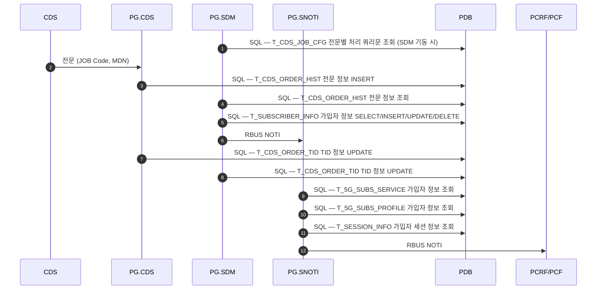
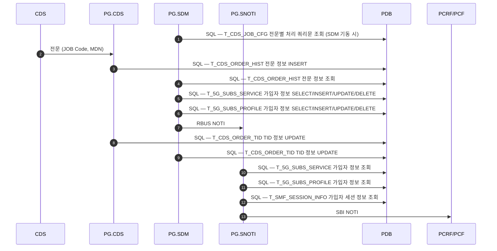
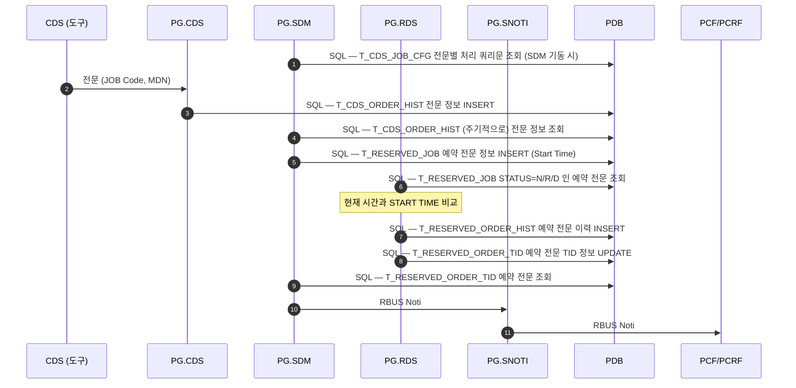

# CDS — 노드 스펙

규격: `CDS 표준 인터페이스 규격 Ver6.0`
파일: [`cds_tests.robot`](../../tests/cds/cds_tests.robot) · [`cds_keywords.robot`](../../resources/cds_keywords.robot) · [`cds_variables.robot`](../../resources/cds_variables.robot) · [`CdsHelper.py`](../../resources/CdsHelper.py)

## 접속 — 듀얼 소켓, Rchannel 이 먼저

| 항목 | 값 |
|---|---|
| 도구 역할 | CDS (능동 Connector) |
| 방향 | 도구 → PG.CDS |
| Schannel | `${CDS_SCH_PORT}` = 9200 |
| Rchannel | `${CDS_RCH_PORT}` = 9201 |
| 헤더 | **48-옥텟** 빅엔디안 |
| Body | 고정전문 |
| 타임아웃 | `${CDS_TIMEOUT}` = 10초 |

**접속 순서가 정해져 있다 — Rchannel 을 먼저 연다.**

| 순서 | 채널 | 송신 | 기대 |
|---|---|---|---|
| 1 | Rchannel 9201 | `0003` RchannelConnectionRequest | `0004` ACK |
| 2 | Schannel 9200 | `0001` SchannelConnectionRequest | `0002` ACK |

**접속과 해제는 TC 가 아니라 Suite Setup / Teardown 이다.**

| | 키워드 | 하는 일 |
|---|---|---|
| Suite Setup | `Suite CDS Connect` | Rch 연결 → `0003`/`0004` → Sch 연결 → `0001`/`0002` → **두 소켓 생존 확인** |
| Suite Teardown | `Suite CDS Disconnect` | Sch `0005`→`0006` 검증 → Rch `0007`→`0008` 검증 → 소켓 종료 |

Setup 이 실패하면 슈트가 서지 않으므로 접속을 TC 로 재확인할 필요가 없다. 해제도
슈트가 끝나면 반드시 해야 하는 일이라 TC 로 두면 실패·필터 시 건너뛰게 된다.

Teardown 은 역순이 아니라 **Schannel→Rchannel 순으로** Release 를 보낸 뒤 닫는다.
`Send Release And Validate` 가 ACK 의 msg_id 와 `Result=SC` 를 검증하되,
**PG 가 ACK 없이 끊는 것은 정상 해제로 간주**한다(규격상 허용).

ACK 검증을 `Run Keyword And Ignore Error` 로 감싸지 않는다 — 감싸면 검증이 무력화된다.
Robot 은 **teardown 안의 키워드가 실패해도 나머지를 계속 실행**하므로 소켓 종료는 어차피
수행된다. 실제로 Release ACK 를 `FA` 로 돌려주는 가짜 PG 로 확인했다: 두 채널 모두
실패를 보고하고, 그럼에도 소켓은 닫혔다.

포트와 `${CDS_DST_SYS_ID}`(PG.CDS SYSTEM_ID, 기본 `PG01`)는 `cds_variables.robot` 기본값이며
환경별로 다르면 `config/env/<env>.py` 에서 오버라이드한다.
업로드 전용 포트 `${CDS_UP_SCH_PORT}`(6100) / `${CDS_UP_RCH_PORT}`(6101) 도 정의돼 있다.

## 메시지 타입

| ID | 이름 | ID | 이름 |
|---|---|---|---|
| `0001`/`0002` | SchannelConnectionRequest / ACK | `0017`/`0018` | CommandResult / ACK |
| `0003`/`0004` | RchannelConnectionRequest / ACK | `0025`/`0026` | UploadRequest / ACK |
| `0005`/`0006` | SchannelReleaseRequest / ACK | `0027`/`0028` | UploadResult / ACK |
| `0007`/`0008` | RchannelReleaseRequest / ACK | `0029`/`0030` | SubsDataRequest / ACK |
| `0013`/`0014` | ProcessStateRequest / ACK | `0031`/`0032` | SubsDataResult / ACK |
| `0015`/`0016` | CommandRequest / ACK | | |

Process State 값: `${CDS_PS_NORMAL}`=1 / `${CDS_PS_ABNORMAL}`=2, `uint16` 빅엔디안
(`pack_process_state` / `unpack_process_state`).

## Call Flow — PG 내부 처리

**도구가 검증하는 구간은 첫 화살표 하나(`전문(JOB Code, MDN)`)뿐이다.** 그 뒤는 전부 PG
내부이며 도구에서 보이지 않는다. 전문이 실제로 반영됐는지는 PDB 테이블로만 확인된다 —
`CommandResult` 는 Body 내용과 무관하게 `SC` 로 오기 때문이다(아래 [함정](#body-인코딩-회귀를-자동으로-잡을-수-없다) 참조).

전문은 **즉시 / 예약** 두 갈래이고 각각 **LTE / SA** 가입자로 갈린다 — 아래 다이어그램 2개와
[차이 표](#lte--sa-차이--테이블-이름과-noti-방식뿐)로 네 경우를 모두 덮는다.
CDS 가 여러 노드에 걸치는 HFC(`1X`/`1Y`) 흐름은 [INTERFACES.md](../INTERFACES.md#hfc-서비스-call-flow--세-노드가-어떻게-이어지는가) 에 있다.

출처: `PG (PCF Gateway) 교육 자료` Chapter 03 — *02. PG 서비스 별 동작 Flow*.

### LTE 가입자



### SA 가입자



### 예약 전문 — RDS 가 START TIME 까지 들고 있는다

예약 전문은 **PG.RDS 가 추가로 낀다.** SDM 이 즉시 처리하지 않고 `T_RESERVED_JOB` 에
Start Time 과 함께 넣어두면, RDS 가 `STATUS=N/R/D` 인 건을 돌면서 **현재 시각과 START TIME 을
비교**해 때가 됐을 때 실행한다. `T_CDS_ORDER_TID` 대신 `T_RESERVED_ORDER_TID` 를 쓴다.



### LTE / SA 차이 — 테이블 이름과 NOTI 방식뿐

**흐름의 단계·순서는 LTE 와 SA 가 완전히 동일하다.** 위 다이어그램에서 아래 이름만 바뀐다.

| 흐름 | 항목 | LTE | SA |
|---|---|---|---|
| 즉시 | SDM 가입자 정보 갱신 | `T_SUBSCRIBER_INFO` (1개) | `T_5G_SUBS_SERVICE` + `T_5G_SUBS_PROFILE` (2개) |
| 즉시 | SNOTI 세션 정보 조회 | `T_SESSION_INFO` | `T_SMF_SESSION_INFO` |
| 예약 | 예약 큐 | `T_RESERVED_JOB` | `T_5G_RESERVED_JOB` |
| 예약 | 예약 이력 | `T_RESERVED_ORDER_HIST` | `T_5G_RESERVED_ORDER_HIST` |
| 예약 | 예약 TID | `T_RESERVED_ORDER_TID` | `T_5G_RESERVED_ORDER_TID` |
| 공통 | **PCF/PCRF 통보** | **RBUS Noti** | **SBI Noti** |

`T_CDS_JOB_CFG` · `T_CDS_ORDER_HIST` 는 LTE/SA 공용이다. SDM→SNOTI 구간은 SA 도 RBUS Noti 이며,
**바뀌는 건 SNOTI→PCF/PCRF 마지막 구간 하나**다.

즉시 전문에서 SNOTI 의 가입자 정보 조회는 **LTE 도 `T_5G_SUBS_SERVICE` / `T_5G_SUBS_PROFILE` 를 본다**
— SDM 이 쓰는 테이블(`T_SUBSCRIBER_INFO`)과 다르다.

**☞ 일부 전문에 대해서는 PCF/PCRF 로 NOTI 하지 않는다.** 네 흐름 모두에 붙은 단서다.
어떤 JOB Code 가 해당하는지는 자료에 없다 — TID 는 갱신되는데 PCF 반영이 없으면 이걸 먼저 의심할 것.

### 도구 관점에서의 함의

| 흐름 | 도구가 볼 수 있는 것 |
|---|---|
| `전문 → PG.CDS` | `CommandResult`(`SC`/`FA`) — **Body 내용과 무관하게 `SC`** |
| `PG.CDS → PDB` 이후 전부 | **없음.** PDB 조회 없이는 판정 불가 |

리포에 `robotframework-databaselibrary` / `pyodbc` 의존성이 잡혀 있으나 **CDS 슈트는
현재 PDB 를 조회하지 않는다.** 전문 반영을 실제로 검증하려면 `T_CDS_ORDER_HIST` ·
`T_CDS_ORDER_TID` 대조를 붙이는 것이 이 노드의 유일한 자동 판정 경로다.

**예약 전문은 특히 그렇다.** 실행이 START TIME 까지 미뤄지므로 `CommandResult` 를 받은
시점에는 아직 아무것도 반영되지 않았다 — `T_RESERVED_JOB` 에 적재만 된 상태다.

어느 JOB Code 가 예약으로 분류되는지는 자료에 없고 **PG.SDM 이 정한다.** 슈트에도 예약을
명시적으로 다루는 TC 는 없다. (`CdsHelper.py` 의 `start_time` 필드는 쿠폰/시간프리용이며
이 예약 흐름의 START TIME 과 같은 것인지 확인되지 않았다.)

## wire 인코딩

### 48-옥텟 헤더

```
Message ID / Transaction ID(date + seq) / System ID / Application ID
/ Continue Flag / Serial No / Data Size
```

정수 필드는 `htonl`/`htons` 로 **빅엔디안 송신**한다. `pack_cds_header` / `parse_cds_header` 참조.

### Transaction ID — 와이어 12B, PG 인식은 16자

와이어는 규격대로 `tidDate` char(8) + `seqNo` uint32 BE(4) = **12B** 다.
그런데 PG 는 이걸 받아서 **16자 문자열로 만들어** DB 기본키로 쓴다.

```c
// CDS/CDownMessage.cpp:70
sprintf(strTid, "%8.8s%08d", _pR->GetTid()->tidDate, _pR->GetTid()->seqNo);
```
```sql
-- CDS/sql.txt:6,14
TRANSACTION_ID char(16) NOT NULL,  CONSTRAINT PK_CDS_ORDER_HIST PRIMARY KEY(TRANSACTION_ID)
```

`%08d` 가 8자리이므로 **seq 에 `HHMMSS * 100 + 일련번호`** 를 넣으면
PG 가 찍는 16자가 정확히 `YYYYMMDD HHMMSS NN` 이 된다.

| | 값 |
|---|---|
| 와이어 | `tidDate="20260731"`, `seqNo=9300001` |
| PG 렌더링 | `2026073109300001` = `20260731`+`093000`+`01` |

`Next CDS TID` 가 이 계산을 하며, **초가 바뀌면 일련번호를 0 으로 리셋**한다.
같은 초에 100개를 넘기면 순환하면서 WARN 을 남긴다(테스트 슈트에서는 도달하지 않는다).

`${CDS_TID_SEQ_MOD}`(=100)는 **자유롭게 못 바꾼다** — `%08d` 8자리에서 HHMMSS 가 6자리를
쓰므로 일련번호 몫이 2자리뿐이다. 1000 으로 올리면 날짜 자리를 침범한다.

날짜만 쓰던 이전 방식은 **하루에 두 번 돌리면 TID 가 겹쳤다**(seq 가 매 실행 1부터).
PG 기본키와 충돌하므로 시각을 넣어 회피한다.

8-옥텟 공통 헤더를 쓰지 않는 유일한 노드다(NWDAF 는 8옥텟이되 필드 구성이 다름).
소켓 자체는 `TcpHelper` 의 클라이언트 함수를 재사용한다.

### CommandRequest(0015) Body — 327 옥텟 고정 레코드

업무 코드(`svc_code`) 와 무관하게 **항상 35필드 327B 전체를 보낸다.** 해당 코드가 쓰지
않는 필드는 공백으로 채운다. 채울 필드는 `CdsHelper._fill_command_fields(code)` 가 정한다.

**레이아웃은 실 A1 전문 샘플 327B + 규격표 35필드로 이중 검증됐다** — 추정이 아니다.
샘플의 모든 유효 바이트가 A1 대상 필드에만 정렬되고, 규격표의 순서·크기가 전부 일치했다.

아래 `A1` 열은 실 A1 전문에서 **값이 채워져 있던 필드**를 표시한다(값 자체는 실 가입자
데이터라 옮기지 않는다). 다만 규격표와 어긋나 근거가 필요한 두 건은 값을 남겼다.

| off | 내부 필드명 | 규격명 (TCP / JSON) | Size | 값 | A1 |
|---|---|---|---|---|---|
| 0 | `svc_code` | JOB_CODE / opCode | 2 | 업무 코드 | `A1` |
| 2 | `mdn` | MDN / mdn | 12 | | ● |
| 14 | `new_mdn` | NEW_MDN | 12 | | |
| 26 | `min` | MIN / min | 10 | | ● |
| 36 | `new_min` | NEW_MIN | 10 | | |
| 46 | `prod_id` | PRODUCT_ID / produId | 10 | 상품 ID | ● |
| 56 | `data_prod_id` | ADD_SVC / addSvc | 10 | 안심데이터상품ID | (옵션) |
| 66 | `network` | NETWORK_ID / netId | 8 | WCDMA CDMA WiBro LTE 5G 플래그 | `10011` ★ |
| 74 | `block_data_roaming_id` | ROADMING_STOP / roamStopId | 1 | 0=해당없음 1=가입/해지 | |
| 75 | `block_data_roaming_provider_id` | ROADMING_STOP_PROVIDER / roamStopProviId | 1 | 0/1 | |
| 76 | `allow_mvoip_yn` | MVOIP_APPLY_FG | 1 | 0/1 | |
| 77 | `tablet_yn` | TABLET_PC_YN / tabPcYn | 1 | 0=아니오 1=예 | ● |
| 78 | `os_ver` | OS_VERSION / osVer | 2 | | ● |
| 80 | `device_model` | TERMINAL_MODEL_CODE / termModelCode | 4 | | ● |
| 84 | `block_harmful_yn` | YOUNG_HARM_INFO_BLOCK / YoungHarmInfoBlock | 1 | 청소년 유해정보 차단 | |
| 85 | `block_roaming_data_yn` | ROAMING_DATA | 1 | 0=허용 1=차단 2=VOMS제휴망 | |
| 86 | `block_roaming_mvoip_yn` | ROAMING_MVOIP | 1 | 0=허용 1=차단 | |
| 87 | `zone_code` | ZONE_CODE | 4 | 0000~9999 | |
| 91 | `ca` | CA | 1 | CA 단말 속성 3=L3 4=L4 | `7` ★ |
| 92 | `aprf` | APRF / aprfTermAttri | 1 | 0=N/A 1=Support | ● |
| 93 | `imsi` | IMSI | 15 | 450+05+국번호(5)+Serial(5) | ● |
| 108 | `mvno` | MVNO_COMPANY / mvnoCompa | 1 | | 공백 |
| 109 | `limit` | LIMIT_SUBS_FG / limitSubsFlag | 1 | 한도형 가입자 | ● |
| 110 | `qos_param` | ROAMING_QOS_PARAM | 1 | | |
| 111 | `start_time` | START_TIME | 12 | 쿠폰 종료 시간 / 시간프리 Start | |
| 123 | `coupon_type` | COUPON_TYPE | 2 | 쿠폰 권종 / 시간프리 End | |
| 125 | `coupon_pin` | COUPON_PIN | 11 | | |
| 136 | `ms_type` | MS_TYPE / catMsType | 1 | Cat.M1 단말 타입 | 공백 |
| 137 | `category_lte` | CATEGORY_LTE / lteCatgy | 2 | Default 10 | 공백 |
| 139 | `category_5g` | CATEGORY_5G / 5gCatgy | 2 | Default 10 | 공백 |
| 141 | `device_type` | DEVICE_TYPE / devceType | 1 | W=3G L=LTE N=NSA S=SA (Null=LTE) | ● |
| 142 | `coupon_category` | COUPON_CATEGORY | 1 | T=Time P=Period | |
| 143 | `real_start_time` | REAL_START_TIME | 12 | 쿠폰 시작 시간 | |
| 155 | `addr` | ADDR | 170 | 주소 (**cp949**) | |
| 325 | `product_type` | PRODUCT_GEN_TYPE / produGenType | 2 | 01=3G 02=LTE 03=5G | ● |

`●` = 실 전문에 값이 있던 필드 / `공백` = 규격상 A1 필수인데 실 전문은 비어 있던 필드 /
`★` = 규격표와 어긋나 값을 근거로 남긴 필드(아래 함정 절).

`addr` 만 한글이 들어가 cp949 로 인코딩한다(`_FIELD_ENCODING`). 나머지는 ASCII.

#### 업무 코드별 필드 집합

코드가 쓰지 않는 필드는 공백으로 나간다. 대상 필드는
`CdsHelper._fill_command_fields(code)` 의 분기가 정한다.

**A1 을 기준으로 읽는 게 빠르다.** 나머지는 대부분 A1 의 가감이다.

| 코드 | 규격 필드 수 | 구성 |
|---|---|---|
| `A1` 신규 | 17 | `opCode` `mdn` `min` `produId` `addSvc`(**옵션**) `netId` `tabPcYn` `osVer` `termModelCode` `aprfTermAttri` `mvnoCompa` `limitSubsFlag` `catMsType` `lteCatgy` `5gCatgy` `devceType` `produGenType` |
| `G1` | 17 | **A1 과 완전히 동일** |
| `C1` 기기변경 | 18 | **A1 + `newMin`** |
| `Z1` 해지 | 15 | **A1 − `min` − `addSvc`** |
| `D3` 번호변경 | 8 | `opCode` `mdn` `newMdn` `min` `newMin` `produId` `limitSubsFlag` `produGenType` |
| `I2` `I3` | 9 | `opCode` `mdn` `min` `produId` `roamStopId` `roamStopProviId` `YoungHarmInfoBlock` `limitSubsFlag` `produGenType` |
| `1X` HFC가입 | 6 | `opCode` `mdn` `produId` `limitSubsFlag` `addr` `produGenType` |
| `1Y` HFC해지 | **미확인** | 아래 [업무 코드](#업무-코드) 참조 |

`A1` `G1` `C1` `Z1` 는 **단말·망 필드 전체**(`netId` `tabPcYn` `osVer` `termModelCode`
`aprfTermAttri` `mvnoCompa` `catMsType` `lteCatgy` `5gCatgy` `devceType`)를 쓰는 계열이고,
`D3` `I2` `I3` `1X` 는 **가입자 식별 + 업무 고유 필드만** 쓰는 계열이다.

`1X` 는 **`addr` 를 쓰는 유일한 코드**다(170B, cp949).
`I2`/`I3` 만 `roamStopId`(`ROADMING_STOP`) · `roamStopProviId`(`ROADMING_STOP_PROVIDER`) ·
`YoungHarmInfoBlock`(`YOUNG_HARM_INFO_BLOCK`) 을 쓴다.

`addSvc` 외에는 전부 필수다. **실 전문은 여기에 `CA` 와 `IMSI` 를 더 채워 보낸다**
(아래 [함정](#규격표와-실-전문이-어긋난다--실-전문이-기준이다) 참조) — 코드 분기도 두 필드를 유지한다.

`C1`(기기변경) 은 `min ← mdn` 을 강제하고 `new_mdn` 을 선언하지 않는다 — MDN 이 바뀌지
않는 업무라서다. `new_min` 만 넘긴다. **규격 C1 에도 `newMdn` 이 없어 이 판단이 확인됐다.**

이 단말·망 필드들은 `${CDS_NETWORK}` `${CDS_CA}` `${CDS_IMSI}` 등 **코드 공용 변수**로
`Send Command Request` 의 기본 인자에 올라가 있다. 하나를 채우면 그 필드를 선언한
모든 코드에 반영된다.

#### 규격과 코드 분기 대조 결과

2026-08-03 에 위 규격 목록을 `_fill_command_fields` 분기와 나란히 대조한 결과다.

| 코드 | 규격에 있는데 코드에 **없음** | 코드에만 **더 있음** | 판정 |
|---|---|---|---|
| `A1` | — | `ca` `imsi` | 정상 (실 전문 근거로 유지) |
| `Z1` | — | `ca` `imsi` | 정상 — 규격으로 확인됨 |
| `C1` | — | `ca` `imsi` | 정상 — 규격으로 확인됨 |
| `G1` | ~~`min`~~ | `ca` `imsi` | ✅ **2026-08-03 코드 수정 완료** |
| `I2` `I3` | ~~`produId` · `produGenType`~~ | ~~`mvnoCompa`~~ | ✅ **2026-08-03 코드 수정 완료** |
| `D3` | — | `addSvc` `netId` `tabPcYn` `osVer` `termModelCode` `ca` `aprf` `imsi` `mvnoCompa` `lteCatgy` `5gCatgy` `devceType` (12개) | ⚠ **과다 선언 (미반영)** |

**`G1` 의 `min` 누락은 고쳤다.** 규격상 G1 은 A1 과 필드 집합이 완전히 같은데 코드 분기만
`min` 이 빠져 있었다 — Z1 에서 발견됐던 것과 같은 유형의 레거시 누락이다.
`Send Command Request` 는 모든 코드에 `min=${CDS_MIN}` 을 넘기고 있었으므로
**`TC-CDS-008`(G1 정보변경)가 MIN 을 공백으로 송신하고 있었다.** 지금은 offset 26 에
10B 로 들어간다.

**`I2`/`I3` 도 고쳤다.** `produId` · `produGenType` 을 추가하고 규격 목록에 없는 `mvnoCompa`
를 뺐다. `TC-CDS-005`/`TC-CDS-006` 이 `produId` 를 공백으로 보내고 있었다 —
`${CDS_PROD_ID}`(`NA00003479`)가 분기에서 버려지고 있었기 때문이다.
`mvnoCompa` 는 되살릴 근거(실 I2/I3 전문)가 나오면 A1 의 `ca`/`imsi` 처럼 다시 넣는다.

**`D3` 의 12개 과다 선언은 미반영이다.** 규격 D3 는 8개뿐인데 코드가 A1 계열 필드를
통째로 얹고 있다. 단말·망 공용 변수가 현재 전부 비어 있어 증상이 없을 뿐,
값을 채우면 규격에 없는 필드가 채워져 나간다.

#### ⚠ `min ← mdn` 강제 대입이 값을 망가뜨린다 (미반영)

`C1` · `I2` · `I3` 분기는 `min` 을 인자로 받지 않고 **MDN 값을 그대로 넣는다.**

```python
f['min'] = kw.get('mdn', '')          # C1 / I2 / I3
```

`min` 필드는 **10B** 인데 MDN 은 11자리다. 그래서 **뒤 한 자리가 잘린다.**

| | 값 |
|---|---|
| `${CDS_MDN}` | `01090010001` (11자리) |
| `${CDS_MIN}` | `1090010001` (10자리 — MDN 에서 앞 `0` 을 뗀 값) |
| 강제 대입 결과 | **`0109001000`** ← 뒷자리 잘린 MDN. MIN 도 MDN 도 아니다 |

MIN 은 통상 MDN 에서 선행 `0` 을 뗀 값이므로, 이 코드는 **자리를 하나 밀어 보내고 있다.**
`TC-CDS-005`(I2) · `TC-CDS-006`(I3) · `TC-CDS-007`(C1) 이 전부 해당한다.

규격 `I2`/`I3`/`C1` 모두 `min` 을 **별도 필드로** 열거하므로 인자 값(`${CDS_MIN}`)을 그대로
쓰는 게 맞아 보이지만, 레거시 도구가 의도적으로 MDN 을 넣었을 가능성을 배제하지 못했다.
**값 의미가 바뀌는 변경이라 손대지 않았다** — 실 `I2`/`C1` 전문을 확보해 확정할 것.
PG 는 어차피 `SC` 를 주므로 TC 로는 잡히지 않는다.

D3 가 `catMsType`(`ms_type`) 을 선언하지 않는 건 **의도대로다** — 규격 D3 목록에도 없다.
(이전에 "누락인지 의도인지 판단 불가"로 남겨뒀던 항목이 여기서 해소됐다.)

#### 실 G1 전문 샘플 (2026-08-03)

JSON 표현으로 확보했다. **레이아웃과 필드 폭을 독립적으로 재확인해 준다** — 아래 값들이
`_CMD_LAYOUT` 폭에 잘림 없이 정확히 들어간다(`min` 10/10, `produId` 10/10,
`termModelCode` 4/4, `lteCatgy`·`5gCatgy`·`produGenType` 2/2, `devceType` 1/1).

```json
{ "opCode": "G1", "mdn": "01000000000", "min": "1000000000",
  "produId": "NA00000000", "netId": "10010", "tabPcYn": 0, "osVer": 11,
  "termModelCode": "ODH1", "aprfTermAttri": 0, "mvnoCompa": 0,
  "limitSubsFlag": 0, "catMsType": 0, "lteCatgy": "06", "5gCatgy": "00",
  "devceType": "L", "produGenType": "02" }
```

여기서 읽어낼 것:

- **`netId` = `10010` — 5자리다.** 규격표의 4자리(WCDMA/CDMA/WiBro/LTE) 주장이 틀렸다는
  근거가 A1 전문에 이어 **두 번째로 확보됐다**. `devceType=L`·`produGenType=02`(LTE)와
  LTE 자리 `1` 이 일관된다. [규격표와 실 전문이 어긋난다](#규격표와-실-전문이-어긋난다--실-전문이-기준이다) 참조.
- **`lteCatgy`·`catMsType`·`mvnoCompa` 에 값이 있다.** A1 실 전문에서는 이들이 공백이었다
  — **코드마다 채우는 범위가 다르다**는 뜻이며, "A1 에서 공백이니 항상 공백"으로 일반화하면 안 된다.
- **`lteCatgy`=`06` / `5gCatgy`=`00` 은 규격 Default `10` 이 아니다.** Default 값을
  그대로 상수에 박아 넣지 말 것.
- `addSvc` 가 없다 — 옵션 필드이므로 정상이다.
- **`CA`·`IMSI` 가 없다.** 다만 이건 JSON 표현이라 **TCP 전문에서의 부재를 확정하지 못한다**
  — A1 은 규격 목록에 없으면서도 TCP 전문에 값이 실려 있었다. 코드는 두 필드를 그대로 둔다.

#### 업무 코드

규격 `JOB_CODE` 허용 목록: `A1` `D3` `Z1` `G1` `C1` `Q1~Q9` `H1~H6`.

`cds_variables.robot` 은 레거시 도구에서 옮겨온 29개(`C2~C5` `D2` `D4` `D5` `E1` `E2`
`F1~F6` `I1~I3` `M1` `Y3~Y5` `Z2` `1X` `1Y`)를 더 정의하고 `_fill_command_fields` 도
이들을 처리한다. 그중 **`1X` `1Y` `I2` `I3` 는 위 규격 목록에 없지만** TC 로 유지 중이다
— 규격표가 이미 여러 곳 낡은 것이 확인돼 목록도 불완전할 수 있어서다. 실제 가부는
PG 응답(`SC`/`FA`)으로 판단한다.

필드 목록 확보 현황: **`1X` 2026-07-31**, **`D3` `G1` `Z1` `C1` `I2` `I3` 2026-08-03** —
전부 위 표에 반영했다.

**`I2`/`I3` 는 허용 목록 밖인데도 규격 필드 목록이 확인됐다**(2026-08-03). 즉
**허용 목록(`A1` `D3` `Z1` `G1` `C1` `Q1~Q9` `H1~H6`) 쪽이 낡았다.** 목록에 없다는 이유로
코드를 지우지 말 것.

**⚠ `1Y`(HFC해지) 필드 집합 미확인** — 현재 분기는 `mdn` `produId` `produGenType` 3개뿐이라
쌍이 되는 `1X` 에 있는 **`limitSubsFlag` 가 빠져 있다.** 거의 모든 코드가 `limitSubsFlag` 를
채우므로 누락이 의심되지만 `1Y` 규격을 확보하지 못해 그대로 두었다. Z1 에서 같은 유형의
누락이 실제로 있었으므로(위 함정 절) **1Y 목록을 구하면 반드시 대조할 것.**

## TC

현재 **활성 12건 / 주석 2건**(001~014 연속). 태그: `cds` `process-state` `command` `smoke` `validation`
(+ 주석 TC 에 `subs-data` `upload`)

| 대역 | 내용 |
|---|---|
| 001 | ProcessState 상태확인 |
| 002~008 | Download Command — 업무 코드별 (원래 번호) |
| 009~012 | Download Command — **번호변경(D3) 후 체인** |
| 013~014 | SubsData · UpLoad (현재 비활성) |

접속·해제는 TC 가 아니라 Suite Setup/Teardown 이다([접속](#접속--듀얼-소켓-rchannel-이-먼저) 참조).
그래서 `connect` · `release` 태그는 더 이상 쓰이지 않는다.

단말·망 공용 필드(`${CDS_NETWORK}` `${CDS_CA}` `${CDS_IMSI}` 등)는 현재 전부 비어 있다
— 실환경 값이 없어서다. `Send Command Request` 의 기본 인자로 올라가 있으므로
`cds_variables.robot` 에 값만 채우면 해당 필드를 선언한 모든 코드에 즉시 반영된다.
채우지 않으면 그 필드들은 공백으로 나가고 **PG 는 그래도 `SC` 를 준다.**

### TC 간 의존성 — `TC-CDS-009` ~ `012` 는 하나의 체인이다

**이 슈트에서 유일하게 앞 TC 의 결과에 의존하는 구간이다.** 나머지 TC 는 서로 독립이다.

D3(번호변경)가 성공하면 가입자의 현재 번호가 `${CDS_NEW_MDN}` 으로 바뀐다. 따라서
뒤따르는 TC 들은 전부 **바뀐 번호를 대상으로** 해야 한다 — 원래 번호로 보내면 이미
존재하지 않는 가입자를 건드리는 셈이다.

| TC | 코드 | 하는 일 |
|---|---|---|
| 009 | `D3` 번호변경 | 성공 시 `${CDS_ACTIVE_MDN}` 을 `${CDS_NEW_MDN}` 으로 갱신 |
| 010 | `1X` HFC가입 | **바뀐 번호로** HFC 가입 (`addr` 동봉) |
| 011 | `1Y` HFC해제 | 010 이 가입한 번호를 해제 |
| 012 | `Z1` 해지 | 가입자 자체를 해지 — **체인의 끝** |

`${CDS_ACTIVE_MDN}`(`cds_variables.robot`) 이 "현재 유효 MDN" 을 들고 있다.

| 상황 | `${CDS_ACTIVE_MDN}` | 010~012 의 대상 |
|---|---|---|
| D3 성공 | `Set Suite Variable` 로 `${CDS_NEW_MDN}` 교체 | **변경된 번호** |
| D3 실패 | `Command Download Flow` 가 먼저 죽어 갱신 미실행 | 원래 번호 |
| D3 미실행 (`--test`, 태그 필터) | 기본값 유지 | 원래 번호 |

기본값이 `${CDS_MDN}` 이라 **개별 TC 를 단독 실행해도 그대로 동작한다.** 갱신은 D3 의
`Command Download Flow` **뒤에** 두어 성공했을 때만 반영되게 했다.

```bash
# 체인 전체
python -m robot --test "TC-CDS-009*" --test "TC-CDS-01[0-2]*" tests/cds/
# 번호를 직접 지정 (D3 없이 특정 가입자로)
python -m robot --test "TC-CDS-010*" --variable CDS_ACTIVE_MDN:01090010002 tests/cds/
```

`--variable` 은 최우선이라 `${CDS_ACTIVE_MDN}` 을 직접 덮는다. `CDS_MDN` 을 덮어도
`${CDS_ACTIVE_MDN}` 이 그것을 참조해 정의되므로 함께 따라온다
([변수 우선순위](../ENVIRONMENTS.md#변수-우선순위)).

**MIN 은 따라가지 않는다.** 규격 `Z1` 필드 집합에 `min` 이 없고(A1 − `min` − `addSvc`),
`1X`/`1Y` 도 `min` 을 쓰지 않는다. 셋 다 MDN 만 보낸다.

`TC-CDS-003`/`004` 는 **원래 번호로** 1X/1Y 를 검증하는 별개 TC 로 남아 있다.
010/011 은 "번호가 바뀐 가입자에게 HFC 를 붙였다 떼는" 경로를 따로 본다.

## 함정

- **Upload 는 PG 가 먼저 보낸다.** `Receive Upload Request` → `Send Upload Request Ack`
  → `Send Upload Result` 순. 해당 TC 는 PG 이벤트가 필요해 주석 처리돼 있다.
- Release 시 PG 가 ACK 없이 끊는 경우가 정상 동작으로 취급된다
  (`Send Release And Validate` 가 `Run Keyword And Return Status` 로 처리).

### 코드 분기가 선언하지 않은 필드는 값을 넘겨도 버려진다

`pack_command_body` 는 327B 를 전부 공백으로 초기화한 뒤 **분기가 선언한 이름만** 채운다.

```python
f = {name: '' for name, _ in _CMD_LAYOUT}   # 전부 공백
_fill_command_fields(code, fields, f)        # s() 로 호출된 이름만 f 에 들어간다
```

따라서 호출부가 `product_type=03` 을 넘겨도 그 코드의 분기에 `product_type` 이 없으면
**조용히 사라진다.** 예외도 로그도 없다.

실제로 **`Z1` 분기에 `category_lte` · `category_5g` · `product_type` 3개가 빠져 있었다**
(2026-07 규격 대조로 발견). `${CDS_PROD_TYPE}` 가 비어 있어 증상이 없었을 뿐, 값을
채우면 A1·D3·C1·G1·1X·1Y 는 반영되고 Z1 만 무시됐을 것이다.

**코드별 필드 집합을 고칠 때는 규격 목록과 분기를 나란히 대조할 것** — TC 로는 잡히지
않는다(PG 가 어차피 `SC` 를 준다).

### Body 인코딩 회귀를 자동으로 잡을 수 없다

**PG.CDS 는 Body 내용과 무관하게 `CommandResult` 를 `SC` 로 돌려준다.** 따라서
`_CMD_LAYOUT` 의 필드 순서·길이가 깨져도, A1 필수 필드가 전부 공백으로 나가도
**전 TC 가 통과한다.**

실제로 A1 이 10개 필드를 비운 채 송신하면서 모든 TC 가 PASS 했던 전례가 있다.

레이아웃을 손댔다면 실 전문 캡처와 **수동으로** 대조할 것 —
`PG_LOG_MSG=1`(`run_tests.sh cds --log-msg`)로 송신 덤프를 `log.html` 에 남기고
위 오프셋 표와 맞춘다. 절차는 `pg-wire-encoding` 스킬.

### 규격표와 실 전문이 어긋난다 — 실 전문이 기준이다

`CLAUDE.md` 의 *"규격서 표를 그대로 믿지 말 것"* 이 CDS 에서도 성립한다.
아래 6건은 **문서가 낡은 쪽**으로 판단해 실 전문을 채택했다.

| 필드 | 규격 문서 | 실 A1 전문 | 채택 |
|---|---|---|---|
| `netId`(8B) | WCDMA/CDMA/WiBro/LTE **4자리** + space(4) | `10011` + 공백3 → **5자리** | 실 전문 (5번째 = 5G/NR) |
| `CA`(1B) | `0~4` 만 열거 (3=L3, 4=L4) | **`7`** | 실 전문 (7 = L7 단말) |
| `CA` | A1 필드 목록에 **없음** | 값 있음 | 실 전문 — 채워 보낸다 |
| `IMSI` | A1 필드 목록에 **없음** | 값 있음 | 실 전문 — 채워 보낸다 |
| `mvnoCompa` `catMsType` | A1 **필수** | 공백 | 실 전문 — 공백 유지 |
| `lteCatgy` `5gCatgy` | A1 **필수**, Default `10` | 공백 | 실 전문 — 공백 유지 |

`CA`·`IMSI` 는 오프셋 오독이 아니다. 필드 위치는 코드와 무관한 절대 오프셋이고,
`zone_code`(87~91) 가 공백으로 끝난 직후 바이트가 `7`, 그 뒤 15B 가 정확히 SKT IMSI
형식(`450`+`05`+국번호+Serial)이다. 같은 샘플의 `devceType`=`S`(SA) /
`produGenType`=`03`(5G) 와도 "5G SA 가입자"로 일관된다 — 정렬이 틀렸다면 세 필드가
동시에 말이 될 수 없다.

**샘플 값 자체는 포맷 확인용이므로 소스에 넣지 않았다.** 단말·망 공용 변수는 비어 있고,
실환경 값으로 채우는 것은 별건이다. 규격표 대신 실 전문을 따라야 하는 필드가
어디인지만 위 표로 남긴다.
